# フレームワーク：観測から点なし時空を基礎づける

最終更新: 2026-10-02（第 24 回。T-0019 を完了し、量子統計的実験・チャネルの比較と因果的非分離性の見立てを未解決の論点に加えた）

このファイルは、本プロジェクトの物理のフレームワークの最新版です。セッションの終わりごとに更新します（[`CLAUDE.md`](CLAUDE.md) の「セッションの終え方」）。

## 1. 位置づけ

本プロジェクトの目的は、点なし位相（point-free topology）の考え方を物理学に応用することです。その中心として、「観測」と「実験」を定式化し、そこから点なしの時空を基礎づけるフレームワークを作ります。

- 時空は、観測結果を説明する数学的なモデルと考える（第 07 回のユーザーの構想）。
- 観測者の基準の時計と物差しで装置の読みを換算した「観測者の実験における時空」（[D-0013](definitions/D-0013.md)）と、観測量から再構成する「観測における時空」（[D-0007](definitions/D-0007.md)）を分ける。
- フレームワークは数学基礎論のような位置づけで考える（第 08 回のユーザーの方針）。唯一の正しい時空の再構成を探すのではなく、「観測」や「実験」の形式化に様々な前提や制約を課し、得られる体系の特徴を比べる。

## 2. 構成要素の種類

| 種類 | 置き場所 | 内容 |
| --- | --- | --- |
| 定義 | [`definitions/`](definitions/README.md)（`D-NNNN`） | 本プロジェクト独自の概念の定義 |
| 前提 | [`assumptions/`](assumptions/README.md)（`A-NNNN`） | 議論の土台とする仮定（作業上のものと未定の候補を含む） |
| 予想 | [`conjectures/`](conjectures/README.md)（`C-NNNN`） | 未検証の主張 |
| 結果 | [`results/`](results/README.md)（`R-NNNN`） | 検証済みの主張 |

定義と前提の状態は、採用・作業上・未定・廃止の 4 段階です（[定義の一覧](definitions/README.md) の「状態」）。同時には議論の土台に置かない代替の前提の組は「択一の組」とし、組の各前提が一つの体系を定めます（[前提の一覧](assumptions/README.md) の「択一の組と体系」）。未完成の部分は、状態で明示します。

## 3. 構成の層

構成の順序は、第 09 回にユーザーと合意したものです。

```math
\text{実験} \;→\; \text{観測量} \;→\; \text{観測量の時空} \;→\; \text{可能な実験} \;→\; \text{可能な観測量} \;→\; \text{点なし時空}
```

| 層 | 内容 | 定義 | 前提 | 予想 |
| --- | --- | --- | --- | --- |
| 1. 実験 | 実際に行われる有限な実験と、その設定の空間 | [D-0001](definitions/D-0001.md) 有限な実験（作業上）<br>[D-0002](definitions/D-0002.md) 実際の実験と可能な実験（作業上）<br>[D-0003](definitions/D-0003.md) 設定の空間（作業上）<br>[D-0009](definitions/D-0009.md) 膨張（作業上）<br>[D-0010](definitions/D-0010.md) 余白付きの包含（作業上）<br>[D-0012](definitions/D-0012.md) 主体（作業上）<br>[D-0013](definitions/D-0013.md) 観測者の実験における時空と較正（作業上） | [A-0001](assumptions/A-0001.md) 実際の実験の可算性（採用）<br>[A-0002](assumptions/A-0002.md) プロトコルの有限な記述（採用）<br>[A-0003](assumptions/A-0003.md) 設定と結果は実数値（採用）<br>[A-0004](assumptions/A-0004.md) 資源の量を設定に含める（採用）<br>[A-0005](assumptions/A-0005.md) 実験の有限性を値域のコンパクト性で表す（作業上）<br>[A-0006](assumptions/A-0006.md) 実験の等価原理（採用）<br>[A-0008](assumptions/A-0008.md) 観測者の実験における時空の領域を独立に与える（作業上）<br>[A-0010](assumptions/A-0010.md) 観測者の基準の時計と物差しによる座標づけ（作業上）<br>[A-0012](assumptions/A-0012.md) 実際の実験の最初の観測への制限（作業上）<br>[A-0013](assumptions/A-0013.md) 較正の普遍性（作業上）<br>[A-0014](assumptions/A-0014.md) 観測者の取り替えを比較の実験で与える（採用・体系 E。A-0015 と同じ択一の組）<br>[A-0015](assumptions/A-0015.md) 観測者の取り替えの群（採用・体系 P。A-0014 と同じ択一の組）<br>[A-0016](assumptions/A-0016.md) 実際の実験の観測は、観測者の座標時刻で、登録が準備より前にない（作業上） | [C-0004](conjectures/C-0004.md) 等価原理は計算可能性から従う<br>[C-0009](conjectures/C-0009.md) 較正の普遍性から、観測者の取り替えはローレンツ変換かガリレイ変換になる<br>[C-0010](conjectures/C-0010.md) 比較の実験で取り替えを与える体系では、較正の普遍性は検証できる条件に言い換えられる<br>[C-0011](conjectures/C-0011.md) 比較の取り替えが経路に依らず、全域へ整合的に広げられるなら、観測者の取り替えは群の作用で記述できる<br>[C-0012](conjectures/C-0012.md) 可能な実験の観測も、観測者の座標時刻で、登録が準備より前にない<br>[C-0013](conjectures/C-0013.md) 可能な実験でも較正の普遍性が成り立つ |
| 2. 観測量 | 実際の実験の族の極限としての観測量と、その局在 | [D-0004](definitions/D-0004.md) 応答関数（作業上）<br>[D-0005](definitions/D-0005.md) 実際の観測量（作業上）<br>[D-0008](definitions/D-0008.md) 局在（作業上） | [A-0007](assumptions/A-0007.md) 実際の主体の予測分布どうしの相互絶対連続性（採用） | [C-0003](conjectures/C-0003.md) 統計の関数と状態の推定の対応<br>[C-0005](conjectures/C-0005.md) 可算集合の閉包が観測量を含む条件<br>[C-0006](conjectures/C-0006.md) 事後分布が点に収束しない場合 |
| 3. 観測量の時空 | 実際の観測量から再構成する点なしの空間 | [D-0007](definitions/D-0007.md) 観測における時空（作業上） | （未定） | [C-0002](conjectures/C-0002.md) 可能な実験は観測量の時空の中でモデル化できる |
| 4. 可能な実験 | 観測量の時空の中でモデル化した装置で記述し直した実験 | （[D-0002](definitions/D-0002.md) の可能な実験を、この層で記述し直す）<br>[D-0011](definitions/D-0011.md) 装置の占める領域による膨張（作業上） | [A-0009](assumptions/A-0009.md) 装置の占める領域の上下限（作業上） | [C-0002](conjectures/C-0002.md)<br>[C-0007](conjectures/C-0007.md) 局在の限界から装置の占める領域の上下限が導かれる<br>[C-0008](conjectures/C-0008.md) ポアンカレ共変な装置の占める領域は有界にできない |
| 5. 可能な観測量 | 可能な実験の族の極限としての観測量 | [D-0006](definitions/D-0006.md) 可能な観測量（作業上） | [A-0011](assumptions/A-0011.md) 可能な主体の予測分布どうしの相互絶対連続性（作業上） | |
| 6. 点なし時空 | 時間と空間の構造を持つ点なしの空間と、その極限 | （未定） | （未定） | [C-0001](conjectures/C-0001.md) 長さ空間の尺度 ℓ の膨張の余白付きの包含は補間的でなく、離散化と区別できる |

第 12 回に、C-0001 の「区別」を、実験における時空（第 20 回からは観測者の実験における時空）の言葉（装置の占める領域 $`\mathrm{occ}`$ による膨張。[D-0011](definitions/D-0011.md)）で書き直し、C-0001 を数学の部分（C-0001）、物理から装置の占有範囲の上下限を導く部分（[C-0007](conjectures/C-0007.md)）、共変性との緊張（[C-0008](conjectures/C-0008.md)）に分けました。第 13 回に、D-0011（と A-0009・C-0007・C-0008）は可能な実験についての定義・前提・予想であることを明記し、層 4 に移しました（ユーザーの指摘）。数学の部分 C-0001 は、長さ空間の開集合フレームに、距離から得た膨張を付加した構造についての主張で、フレームが点なしのままでよいこと（離散化との区別）を含むので層 6 に置いています。距離を使わない純粋な点なし版は、まだ定式化していません（C-0001 の詳細化の論点）。

層 6 の中身は、第 07 回のユーザーの構想の 3〜5（観測する側とされる側の対称性による座標系の誘導、点なし時空、一般相対論の時空連続体への極限）で、まだ定義・前提・予想として登録していません。

## 4. 依存関係の図

四角は定義、角丸は前提、六角形は予想、二重枠は結果です。実線の矢印は「依存される側 → 依存する側」を、点線の矢印（「目標」）は「予想 → その予想が定理として導こうとする前提」を表します。この図は、各ファイルの「依存する ID」と「目標の ID」から `python3 tools/deps_graph.py` で生成します。

```mermaid
flowchart TD
  D_0001["D-0001: 有限な実験"]
  D_0002["D-0002: 実際の実験と可能な実験"]
  D_0003["D-0003: 設定の空間"]
  D_0004["D-0004: 応答関数"]
  D_0005["D-0005: 実際の観測量"]
  D_0006["D-0006: 可能な観測量"]
  D_0007["D-0007: 観測における時空"]
  D_0008["D-0008: 局在"]
  D_0009["D-0009: 膨張"]
  D_0010["D-0010: 余白付きの包含"]
  D_0011["D-0011: 装置の占める領域による膨張"]
  D_0012["D-0012: 主体"]
  D_0013["D-0013: 観測者の実験における時空と較正"]
  A_0001(["A-0001: 実際の実験の可算性"])
  A_0002(["A-0002: プロトコルの有限な記述"])
  A_0003(["A-0003: 設定と結果は実数値"])
  A_0004(["A-0004: 資源の量を設定に含める"])
  A_0005(["A-0005: 実験の有限性を値域のコンパクト性で表す"])
  A_0006(["A-0006: 実験の等価原理（連続性の形）"])
  A_0007(["A-0007: 実際の主体の予測分布どうしの相互絶対連続性"])
  A_0008(["A-0008: 観測者の実験における時空の領域を独立に与える"])
  A_0009(["A-0009: 装置の占める領域の上下限"])
  A_0010(["A-0010: 観測者の基準の時計と物差しによる座標づけ"])
  A_0011(["A-0011: 可能な主体の予測分布どうしの相互絶対連続性"])
  A_0012(["A-0012: 実際の実験の最初の観測への制限"])
  A_0013(["A-0013: 較正の普遍性"])
  A_0014(["A-0014: 観測者の取り替えを比較の実験で与える"])
  A_0015(["A-0015: 観測者の取り替えの群"])
  A_0016(["A-0016: 実際の実験の観測は、観測者の座標時刻で、登録が準備より前にない"])
  C_0001{{"C-0001: 長さ空間の尺度 ℓ の膨張の余白付きの包含は補間的でなく、離散化と区別できる"}}
  C_0002{{"C-0002: 可能な実験は、再構成した観測量の時空の中でモデル化できる"}}
  C_0003{{"C-0003: 情報的に完全なプロトコルの族の下では、統計の関数の推定と状態の推定の極限が一致する"}}
  C_0004{{"C-0004: 実験プロトコルを計算可能な手続きとして形式化すると、連続性の意味での等価原理が従う"}}
  C_0005{{"C-0005: 実験から得る可算集合の閉包が、観測量の全体を含む物理的に自然な条件がある"}}
  C_0006{{"C-0006: 等価原理の下でも、事後分布が点に収束しない場合がある"}}
  C_0007{{"C-0007: 局在の限界から、装置の占める領域の上下限が導かれる"}}
  C_0008{{"C-0008: ポアンカレ共変な装置の占める領域は有界にできない"}}
  C_0009{{"C-0009: 較正の普遍性から、観測者の取り替えはローレンツ変換かガリレイ変換になる"}}
  C_0010{{"C-0010: 比較の実験で取り替えを与える体系では、較正の普遍性は検証できる条件に言い換えられる"}}
  C_0011{{"C-0011: 比較の取り替えが経路に依らず、全域へ整合的に広げられるなら、観測者の取り替えは群の作用で記述できる"}}
  C_0012{{"C-0012: 可能な実験の観測も、観測者の座標時刻で、登録が準備より前にない"}}
  C_0013{{"C-0013: 可能な実験でも較正の普遍性が成り立つ"}}
  R_0006[["R-0006: 余白付きの包含の補間性と、識別の関係の推移性（点の場合）"]]
  R_0007[["R-0007: 膨張による余白付きの包含の補間性（点なし版）"]]
  R_0008[["R-0008: オープニングの不動点は膨張の像"]]
  D_0002 --> A_0001
  D_0012 --> A_0001
  D_0003 --> A_0005
  A_0004 --> A_0005
  D_0003 --> A_0006
  D_0004 --> A_0006
  D_0004 --> A_0007
  D_0012 --> A_0007
  D_0013 --> A_0008
  D_0013 --> A_0009
  D_0011 --> A_0009
  D_0001 --> A_0010
  D_0003 --> A_0010
  D_0004 --> A_0011
  D_0012 --> A_0011
  D_0001 --> A_0012
  D_0002 --> A_0012
  D_0013 --> A_0013
  D_0001 --> A_0014
  D_0002 --> A_0014
  D_0013 --> A_0014
  D_0013 --> A_0015
  D_0002 --> A_0016
  D_0013 --> A_0016
  D_0009 --> C_0001
  D_0010 --> C_0001
  D_0003 --> C_0002
  D_0013 --> C_0002
  D_0005 --> C_0002
  D_0006 --> C_0002
  D_0007 --> C_0002
  D_0001 --> C_0003
  D_0004 --> C_0003
  D_0003 --> C_0004
  D_0004 --> C_0004
  D_0005 --> C_0005
  D_0006 --> C_0005
  A_0001 --> C_0005
  D_0004 --> C_0006
  D_0005 --> C_0006
  A_0006 --> C_0006
  D_0009 --> C_0007
  D_0010 --> C_0007
  D_0011 --> C_0007
  D_0002 --> C_0008
  D_0013 --> C_0008
  D_0009 --> C_0008
  D_0011 --> C_0008
  D_0013 --> C_0009
  A_0013 --> C_0009
  A_0015 --> C_0009
  D_0013 --> C_0010
  A_0014 --> C_0010
  D_0013 --> C_0011
  A_0014 --> C_0011
  D_0002 --> C_0012
  D_0013 --> C_0012
  A_0016 --> C_0012
  D_0002 --> C_0013
  D_0013 --> C_0013
  A_0013 --> C_0013
  A_0002 --> D_0001
  A_0003 --> D_0001
  D_0001 --> D_0002
  D_0001 --> D_0003
  A_0002 --> D_0003
  A_0003 --> D_0003
  A_0004 --> D_0003
  D_0001 --> D_0004
  D_0003 --> D_0004
  D_0002 --> D_0005
  D_0004 --> D_0005
  A_0007 --> D_0005
  D_0002 --> D_0006
  D_0004 --> D_0006
  D_0005 --> D_0006
  D_0007 --> D_0006
  D_0005 --> D_0007
  D_0013 --> D_0008
  D_0005 --> D_0008
  A_0008 --> D_0008
  D_0009 --> D_0010
  D_0001 --> D_0011
  D_0002 --> D_0011
  D_0013 --> D_0011
  D_0009 --> D_0011
  D_0010 --> D_0011
  A_0001 --> D_0011
  A_0008 --> D_0011
  C_0002 --> D_0011
  D_0001 --> D_0012
  D_0002 --> D_0012
  D_0001 --> D_0013
  D_0003 --> D_0013
  A_0003 --> D_0013
  A_0010 --> D_0013
  D_0010 --> R_0006
  D_0010 --> R_0007
  D_0009 --> R_0008
  C_0004 -. 目標 .-> A_0006
  C_0007 -. 目標 .-> A_0009
  C_0010 -. 目標 .-> A_0013
  C_0011 -. 目標 .-> A_0015
```

<!-- deps-graph:start（tools/deps_graph.py が生成する。手で書き換えない） -->

<!-- deps-graph:end -->

## 4.1 圏論的な概観（第 14 回）

フレームワークの要素を圏論の言葉で見直した（[調査メモ](surveys/2026-09-29_14_categorical-overview.md)。対応はすべて見立てで、新しい定義・予想は登録していない）。骨組みは次の二つである（第 14 回にユーザーと決めた）。

- **層 1〜2：マルコフ圏**。応答関数（D-0004）はマルコフ核（$`\mathsf{Stoch}`$ の射）で、一つのモデルは、射の圏 $`\mathrm{Arr}(\mathsf{Stoch})`$ への関手とみなせる可能性がある（候補。型と可換性の決め方が先に要る）。状態と装置のモデルは固定せず、**モデル全体の圏**を取る（ユーザーの判断）。実際の観測量の推定（D-0005）は、モデルの空間の上のベイズの逆と、コルモゴロフ積の上の極限として読める（A-0007 から期待できるのは事後予測の一致で、モデルの上の事後分布の一致ではない）。
- **層 3〜5：随伴の不動点**。観測量から空間を再構成する構成（D-0007）と、空間の中で可能な実験を記述し直す構成（C-0002・D-0006）を随伴とみなし、整合条件（D-0003）と不動点の条件（D-0006）を、その単位と余単位が同型になる対象として一つにまとめる見込みがある。

局在（D-0008）は領域の順序集合からの関手（AQFT のネット）、再構成（D-0007）の非可換な場合は Bohr トポス、膨張（D-0009）は収縮とのガロア接続として、その上に載る。

## 4.2 QBism との比較：主体の間の一致（第 15 回）

層 2 の推定（D-0005）と主体の間の一致（A-0007）を、QBism の量子 de Finetti 定理による一致と比べた（[調査メモ](surveys/2026-09-29_15_qbism-agreement.md)）。

- 調査した QBism の一致の主張は、交換可能性、情報的に完全な測定、データが指す状態の近傍で各主体の事前分布が 0 にならないこと（Claude の補足：正確には、その状態のすべての開近傍に正の確率を置くこと）、を課して、将来の系の状態の割り当て（測っていない観測量の予測を含む）の一致まで得る、とする。ただし、確認した範囲の文献では、この一致の主張の証明を見つけられなかった。
- 本プロジェクトは、交換可能性を課さず、予測分布の相互絶対連続性（A-0007）から将来のデータの予測の一致だけを得て、推定の対象の一致は識別可能性と事後分布の集中（D-0005 の未解決の点）に分ける。両者は矛盾しない。量子状態の割り当てが交換可能で、同一の情報的に完全な POVM を各系で独立に繰り返す場合には、A-0007 は事前分布の相互絶対連続性と同値になる（Claude の補足。測定を回ごとに変える場合は一般には従わない）。
- Fuchs–Schack 2009 が一致しない例として挙げるものは、どれも予測分布が互いに絶対連続でなく、A-0007 の対象外である（Claude の補足。例の一つは、測定の設定についての仮定の下で確かめた）。一方、$`σ_z`$ だけを測る例（Schack–Brun–Caves 2001）は A-0007 を満たしうるが、共有する測定の列に含まれない $`σ_x`$ の予測は一致しない。これは A-0007 が保証する範囲の外の例である。

第 16 回に、Blackwell–Dubins 1962 と Diaconis–Freedman 1986 の原典を確かめた（[第 16 回の調査メモ](surveys/2026-09-30_16_merging-and-consistency.md)）。A-0007 の一致は、原典では片側の絶対連続性で成り立ち、主体自身の予測分布についてほとんど確実な、将来全体の全変動距離での一致である。真の状態を固定したときの一致には三つの段階（固定した個数の将来の結果、将来全体の全変動距離、主体の予測分布についてほとんど確実）があり、フレームワークでどれを採るかは A-0007 の未解決の点である。

## 4.3 実験の比較の理論（第 17 回）

層 1〜2 の実験の比較と、D-0005 の極限について、Blackwell（1951・1953）、Le Cam（1964）、Shannon（1958）、Raginsky（2011）の原典を確かめた（[調査メモ](surveys/2026-09-30_17_comparison-of-experiments.md)）。次は候補で（Claude の見立て）、定義・前提は変えていない。

- Le Cam の不足度と距離 $`Δ`$ は、推定の対象の集合 $`Θ`$ が共通なら、結果の空間が異なる実験を比べられる。D-0005 の「実験を共通の空間の元とみなす方法」の候補になる。$`Θ`$ の読み方（推定の対象か設定か）は決まっていない。
- $`Θ`$ が有限なら、実験の型は事後分布の分布（標準測度）で決まり、同じ確率過程のデータを入れ子に観測する（データを増やす）族の極限は、事後分布のマルチンゲール収束で存在する（プロトコルごとに結果の空間が変わる一般の族への適用は未解決）。事後分布の一点への集中は、極限の実験が完全に情報的であることにあたる。
- 4.1 節の「模倣」（設定の前処理と結果の後処理）は、射の圏 $`\mathrm{Arr}(\mathsf{Stoch})`$ ではなく、ねじれ射の圏 $`\mathrm{Tw}(\mathsf{Stoch})`$ の射と読める可能性がある（未確認）。
- Le Cam の実験の定義は、標本空間の上の関数の束と期待値（σ 加法性を仮定しない）によるもので、実験の比較に関する主要な定理（3・4 節）は L 空間・M 空間と期待値の族で述べられ、同値な実験を M 空間のスペクトルの上に表し直せる（元の標本空間そのものの復元ではない）。観測量の代数からの再構成（D-0007）の、統計の側での先例とみなせる。

第 18 回に、D-0005 の「極限の位相」について、Le Cam（1972）の実験の弱位相と Ludwig（1985）の構成を原典で確かめた（[第 18 回の調査メモ](surveys/2026-09-30_18_limit-topology.md)）。次は候補である（Claude の見立て）。

- Le Cam の弱位相（推定の対象の有限部分集合ごとの $`Δ`$ による位相）では、実験の型の空間はコンパクト・ハウスドルフで、有限部分ごとの型の空間の射影極限である。D-0005 の極限の一様構造・完備性・分離性（型を取る）の候補になる。極限の実験は、標準ボレル空間の上の実験として実現できるとは限らず、推移もマルコフ核で表せるとは限らない。
- 共通のデータ列を入れ子に観測する（データを増やす）実験の族では、標準測度が極限の標準測度に弱収束する（マルチンゲール収束による）。$`Θ`$ が有限なら、標準測度の弱収束と $`Δ`$ の位相の一致から、族は $`Δ`$ で極限の実験に収束する。プロトコルごとに結果の空間が変わる一般の族では、標準測度の弱収束を別に示す必要がある。
- Ludwig は、有限個の効果と有限の誤差で区別する位相でアンサンブルの閉包（コンパクト）を取る。Le Cam の構成とは、有限個の対象への制限で定まる位相を使う点で類似している（状態と実験の役割を入れ替えた同じ構成ではない）。

## 5. 結果の位置づけ

登録済みの結果 [R-0001](results/R-0001.md)〜[R-0008](results/R-0008.md) は、点なし位相の基礎（フレームの点と素元、完備ブール代数の点とアトム、余白付きの包含と膨張など）についての数学の結果です。第 12 回に、R-0006・R-0007 を余白付きの包含（[D-0010](definitions/D-0010.md)）に、R-0008 を膨張（[D-0009](definitions/D-0009.md)）に結び付けました。R-0001〜R-0005 は、まだフレームワークの定義・前提に結び付けていません。

## 6. 主な未完成の部分

各ファイルの「未解決の点」のうち、フレームワーク全体に関わるものです。

- 極限の位相と、事後分布を置く空間（[D-0005](definitions/D-0005.md)）。
- 観測者の実験における時空と、観測における時空との整合条件（[D-0013](definitions/D-0013.md)）。異なる実験の観測者の取り替えの与え方（[A-0014](assumptions/A-0014.md) と [A-0015](assumptions/A-0015.md) で体系を分ける）。
- 観測における時空を再構成するときの入力と一意性（[D-0007](definitions/D-0007.md)）。
- 層 4・6 の定義と前提。
- 量子的な観測と古典的な観測の両方と、その混成を「実験」として扱えること（第 19 回のユーザーの方針。量子重力理論への寄与という目的による）。今の定義では、結果は実数値の記録で（[A-0003](assumptions/A-0003.md)）、量子の測定は応答関数の形として入る（[D-0004](definitions/D-0004.md)）。「量子的な観測」を量子系を測った古典的な記録と読むか、時計を含む量子系を、古典的な記録へ読み出す前の量子的な出力として実験の対象に含めると読むかは、ロードマップの T-0019 の調査の後に決める。第 23 回の見立て（[調査メモ](surveys/2026-10-02_23_quantum-clocks-and-frames.md)の 3 節）：量子時計・量子参照系の既存の扱いが調べた最終の読み出しは、(a)（古典的な記録とモデルの組）で書ける。(b) の要否は、許す後続の操作の類を指定した上で判断する。(a) の中でも、較正（[D-0013](definitions/D-0013.md)）を決定的・確率的・事象ごとに位置を定めない、のどの段階まで許すかという論点が残る。第 24 回の見立て（[調査メモ](surveys/2026-10-02_24_quantum-comparison-and-causal-order.md)の 3・4 節）：装置・チャネルの比較の順序は、許す判定・操作の類で決まる（関係する入力と任意の POVM による古典的な判定だけなら統計的射の水準、定理が要求する十分に完全な補助のモデルと同時測定を許す場合には CPTP の水準。どちらも古典的な記録の確率で比べる）。因果的非分離性は、相関の水準（装置に依存しない）と過程の水準（量子的な操作を信頼する）を分けて扱う。T-0019 は第 24 回に完了し、(a)・(b) と較正の段階の判断は次に行う。
- 第 20 回の再編（ロードマップの T-0018。完了）の後に残った論点：観測者の取り替えの与え方の比較（[A-0014](assumptions/A-0014.md) と [A-0015](assumptions/A-0015.md)）、主体と観測者の関係（[D-0012](definitions/D-0012.md)）、較正の写像の入力と確率的な較正（[D-0013](definitions/D-0013.md)）。

これらを含む作業の順序は、[ロードマップ](roadmap.md) で管理します。
