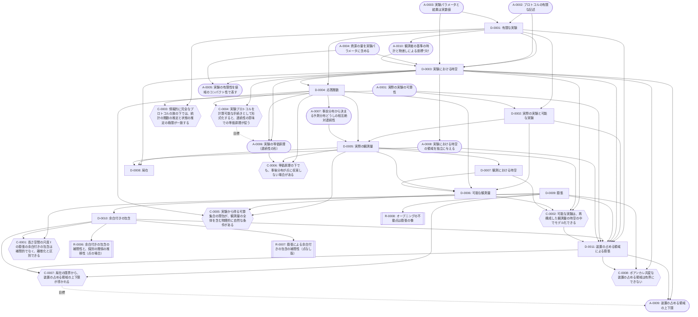

# フレームワーク：観測から点なし時空を基礎づける

最終更新: 2026-09-29（第 15 回。QBism との比較の節（4.2 節）を加えた）

このファイルは、本プロジェクトの物理のフレームワークの最新版です。セッションの終わりごとに更新します（[`CLAUDE.md`](CLAUDE.md) の「セッションの終え方」）。

## 1. 位置づけ

本プロジェクトの目的は、点なし位相（point-free topology）の考え方を物理学に応用することです。その中心として、「観測」と「実験」を定式化し、そこから点なしの時空を基礎づけるフレームワークを作ります。

- 時空は、観測結果を説明する数学的なモデルと考える（第 07 回のユーザーの構想）。
- 実験装置の時計や物差しで測った「実験における時空」（[D-0003](definitions/D-0003.md)）と、観測量から再構成する「観測における時空」（[D-0007](definitions/D-0007.md)）を分ける。
- フレームワークは数学基礎論のような位置づけで考える（第 08 回のユーザーの方針）。唯一の正しい時空の再構成を探すのではなく、「観測」や「実験」の形式化に様々な前提や制約を課し、得られる体系の特徴を比べる。

## 2. 構成要素の種類

| 種類 | 置き場所 | 内容 |
| --- | --- | --- |
| 定義 | [`definitions/`](definitions/README.md)（`D-NNNN`） | 本プロジェクト独自の概念の定義 |
| 前提 | [`assumptions/`](assumptions/README.md)（`A-NNNN`） | 議論の土台とする仮定（作業上のものと未定の候補を含む） |
| 予想 | [`conjectures/`](conjectures/README.md)（`C-NNNN`） | 未検証の主張 |
| 結果 | [`results/`](results/README.md)（`R-NNNN`） | 検証済みの主張 |

定義と前提の状態は、採用・作業上・未定・廃止の 4 段階です（[定義の一覧](definitions/README.md) の「状態」）。未完成の部分は、状態で明示します。

## 3. 構成の層

構成の順序は、第 09 回にユーザーと合意したものです。

```math
\text{実験} \;→\; \text{観測量} \;→\; \text{観測量の時空} \;→\; \text{可能な実験} \;→\; \text{可能な観測量} \;→\; \text{点なし時空}
```

| 層 | 内容 | 定義 | 前提 | 予想 |
| --- | --- | --- | --- | --- |
| 1. 実験 | 実際に行われる有限な実験と、そのパラメータの空間 | [D-0001](definitions/D-0001.md) 有限な実験（作業上）<br>[D-0002](definitions/D-0002.md) 実際の実験と可能な実験（作業上）<br>[D-0003](definitions/D-0003.md) 実験における時空（作業上）<br>[D-0009](definitions/D-0009.md) 膨張（作業上）<br>[D-0010](definitions/D-0010.md) 余白付きの包含（作業上） | [A-0001](assumptions/A-0001.md) 実際の実験の可算性（採用）<br>[A-0002](assumptions/A-0002.md) プロトコルの有限な記述（採用）<br>[A-0003](assumptions/A-0003.md) 実験パラメータと結果は実数値（採用）<br>[A-0004](assumptions/A-0004.md) 資源の量を実験パラメータに含める（採用）<br>[A-0005](assumptions/A-0005.md) 実験の有限性を値域のコンパクト性で表す（作業上）<br>[A-0006](assumptions/A-0006.md) 実験の等価原理（採用）<br>[A-0008](assumptions/A-0008.md) 実験における時空の領域を独立に与える（作業上）<br>[A-0010](assumptions/A-0010.md) 観測者の基準の時計と物差しによる座標づけ（作業上） | [C-0004](conjectures/C-0004.md) 等価原理は計算可能性から従う |
| 2. 観測量 | 実際の実験の族の極限としての観測量と、その局在 | [D-0004](definitions/D-0004.md) 応答関数（作業上）<br>[D-0005](definitions/D-0005.md) 実際の観測量（作業上）<br>[D-0008](definitions/D-0008.md) 局在（作業上） | [A-0007](assumptions/A-0007.md) 事前分布から決まる予測分布どうしの相互絶対連続性（採用） | [C-0003](conjectures/C-0003.md) 統計の関数と状態の推定の対応<br>[C-0005](conjectures/C-0005.md) 可算集合の閉包が観測量を含む条件<br>[C-0006](conjectures/C-0006.md) 事後分布が点に収束しない場合 |
| 3. 観測量の時空 | 実際の観測量から再構成する点なしの空間 | [D-0007](definitions/D-0007.md) 観測における時空（作業上） | （未定） | [C-0002](conjectures/C-0002.md) 可能な実験は観測量の時空の中でモデル化できる |
| 4. 可能な実験 | 観測量の時空の中でモデル化した装置で記述し直した実験 | （[D-0002](definitions/D-0002.md) の可能な実験を、この層で記述し直す）<br>[D-0011](definitions/D-0011.md) 装置の占める領域による膨張（作業上） | [A-0009](assumptions/A-0009.md) 装置の占める領域の上下限（作業上） | [C-0002](conjectures/C-0002.md)<br>[C-0007](conjectures/C-0007.md) 局在の限界から装置の占める領域の上下限が導かれる<br>[C-0008](conjectures/C-0008.md) ポアンカレ共変な装置の占める領域は有界にできない |
| 5. 可能な観測量 | 可能な実験の族の極限としての観測量 | [D-0006](definitions/D-0006.md) 可能な観測量（作業上） | （未定） | |
| 6. 点なし時空 | 時間と空間の構造を持つ点なしの空間と、その極限 | （未定） | （未定） | [C-0001](conjectures/C-0001.md) 長さ空間の尺度 ℓ の膨張の余白付きの包含は補間的でなく、離散化と区別できる |

第 12 回に、C-0001 の「区別」を、実験における時空の言葉（装置の占める領域 $`\mathrm{occ}`$ による膨張。[D-0011](definitions/D-0011.md)）で書き直し、C-0001 を数学の部分（C-0001）、物理から装置の占有範囲の上下限を導く部分（[C-0007](conjectures/C-0007.md)）、共変性との緊張（[C-0008](conjectures/C-0008.md)）に分けました。第 13 回に、D-0011（と A-0009・C-0007・C-0008）は可能な実験についての定義・前提・予想であることを明記し、層 4 に移しました（ユーザーの指摘）。数学の部分 C-0001 は、長さ空間の開集合フレームに、距離から得た膨張を付加した構造についての主張で、フレームが点なしのままでよいこと（離散化との区別）を含むので層 6 に置いています。距離を使わない純粋な点なし版は、まだ定式化していません（C-0001 の詳細化の論点）。

層 6 の中身は、第 07 回のユーザーの構想の 3〜5（観測する側とされる側の対称性による座標系の誘導、点なし時空、一般相対論の時空連続体への極限）で、まだ定義・前提・予想として登録していません。

## 4. 依存関係の図

四角は定義、角丸は前提、六角形は予想、二重枠は結果です。実線の矢印は「依存される側 → 依存する側」を、点線の矢印（「目標」）は「予想 → その予想が定理として導こうとする前提」を表します。この図は、各ファイルの「依存する ID」と「目標の ID」から `python3 tools/deps_graph.py` で生成します。

<!-- deps-graph:start（tools/deps_graph.py が生成する。手で書き換えない） -->

<!-- deps-graph:end -->

## 4.1 圏論的な概観（第 14 回）

フレームワークの要素を圏論の言葉で見直した（[調査メモ](surveys/2026-09-29_14_categorical-overview.md)。対応はすべて見立てで、新しい定義・予想は登録していない）。骨組みは次の二つである（第 14 回にユーザーと決めた）。

- **層 1〜2：マルコフ圏**。応答関数（D-0004）はマルコフ核（$`\mathsf{Stoch}`$ の射）で、一つのモデルは、射の圏 $`\mathrm{Arr}(\mathsf{Stoch})`$ への関手とみなせる可能性がある（候補。型と可換性の決め方が先に要る）。状態と装置のモデルは固定せず、**モデル全体の圏**を取る（ユーザーの判断）。実際の観測量の推定（D-0005）は、モデルの空間の上のベイズの逆と、コルモゴロフ積の上の極限として読める（A-0007 から期待できるのは事後予測の一致で、モデルの上の事後分布の一致ではない）。
- **層 3〜5：随伴の不動点**。観測量から空間を再構成する構成（D-0007）と、空間の中で可能な実験を記述し直す構成（C-0002・D-0006）を随伴とみなし、整合条件（D-0003）と不動点の条件（D-0006）を、その単位と余単位が同型になる対象として一つにまとめる見込みがある。

局在（D-0008）は領域の順序集合からの関手（AQFT のネット）、再構成（D-0007）の非可換な場合は Bohr トポス、膨張（D-0009）は収縮とのガロア接続として、その上に載る。

## 4.2 QBism との比較：主体の間の一致（第 15 回）

層 2 の推定（D-0005）と主体の間の一致（A-0007）を、QBism の量子 de Finetti 定理による一致と比べた（[調査メモ](surveys/2026-09-29_15_qbism-agreement.md)）。

- 調査した QBism の一致の主張は、交換可能性、情報的に完全な測定、データが指す状態の近傍に各主体の事前分布が正の確率を置くこと、を課して、将来の系の状態の割り当て（測っていない観測量の予測を含む）の一致まで得る、とする。ただし、読んだ文献の中に、この一致の主張の証明はない。
- 本プロジェクトは、交換可能性を課さず、予測分布の相互絶対連続性（A-0007）から将来のデータの予測の一致だけを得て、推定の対象の一致は識別可能性と事後分布の集中（D-0005 の未解決の点）に分ける。両者は矛盾しない。交換可能で情報的に完全な場合には、A-0007 は事前分布の相互絶対連続性と同値になる（Claude の補足）。
- QBism の文献で一致しない例として挙げられるものは、どれも予測分布が互いに絶対連続でなく、A-0007 の対象外である（Claude の補足。例の一つは、測定の設定についての仮定の下で確かめた）。

## 5. 結果の位置づけ

登録済みの結果 [R-0001](results/R-0001.md)〜[R-0008](results/R-0008.md) は、点なし位相の基礎（フレームの点と素元、完備ブール代数の点とアトム、余白付きの包含と膨張など）についての数学の結果です。第 12 回に、R-0006・R-0007 を余白付きの包含（[D-0010](definitions/D-0010.md)）に、R-0008 を膨張（[D-0009](definitions/D-0009.md)）に結び付けました。R-0001〜R-0005 は、まだフレームワークの定義・前提に結び付けていません。

## 6. 主な未完成の部分

各ファイルの「未解決の点」のうち、フレームワーク全体に関わるものです。

- 極限の位相と、事後分布を置く空間（[D-0005](definitions/D-0005.md)）。
- 実験における時空 $`X`$ の位相と、観測における時空との整合条件（[D-0003](definitions/D-0003.md)）。
- 観測における時空を再構成するときの入力と一意性（[D-0007](definitions/D-0007.md)）。
- 層 4・6 の定義と前提。

これらを含む作業の順序は、[ロードマップ](roadmap.md) で管理します。
