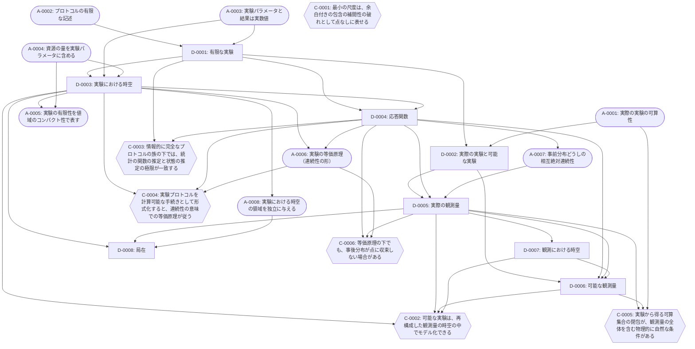

# フレームワーク：観測から点なし時空を基礎づける

最終更新: 2026-09-29（第 10 回、初版）

このファイルは、本プロジェクトの物理のフレームワークの最新版です。セッションの終わりごとに更新します（[`CLAUDE.md`](CLAUDE.md) の「セッションの終え方」）。

## 1. 位置づけ

本プロジェクトの目的は、点なし位相（point-free topology）の考え方を物理学に応用することです。その中心として、「観測」と「実験」を定式化し、そこから点なしの時空を基礎づけるフレームワークを作ります。

- 時空は、観測結果を説明する数学的なモデルと考える（第 07 回のユーザーの構想）。
- 実験装置の時計や物差しで測った「実験における時空」（[D-0003](definitions/D-0003.md)）と、観測量から再構成する「観測における時空」（[D-0007](definitions/D-0007.md)）を分ける。
- フレームワークは数学基礎論のような位置づけで考える（第 08 回のユーザーの方針）。唯一の正しい時空の再構成を探すのではなく、「観測」や「実験」の形式化に様々な前提や制約を課し、得られる体系の特徴を比べる。

## 2. 構成要素の種類

| 種類 | 置き場所 | 内容 |
| --- | --- | --- |
| 定義 | [`definitions/`](definitions/README.md)（`D-NNNN`） | 本プロジェクト独自の概念の定義 |
| 前提 | [`assumptions/`](assumptions/README.md)（`A-NNNN`） | 議論の土台として採用する仮定 |
| 予想 | [`conjectures/`](conjectures/README.md)（`C-NNNN`） | 未検証の主張 |
| 結果 | [`results/`](results/README.md)（`R-NNNN`） | 検証済みの主張 |

定義と前提の状態は、採用・作業上・未定・廃止の 4 段階です（[定義の一覧](definitions/README.md) の「状態」）。未完成の部分は、状態で明示します。

## 3. 構成の層

構成の順序は、第 09 回にユーザーと合意したものです。

```math
\text{実験} \;→\; \text{観測量} \;→\; \text{観測量の時空} \;→\; \text{可能な実験} \;→\; \text{可能な観測量} \;→\; \text{点なし時空}
```

| 層 | 内容 | 定義 | 前提 | 予想 |
| --- | --- | --- | --- | --- |
| 1. 実験 | 実際に行われる有限な実験と、そのパラメータの空間 | [D-0001](definitions/D-0001.md) 有限な実験（作業上）<br>[D-0002](definitions/D-0002.md) 実際の実験と可能な実験（作業上）<br>[D-0003](definitions/D-0003.md) 実験における時空（作業上） | [A-0001](assumptions/A-0001.md) 実際の実験の可算性（採用）<br>[A-0002](assumptions/A-0002.md) プロトコルの有限な記述（採用）<br>[A-0003](assumptions/A-0003.md) 実験パラメータと結果は実数値（採用）<br>[A-0004](assumptions/A-0004.md) 資源の量を実験パラメータに含める（採用）<br>[A-0005](assumptions/A-0005.md) 実験の有限性を値域のコンパクト性で表す（作業上）<br>[A-0006](assumptions/A-0006.md) 実験の等価原理（採用）<br>[A-0008](assumptions/A-0008.md) 実験における時空の領域を独立に与える（未定） | [C-0004](conjectures/C-0004.md) 等価原理は計算可能性から従う |
| 2. 観測量 | 実際の実験の族の極限としての観測量と、その局在 | [D-0004](definitions/D-0004.md) 応答関数（作業上）<br>[D-0005](definitions/D-0005.md) 実際の観測量（作業上）<br>[D-0008](definitions/D-0008.md) 局在（作業上） | [A-0007](assumptions/A-0007.md) 事前分布どうしの相互絶対連続性（採用） | [C-0003](conjectures/C-0003.md) 統計の関数と状態の推定の対応<br>[C-0005](conjectures/C-0005.md) 可算集合の閉包が観測量を含む条件<br>[C-0006](conjectures/C-0006.md) 事後分布が点に収束しない場合 |
| 3. 観測量の時空 | 実際の観測量から再構成する点なしの空間 | [D-0007](definitions/D-0007.md) 観測における時空（作業上） | （未定） | [C-0002](conjectures/C-0002.md) 可能な実験は観測量の時空の中でモデル化できる |
| 4. 可能な実験 | 観測量の時空の中でモデル化した装置で記述し直した実験 | （未定。[D-0002](definitions/D-0002.md) の可能な実験を、この層で記述し直す） | （未定） | [C-0002](conjectures/C-0002.md) |
| 5. 可能な観測量 | 可能な実験の族の極限としての観測量 | [D-0006](definitions/D-0006.md) 可能な観測量（作業上） | （未定） | |
| 6. 点なし時空 | 時間と空間の構造を持つ点なしの空間と、その極限 | （未定） | （未定） | [C-0001](conjectures/C-0001.md) 最小の尺度は余白付きの包含の補間性の破れとして表せる（土台の定義は、C-0001 の見直しのときに移す） |

層 6 の中身は、第 07 回のユーザーの構想の 3〜5（観測する側とされる側の対称性による座標系の誘導、点なし時空、一般相対論の時空連続体への極限）で、まだ定義・前提・予想として登録していません。

## 4. 依存関係の図

四角は定義、角丸は前提、六角形は予想、二重枠は結果です。矢印は「依存される側 → 依存する側」を表します。この図は、各ファイルの「依存する ID」から `python3 tools/deps_graph.py` で生成します。

<!-- deps-graph:start（tools/deps_graph.py が生成する。手で書き換えない） -->

<!-- deps-graph:end -->

## 5. 結果の位置づけ

登録済みの結果 [R-0001](results/R-0001.md)〜[R-0008](results/R-0008.md) は、点なし位相の基礎（フレームの点と素元、完備ブール代数の点とアトム、余白付きの包含と膨張など）についての数学の結果です。層 6 の予想 C-0001 の土台になりますが、フレームワークの定義・前提にはまだ結び付けていません。C-0001 の見直しのときに、依存関係を加えます。

## 6. 主な未完成の部分

各ファイルの「未解決の点」のうち、フレームワーク全体に関わるものです。

- 極限の位相と、事後分布を置く空間（[D-0005](definitions/D-0005.md)）。
- 実験における時空 $`X`$ の位相と、観測における時空との整合条件（[D-0003](definitions/D-0003.md)）。
- 観測における時空を再構成するときの入力と一意性（[D-0007](definitions/D-0007.md)）。
- 層 4・6 の定義と前提。

作業の順序は、ロードマップ（`roadmap.md`。第 11 回に初版を作る予定）で管理します。
