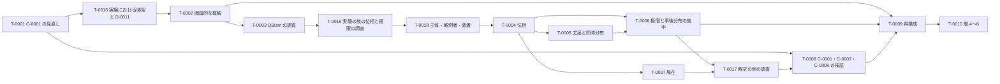

# 2026-09-30 第 19 回: 量子・古典の実験の要件と、設定・時空の用語の整理

> この記録は Claude Code のセッション記録から `tools/export_log.py` で自動変換したものです。
> ツールの呼び出しは折りたたんで表示し、個人情報などは伏せ字にしています。

## ユーザー

調査ありがとうございます。`2026-09-30_17_comparison-of-experiments.md` と `2026-09-30_18_limit-topology.md` を確認しました。いくつかコメントさせてください。

本プロジェクトの目的として、量子重力理論への寄与があります。それが、「時空を背景とせず、量子的な観測結果から時空を再構成したい」という、フレームワーク構築の動機となっています。そこで、このフレームワークの要件として、量子的な観測と古典的な観測の両方、もしくはそれらのハイブリッドを「実験」として扱えるようにしたいです。Le Cam の実験の弱収束と、Ludwig の一様構造、両方を調査していただきましたが、この要件に合うのはどちらの研究でしょうか？

また、既存研究をこのフレームワークに適用するにあたって、フレームワーク中の概念を改めて整理して、既存研究の概念と対応づくようにしたいです。「T-0018 主体・観測者・装置の使い分け」もそのタスクの一つになりますが、「時空」に関する概念、特に「実験における時空」と「パラメータ」が分かりにくいように思います。

D-0003 では、「実験における時空 X は、可能な実験パラメータの組全体の空間である」と定義しましたが、X を「プロトコル全体の設定の空間」とし、観測者 O の時空の部分を「観測者 O の実験における時空」と定義するのはいかがでしょうか？ 現状だと D-0003 の中で「時空」が二重の意味に使われていて、分かりにくくなっています。また、現状の D-0003 だと、「時空の部分」と「設定の部分」を単純に分けていますが、実は相関があるのではないかと考えています。「設定の部分」の値によって、「観測者 O の基準の時計と物差しとの較正」に補正をかけなければいけないような場合です。その場合、 τ_π^O : X_π → M_O は単純な射影ではなく、複雑な関数になるかもしれません。X_π を「プロトコル π の設定の空間」、M_O を「観測者 O の実験における時空」と定義するのが概念的にすっきりすると思います。そうすると、D-0003 の前半 1 ～ 2 は「設定の空間」という用語に統一でき、既存研究の概念と対応させやすくなると思います。いかがでしょうか？

次に「パラメータ」ですが、本プロジェクトでは「実験パラメータ」 の意味で使われることが多いと思いますが、既存研究では、「パラメータ」の用語は、ベイズ推定で推定するパラメータ (本プロジェクトにおける応答関数のパラメータ) を指すことが多いように思います。「実験パラメータ」を「設定」に統一する方がよいと思いますが、いかがでしょうか？

最後に、ロードマップの「段階 A」 およびその関連調査が今回のセッションで終わりになると思います。再確認ですが、「段階 A」で必要な調査は完了と見てよいでしょうか？ もし調査に穴があれば、教えてください。

<details><summary>ツール: Bash</summary>

```text
cd /home/user/point-free-spacetime && git fetch -q origin main && git checkout -q -B claude/zealous-keller-o7r1sv origin/main && git log -1 --oneline && cat NEXT.md && cat definitions/D-0003.md && ls definitions assumptions conjectures
```

</details>

<details><summary>結果: Bash</summary>

```text
872f130 Merge pull request #35 from kittenkiki15/claude/zealous-keller-o7r1sv
# 次のセッションでやること

最終更新: 2026-09-30（第 18 回セッションの後）

## 状況

- 第 01 回：リポジトリの運用ルールを決め、自動検証（Lean・Python・クロスモデルレビュー）を整えた。
- 第 02 回：点なし位相と論理・様相論理・因果・量子論のつながりを整理し、調査メモ・用語一覧・記号一覧・参考文献一覧を作った（[まとめ](summaries/2026-09-25_02_pointfree-logic.md)）。
- 第 03 回：Heunen–van der Schaaf の 2 本の論文メモを作り、「完備ブール代数の点はアトムと対応する」を Lean で形式化した（[まとめ](summaries/2026-09-25_03_ordered-locales.md)）。
- 第 04 回：第 03 回の結果をユーザーと確認し、論文メモを修正した。検証済みの主張を「結果」として管理する [`results/`](results/README.md) を作った（[まとめ](summaries/2026-09-25_04_review-and-results.md)）。
  - ユーザーの方針：予想の価値の主軸は、数学ではなく**物理学への寄与**（厳密な定義のない物理の概念や主張に数学的な定式化を与えることなど）に置く。
- 第 05 回：最小の長さと操作的な領域の構造について、おもちゃのモデルを多角的に検討した。最小の尺度の入れ方を型 I（小さい領域を捨てる）と型 II（余白に下限を置く）に分け、型 II を「膨張 $`N`$ による余白付きの包含が補間的でないこと」として点なしに表した。文献を調べ、数学の部分は既知と確認して結果 R-0006〜R-0008 に登録し、最初の予想 [C-0001](conjectures/C-0001.md)（優先度：高、[Issue #8](https://github.com/kittenkiki15/point-free-spacetime/issues/8)）を立てた（[まとめ](summaries/2026-09-26_05_minimal-scale.md)、[調査メモ](surveys/2026-09-26_05_subordination.md)）。
- 第 06 回：C-0001 を見直す前の先行研究の調査を行った。主張 4 と同じ型の no-go 型の結果（因果集合の非局所性、粒子の局在）、測定と局所性（Sorkin の不可能な測定、Fewster–Verch のプローブによる測定の枠組み）、最小の長さの観測者非依存性（DFR、Hossenfelder）を原典で確かめた。主張 4 は「単一の不変な関係」の no-go 定理として既知の型に属し、先行研究（Fewster–Verch の測定の構成の共変性など）から着想して、「区別」を観測者側のデータを添字にした族として扱う方針を立てた（見立て）。ユーザーの提案で、宇宙の有限性を赤外の上限として入れ、紫外と赤外の二つの尺度から実効的な尺度が現れるかを問う方向で、C-0001 を見直すことにした（[まとめ](summaries/2026-09-26_06_minimal-length-covariance.md)、[調査メモ](surveys/2026-0
…（以下 11900 文字を省略）
```

</details>

<details><summary>ツール: Bash</summary>

```text
grep -n "^#\|段階" roadmap.md | head -80
```

</details>

<details><summary>結果: Bash</summary>

```text
1:# ロードマップ
7:## 1. 使い方
11:- 順序は、第 11 回にユーザーと相談して決めた（2 節）。第 13 回に、ユーザーの提案で T-0015（D-0003 の未解決の点の解決）を T-0002 の前に加えた。第 15 回に、調査が不足している領域を洗い出し、Claude の提案にユーザーが賛成して、調査のタスク T-0016（段階 B の前）と T-0017（T-0008 の前）を加えた。優先の順は、状況に応じてユーザーと相談して見直す。
13:## 2. 進める順序
18:\text{T-0001} \;→\; \text{T-0015} \;→\; \text{T-0002} \;→\; \text{T-0003} \;→\; \text{T-0016} \;→\; \text{T-0018} \;→\; \text{段階 B（T-0004〜T-0007）} \;→\; \text{T-0017} \;→\; \text{T-0008} \;→\; \text{段階 C（T-0009）} \;→\; \text{段階 D（T-0010）}
21:| 段階 | 内容 | タスク |
33:T-0015 は、番号は後から付けたが、順序は T-0001 の次である。T-0016 は T-0003 の次、T-0018 は T-0016 の次（第 16 回にユーザーと決めた）、T-0017 は段階 B の次（T-0008 の前）である。
35:## 3. タスク
39:| ID | タスク | 段階 | 前提のタスク | 関係する ID | 状態 |
51:| T-0011 | 予想 C-0002〜C-0006 の詳細化 | 随時 | 関係する段階のタスク | [C-0002](conjectures/C-0002.md)〜[C-0006](conjectures/C-0006.md) | 未着手 |
84:## 4. 各タスクの内容
86:### T-0001 予想 C-0001 の見直し（第 12 回に完了）
94:### T-0002 フレームワークの圏論的な概観（第 14 回に完了）
112:### T-0003 QBism の先行研究の調査（第 15 回に完了）
119:### T-0004 実験パラメータの空間と、結果の統計の空間の位相
128:### T-0005 尤度と同時分布、主体の間で共有するデータの空間
132:- [A-0007](assumptions/A-0007.md)：予測分布を作る同時分布と尤度、主体の間で共有するデータの空間、適用範囲。前提を相互とするか片側とするか、フレームワークで採る一致の段階（第 16 回に加えた論点。ユーザーの判断で次に回した）。
134:### T-0006 極限と事後分布の集中
141:### T-0007 局在の詳細化
147:### T-0008 C-0001・C-0007・C-0008 の検証
155:### T-0009 観測における時空の再構成
167:### T-0010 層 4〜6 の定義と前提
173:### T-0011 予想 C-0002〜C-0006 の詳細化
177:### T-0012 ほかの予想の候補
185:### T-0013 `framework.md` の層別の表の検査
189:### T-0014 文献の未確認事項の確認
201:### T-0015 D-0003 の未解決の点の解決と、D-0011 を可能な実験の定義に改めること（
…（以下 472 文字を省略）
```

</details>

<details><summary>ツール: Bash</summary>

```text
sed -n 13,60p roadmap.md && sed -n 112,135p roadmap.md && sed -n 206,260p roadmap.md
```

</details>

<details><summary>結果: Bash</summary>

````text
## 2. 進める順序

C-0001 の見直しに必要な定義と前提から先に固め（第 09 回の PR #22 で決めた方針）、そのあとでフレームワークの層を下から順に詳しくしていく。

```math
\text{T-0001} \;→\; \text{T-0015} \;→\; \text{T-0002} \;→\; \text{T-0003} \;→\; \text{T-0016} \;→\; \text{T-0018} \;→\; \text{段階 B（T-0004〜T-0007）} \;→\; \text{T-0017} \;→\; \text{T-0008} \;→\; \text{段階 C（T-0009）} \;→\; \text{段階 D（T-0010）}
```

| 段階 | 内容 | タスク |
| --- | --- | --- |
| A | C-0001 の見直し、実験における時空の詳細化、フレームワークの概観 | T-0001、T-0015、T-0002 |
| （調査） | QBism の先行研究、実験の族の位相と極限 | T-0003、T-0016 |
| （用語） | 主体・観測者・装置の使い分け | T-0018 |
| B | 層 1・2（実験・観測量）の詳細化 | T-0004〜T-0007 |
| （調査） | 時空の側の先行研究（因果構造からの再構成、局在の不可能性の定理、操作的な座標づけ） | T-0017 |
| （検証） | C-0001・C-0007・C-0008 の検証 | T-0008 |
| C | 層 3（観測量の時空）の再構成 | T-0009 |
| D | 層 4〜6（可能な実験・可能な観測量・点なし時空） | T-0010 |
| 随時 | 予想の詳細化、予想の候補、運用、文献 | T-0011〜T-0014 |

T-0015 は、番号は後から付けたが、順序は T-0001 の次である。T-0016 は T-0003 の次、T-0018 は T-0016 の次（第 16 回にユーザーと決めた）、T-0017 は段階 B の次（T-0008 の前）である。

## 3. タスク

状態は、未着手・進行中・完了・保留のどれかです。

| ID | タスク | 段階 | 前提のタスク | 関係する ID | 状態 |
| --- | --- | --- | --- | --- | --- |
| T-0001 | 予想 C-0001 の見直し（第 12 回） | A | なし | [C-0001](conjectures/C-0001.md)、[C-0007](conjectures/C-0007.md)、[C-0008](conjectures/C-0008.md)、[D-0008](definitions/D-0008.md)、[R-0001](results/R-0001.md)〜[R-0008](results/R-0008.md) | 完了 |
| T-0002 | フレームワークの圏論的な概観（第 14 回） | A | T-0001 | [framework.md](framework.md) のすべての要素 | 完了 |
| T-0003 | QBism の先行研究の調査（第 15 回） | 調査 | なし | [D-0005](definitions/D-0005.md)、[A-0007](assumptions/A-0007.md)、[C-0003](conjec
…（以下 9445 文字を省略）
````

</details>

<details><summary>ツール: Bash</summary>

```text
for f in definitions/D-0001.md definitions/D-0002.md definitions/D-0004.md assumptions/A-0002.md assumptions/A-0003.md assumptions/A-0010.md; do echo "=== $f"; sed -n '/^## 定義\|^## 主張/,/^## 未解決/p' $f; done
```

</details>

<details><summary>結果: Bash</summary>

````text
=== definitions/D-0001.md
## 定義

**有限な実験**とは、一つの実験プロトコル $`π`$ に従い、有限回の操作と観測を行って、有限個の結果を読み出すものである。一つの有限な実験について、次を指定する。

- プロトコル $`π`$（有限の記述を持つ。[A-0002](../assumptions/A-0002.md)）
- 設定 $`x ∈ X_π`$：プロトコル $`π`$ の設定の空間 $`X_π`$ の元。初期状態の条件と測定の条件を定める実数値のパラメータの組（[A-0003](../assumptions/A-0003.md)）
- 結果の空間 $`Y_π`$ と、読み出した有限個の結果（実数値。[A-0003](../assumptions/A-0003.md)）

## 注意

- 実験を行う観測者の世界線の区間（実験の期間）と、装置と操作が占める実験における時空の領域とは区別する。
- 設定の空間 $`X_π`$ と結果の空間 $`Y_π`$ は、プロトコルごとに異なりうる。
- 有限な実験に何を対応させるか（結果の統計）は [D-0004](D-0004.md) で定める。

## 未解決の点
=== definitions/D-0002.md
## 定義

- **可能な実験**：プロトコル $`π`$ と設定 $`x ∈ X_π`$ の組 $`(π, x)`$。一般に非可算個ある。
- **実際の実験**：実際に行われた有限な実験（[D-0001](D-0001.md)）。行ったときの組 $`(π, x)`$ と、得た結果の記録からなる。[A-0001](../assumptions/A-0001.md) により、実際の実験の全体は高々可算である。

## 注意

- 実際の観測量（[D-0005](D-0005.md)）は実際の実験から、可能な観測量（[D-0006](D-0006.md)）は可能な実験から定める。
- 構成の順序では、可能な実験は、実際の観測量から再構成した観測量の時空の中で記述し直す（[C-0002](../conjectures/C-0002.md)）。

## 未解決の点
=== definitions/D-0004.md
## 定義

プロトコル $`π`$ ごとに、設定 $`x ∈ X_π`$ に、結果の空間 $`Y_π`$ の上の確率分布 $`p_π(\,\cdot \mid x)`$（その設定での結果の統計）を対応させる写像を考える。

```math
p_π : X_π → \mathrm{Prob}(Y_π)
```

その族 $`(π, x) ↦ p_π(\,\cdot \mid x)`$ を**応答関数**（統計の関数）と呼ぶ。$`\mathrm{Prob}(Y_π)`$ は $`Y_π`$ の上の確率分布の空間である。

## 注意

- 第 09 回に、「観測量を推定する」とは応答関数を推定することだと読んだ（ユーザーが確認）。
- 各設定での統計だけでは、複数回の結果に対する尤度は決まらない（各回が独立か、相関しているかで尤度が変わる）。
- 量子論で、状態を密度作用素で表せる場合（正規状態）には、設定 $`x`$ の準備の部分で決まる密度作用素 $`ρ_{π,x}`$ と、測定の部分で決まる結果の空間の上の POVM $`E_{π,x}`$ を用いて $`p_π(B \mid x) = \mathrm{Tr}(ρ_{π,x}\, E_{π,x
…（以下 1658 文字を省略）
````

</details>

<details><summary>ツール: Bash</summary>

```text
echo "実験パラメータ:"; grep -rl "実験パラメータ" --include=*.md . | grep -v '^./logs' | sort | tr '\n' ' '; echo; echo "実験における時空:"; grep -rl "実験における時空" --include=*.md . | grep -v -e '^./logs' -e '^./summaries' -e '^./surveys' | sort | tr '\n' ' '; echo; echo "時空の部分:"; grep -rl "時空の部分" --include=*.md . | grep -v -e '^./logs' -e '^./summaries' -e '^./surveys'| tr '\n' ' '; echo; grep -n "Θ.*読む\|推定の対象の空間と読む" definitions/D-0005.md | cut -c1-80
```

</details>

<details><summary>結果: Bash</summary>

```text
実験パラメータ:
./NEXT.md ./assumptions/A-0003.md ./assumptions/A-0004.md ./assumptions/A-0005.md ./assumptions/A-0006.md ./assumptions/README.md ./conjectures/C-0004.md ./conjectures/C-0007.md ./definitions/D-0003.md ./framework.md ./glossary.md ./roadmap.md ./summaries/2026-09-27_07_observation-and-experiment.md ./summaries/2026-09-28_08_observation-as-limit.md ./summaries/2026-09-29_09_actual-and-possible-observables.md ./summaries/2026-09-29_10_definitions-and-framework.md ./surveys/2026-09-28_08_observation-as-limit.md ./symbols.md 
実験における時空:
./NEXT.md ./assumptions/A-0004.md ./assumptions/A-0005.md ./assumptions/A-0008.md ./assumptions/A-0010.md ./assumptions/README.md ./conjectures/C-0002.md ./definitions/D-0001.md ./definitions/D-0003.md ./definitions/D-0007.md ./definitions/D-0008.md ./definitions/D-0009.md ./definitions/D-0011.md ./definitions/README.md ./framework.md ./glossary.md ./roadmap.md ./symbols.md 
時空の部分:
./symbols.md ./definitions/D-0003.md ./definitions/D-0011.md ./conjectures/C-0008.md ./assumptions/A-0008.md ./assumptions/A-0010.md ./assumptions/A-0009.md ./NEXT.md ./roadmap.md 
32:  - 第 17 回の候補（[調査メモ](../surveys/2026-09-30_17_comparison-
```

</details>

## Claude

ご意見ありがとうございます。4 点それぞれに、私の見立てを述べます。以下の文献名のうち、今回まだ本文を確かめていないものは「記憶による」と書いています。

#### 1. 量子・古典・混成の観測を「実験」として扱う要件に合うのはどちらか

**結論**：実験を量子・古典・混成について統一して記述する枠組みとしては、Ludwig（とその後継の一般化確率論）が合います。Le Cam は、その枠組みの上で有限な実験の族の極限を扱う道具として使う、という役割分担になると考えます。二つは答えている問いが違うので、どちらか一方を選ぶものではありません。

| | Ludwig・一般化確率論 | Le Cam |
| --- | --- | --- |
| 基本の対象 | 準備（状態）と登録（効果）の組 | 推定の対象 $`θ ∈ Θ`$ で添字づけた、結果の分布の族 |
| 量子・古典・混成 | 同じ枠組みに入る（古典は単体、量子は密度作用素、混成は両者を組み合わせた状態空間。混成の部分は記憶による） | 結果が古典的な記録なら、量子でもそのまま使える（$`θ = ρ`$ として、$`p(B) = \mathrm{Tr}(ρ E(B))`$） |
| 量子らしさの表れ方 | 状態空間と効果空間の形 | $`θ ↦ p_θ`$ の形の中にしか現れない |
| 位相を入れる側 | 状態の側（有限個の効果で区別する） | 実験の側（有限個の $`θ`$ に制限する） |

補足が 2 点あります。

- **今の定義は、すでに半分この要件を満たしています。** D-0001・D-0004 では結果は実数値の記録で（A-0003）、量子の測定は応答関数の形 $`\mathrm{Tr}(ρE)`$ として入ります。これは Ludwig と同じ立場です。足りないのは、どの応答関数の族が量子的・古典的・混成的かを区別する構造で、ここが一般化確率論の役割です。
- **「量子的な観測」の意味によって、必要な文献が変わります。**
  - (a) 量子系を測った古典的な記録を指すなら、今の Le Cam の調査で足ります。
  - (b) 出力が量子系のまま残る実験や、量子的な時計・物差し（量子参照系）を含めるなら、Le Cam の量子版（量子統計的実験の比較）が要ります。これはまだ調べていません。
  - 量子重力を目標にするなら、時計そのものが量子系である場合（b）は避けられないと思います。

#### 2. D-0003 の再編（設定の空間と、観測者の実験における時空）

**賛成です。** 今の D-0003 では「実験における時空」が $`X`$（設定全体）と $`M_O`$（時空の部分）の二つの意味に使われていて、ご指摘のとおり分かりにくくなっています。第 07 回の構想の「実験装置の中の時計や物差しで測ったものを記述するモデル」に当たるのは、むしろ $`M_O`$ の方です。

**相関の点も妥当で、物理的な例がすぐ挙がります。**

- 原子時計は磁場の中で周波数がずれ（二次のゼーマン効果）、磁場の設定値に応じて補正します。
- 物差しは温度で伸び縮みします（熱膨張）。
- 時計の進みは、装置の速度や重力ポテンシャルで変わります。

どれも「時空の読み以外の設定」に依存する較正の補正です。そのため $`τ^O_π : X_π → M_O`$ は射影ではなく、$`X_π`$ 全体の上の一般の連続写像とするのが正しいと思います。その結果、次の変更が必要になります。

- 「時空の部分」と「設定の部分」への分割（D-0003 の 3・4 項）はなくなります。代わりに「$`τ^O_π`$ が定まるプロトコル」と「$`τ^O_π`$ の形（較正のモデル）」を定めることになります。
- 未解決の点「どのパラメータを時計や物差しの読みとみなすか」も、「どのプロトコルに $`τ^O_π`$ を定め、その形をどう決めるか」に置き換わります。
- 補正のモデル（熱膨張率など）自体も実験から推定するものです。このため、観測における時空との整合条件（T-0009）に組み込まれます。
- 時計が量子系なら、$`τ^O_π`$ は関数ではなく、$`X_π → \mathrm{Prob}(M_O)`$ の確率的な写像（マルコフ核）になるかもしれません。これは今すぐ決める必要はありませんが、1 節の (b) とつながる論点です。

**影響の範囲**：「実験における時空」は定義・前提・予想など 17 ファイル、「時空の部分」は 9 ファイルに出てきます。一件一件書き換える作業になります。

1 ファイル 1 概念の原則からは、次の分け方を提案します。

- D-0003 を「設定の空間」（$`X_π`$ と $`X = ⨆_π X_π`$）にする。
- 新しい定義として「観測者 $`O`$ の実験における時空」（$`M_O`$、$`τ^O_π`$、$`σ^O_π`$）を立てる。

#### 3. 「実験パラメータ」から「設定」への統一

**賛成です。** 理由は二つあります。

- 統計学（Le Cam を含む）では、「パラメータ」は推定の対象 $`θ`$ を指します。本プロジェクトで言えば、応答関数を定める量に当たります。今のままでは、Le Cam の $`Θ`$ と実験パラメータが同じ語で衝突します。
- 「設定（setting）」は、ベル実験やデバイス非依存の文献の $`p(a \mid x)`$（$`x`$ が設定、$`a`$ が結果）と一致します（記憶による）。本プロジェクトの $`p_π(\,\cdot \mid x)`$ はまさにこの形です。

用語を統一すると、D-0005 の未解決の点「$`Θ`$ を推定の対象の空間と読むか、設定の空間と読むか」に自然な答えの候補が出ます。$`Θ`$ は推定の対象で、各設定 $`x`$ が一つの Le Cam の実験 $`θ ↦ p_π(\,\cdot \mid x; θ)`$ を定める、という読み方です。ただし、これは中身の決定なので、候補として記録するにとどめます。

「実験パラメータ」は 17 ファイル（まとめなどを含む）に出てきます。過去のまとめと対話ログは記録なので書き換えず、用語一覧に旧称として注記するのがよいと思います。

#### 4. 段階 A と関連調査は完了と見てよいか

段階 A のタスク（T-0001・T-0015・T-0002）は完了しています。関連調査のうち、1 節の要件から見て穴が二つあると考えます。

1. **Le Cam の量子版**（量子統計的実験の比較）：候補は Buscemi 2012、Jenčová、松本（啓史）、Guţă–Kahn の量子局所漸近正規性です（すべて記憶による）。1 節の (b) の意味を採るなら、段階 B の前に要ります。
2. **一般化確率論**（Hardy、Barrett、Chiribella–D'Ariano–Perinotti）：古典・量子・混成が同じ枠組みでどう区別されるか、複合系をどう扱うか、を調べます。T-0016 の残りに挙がっていながら、まだ手を付けていない部分です。

どちらも主な文献は arXiv にあるはずなので、私が取得できます。

優先度が低いものも挙げておきます。

- 弱い併合（Kalai–Lehrer）は、T-0005 に移せます。
- 量子時計・量子参照系、混成系の力学（Diósi、Oppenheim の古典重力の理論など。記憶による）は、T-0017 の「量子参照系」を広げる形で扱うのがよいと思います。
- 「設定」の用語の先行研究は、T-0018 の中で軽く確かめれば足ります。

#### ご相談したいこと

- **(A)** 「量子的な観測」は、1 節の (a) と (b) のどちらを想定していますか。
- **(B)** 2・3 節の再編は、今回のセッションの課題（T-0016 の対話）とは別のタスクです。CLAUDE.md の「1 セッション 1 タスク」に従い、T-0018 を「主体・観測者・装置、設定・時空・パラメータの概念と用語の整理」に広げて記録し、次回に行うことを提案します。今回、方針（2・3 節の形）の合意だけを記録に残す形でよいでしょうか。
- **(C)** 穴 1・2 はどう扱いますか。T-0016 をもう一回延ばして調べるか、T-0016 を閉じて新しい調査タスク（T-0018 の後、段階 B の前）にするか、のどちらかを考えています。(A) で (b) なら、どちらにしても段階 B の前に調べることを勧めます。

<details><summary>ツール: Bash</summary>

```text
git fetch -q --prune origin && git status -sb | head -2 && git log --oneline origin/claude/zealous-keller-o7r1sv..HEAD 2>&1 | head
```

</details>

<details><summary>結果: Bash</summary>

```text
## claude/zealous-keller-o7r1sv...origin/main
fatal: ambiguous argument 'origin/claude/zealous-keller-o7r1sv..HEAD': unknown revision or path not in the working tree.
Use '--' to separate paths from revisions, like this:
'git <command> [<revision>...] -- [<file>...]'
```

</details>

<details><summary>ツール: Bash</summary>

```text
git push -q -u origin claude/zealous-keller-o7r1sv 2>&1 | tail -2; git status -sb | head -1
```

</details>

<details><summary>結果: Bash</summary>

```text
remote:      https://github.com/kittenkiki15/point-free-spacetime/pull/new/claude/zealous-keller-o7r1sv        
remote: 
## claude/zealous-keller-o7r1sv...origin/claude/zealous-keller-o7r1sv
```

</details>

## Claude

作業ブランチ `claude/zealous-keller-o7r1sv` を push しました。PR #35 のマージの後、GitHub 上のこのブランチは削除されていました。そこで、第 19 回の作業用にローカルのブランチを最新の `main` に合わせてあり、それをそのまま push してブランチを作り直しています。私が書いた新しいコミットはありません。

前のメッセージの最後の、ご相談 (A)〜(C) へのお返事をお待ちしています。

- **(A)** 「量子的な観測」の意味は、(a) 量子系を測った古典的な記録と、(b) 出力が量子系のままの実験や量子的な時計を含むもの、のどちらですか。
- **(B)** D-0003 の再編と、「実験パラメータ」から「設定」への統一は、T-0018 を広げて次回に行う提案です。今回は方針の合意を記録するだけでよいでしょうか。
- **(C)** Le Cam の量子版と一般化確率論の調査が残っています。T-0016 をもう一回延ばして調べるか、新しい調査タスクにするか、どちらにしますか。

## ユーザー

(B) はご提案の内容でよいです。

(C) は新しい調査タスクにしましょう。

(A) は、(C) の調査結果を踏まえて判断したいです。「量子重力を目標にするなら、時計そのものが量子系である場合 (b) は避けられない」とのことですが、(a) も想定としてありえると考えています。現状、本プロジェクトは、「実際の観測結果は高々可算個の実数」という立場であり、(a) に寄っています。この立場だと、時計そのものが量子系である場合、「量子系である時計はあくまで物理モデルであり、観測結果ではない」という位置づけになると思います。「量子参照系は『可能な実験装置』の一部であり、実際に存在するのは最終的に量子系を測った古典的な記録のみ」という立場です。

## Claude

(A) についての整理に賛成します。「避けられない」と書いたのは言い過ぎでした。今の立場のままでも、量子的な時計は扱えます。

#### (A) の立場の整理

今の立場を「(a) の立場」と呼ぶことにします。実際に存在するのは、量子系を測った古典的な記録（高々可算個の実数）だけで、量子的な時計や量子参照系は「可能な実験装置」の物理モデルの一部だとする立場です。この立場は、A-0001・A-0003 や、実際の実験と可能な実験の区別（D-0002）とそのまま整合します。

この立場で量子的な時計を扱うと、次のようになります。

- **時計の読み**：時計の読みは古典的な記録なので、設定の値か結果の値として実数で残ります。
- **読みと座標の関係**：時計が量子系であることは、記録された読みと観測者の座標 $`M_O`$ の間の関係が確率的になる、という形で現れます。例えば、$`τ^O_π`$ を関数ではなくマルコフ核にするといった形です。これはモデルの側の話で、記録の側は古典的なままです。
- **推論の道具**：データの側の推論は、古典の Le Cam 理論で足ります。Le Cam の量子版が要るのは、可能な実験の層（層 4）で、量子的な装置のモデルどうしを比べる道具としてです。

新しい調査の目的は、どちらの立場を採るかを判断する材料を集めることです。そのため、調査の問いは次の形にするとよいと思います。

- (a) の立場で、量子参照系・量子時計の既存の扱いが、古典的な記録とモデルの組として書き直せるか。
- 書き直せない場合（本質的に (b) が要る場合）があるか。

#### 新しい調査タスクの案（T-0019）

- **名前**：量子・古典・混成の実験の扱いの先行研究の調査
- **内容**：
  1. 一般化確率論（Hardy、Barrett、Chiribella–D'Ariano–Perinotti）。古典・量子・混成の区別と、複合系の扱いを調べる。T-0016 の残りをここに移す。
  2. Le Cam の量子版（量子統計的実験の比較。Buscemi、Jenčová、松本（啓史）、Guţă–Kahn）。
  3. 量子参照系・量子時計（Page–Wootters、Giacomini–Castro-Ruiz–Brukner など）について、上の (a) と (b) の問いを立てる。
- **成果物**：調査メモと、(A) を判断するための材料
- **文献**：記憶によるもので、未確認です。主な文献は arXiv にあるはずです。
- **順序**：T-0018 の次、段階 B の前

#### T-0016 を閉じるかについて

(C) で新しいタスクにすると決まったので、T-0016 の残りの行き先は次のようになります。

- 一般化確率論は T-0019 に移す。
- 弱い併合（Kalai–Lehrer）は T-0005 に移す。
- 第 17・18 回の検算を証明の形で確かめることは T-0006 に移す。

この形で、今回 T-0016 を閉じてよいでしょうか。

もう一つ確認させてください。第 17 回の調査メモについての疑問点や、掘り下げたい点は、今回のコメントのほかにもありますか。なければ、次の 2 点に合意いただければ、今回の決定をまとめて記録します。

- 上の T-0019 の案と、T-0018 → T-0019 → 段階 B の順序
- T-0016 を閉じること

記録する場所は、`roadmap.md`、`NEXT.md`、D-0003・D-0005 の未解決の点です。

## ユーザー

上記の形で、今回のセッションで T-0016 を閉じてよいです。第 17 回の調査メモについての疑問点や、掘り下げたい点は、今回のコメントのほかにはありません。上の T-0019 の案と、T-0018 → T-0019 → 段階 B の順序も、ご提案通りで問題ありません。

<details><summary>ツール: Bash</summary>

```text
cd /home/user/point-free-spacetime && sed -n 1,11p roadmap.md; sed -n 58,83p roadmap.md; sed -n 128,146p roadmap.md; grep -n "T-0016\|T-0018\|第 18 回" framework.md | cut -c1-150
```

</details>

<details><summary>結果: Bash</summary>

````text
# ロードマップ

最終更新: 2026-09-30（第 18 回。T-0016 の続きとして極限の位相を調べた）

このファイルは、[フレームワーク](framework.md) を完成させるための作業の最新版です。セッションの終わりごとに更新します（[`CLAUDE.md`](CLAUDE.md) の「セッションの終え方」）。

## 1. 使い方

- 作業は**タスク**（`T-NNNN`）に分け、1 セッションで 1 タスク（大きいものはその一部）を扱う。次のセッションで扱うタスクは [`NEXT.md`](NEXT.md) に書く。
- 詳細化の論点の**本文**は、関係する定義・前提の「未解決の点」と、予想の「詳細化の論点」に置く（そこが正本）。ロードマップは、それらをタスクにまとめ、ID で参照する。
- 順序は、第 11 回にユーザーと相談して決めた（2 節）。第 13 回に、ユーザーの提案で T-0015（D-0003 の未解決の点の解決）を T-0002 の前に加えた。第 15 回に、調査が不足している領域を洗い出し、Claude の提案にユーザーが賛成して、調査のタスク T-0016（段階 B の前）と T-0017（T-0008 の前）を加えた。優先の順は、状況に応じてユーザーと相談して見直す。
| T-0018 | 主体・観測者・装置の使い分け（第 16 回に追加） | 用語 | なし | [A-0001](assumptions/A-0001.md)、[A-0007](assumptions/A-0007.md)、[A-0010](assumptions/A-0010.md)、[D-0001](definitions/D-0001.md)、[D-0003](definitions/D-0003.md)、[D-0005](definitions/D-0005.md)、[D-0011](definitions/D-0011.md) | 未着手 |



図の矢印は、2 節の進める順序です
…（以下 1343 文字を省略）
````

</details>

## Claude

Roadmap edits:

<details><summary>ツール: Bash</summary>

````text
python3 - <<'EOF'
p='roadmap.md'
s=open(p).read()
def rep(a,b):
    global s
    assert s.count(a)==1,a; s=s.replace(a,b)
rep('最終更新: 2026-09-30（第 18 回。T-0016 の続きとして極限の位相を調べた）',
    '最終更新: 2026-09-30（第 19 回。T-0016 を閉じ、T-0018 の範囲を広げ、調査のタスク T-0019 を加えた）')
rep('調査のタスク T-0016（段階 B の前）と T-0017（T-0008 の前）を加えた。',
    '調査のタスク T-0016（段階 B の前）と T-0017（T-0008 の前）を加えた。第 19 回に、ユーザーの判断で、T-0018 の範囲を概念と用語の整理に広げ、調査のタスク T-0019（T-0018 の次、段階 B の前）を加えた。')
rep(r'\text{T-0016} \;→\; \text{T-0018} \;→\; \text{段階 B',
    r'\text{T-0016} \;→\; \text{T-0018} \;→\; \text{T-0019} \;→\; \text{段階 B')
rep('| （用語） | 主体・観測者・装置の使い分け | T-0018 |\n',
    '| （用語） | 主体・観測者・装置の使い分けと、設定・時空・パラメータの概念と用語の整理 | T-0018 |\n| （調査） | 量子・古典・混成の実験の扱い（一般化確率論、Le Cam の量子版、量子参照系） | T-0019 |\n')
rep('T-0018 は T-0016 の次（第 16 回にユーザーと決めた）、',
    'T-0018 は T-0016 の次（第 16 回にユーザーと決めた）、T-0019 は T-0018 の次で段階 B の前（第 19 回にユーザーと決めた）、')
rep('[C-0006](conjectures/C-0006.md) | 進行中 |', '[C-0006](conjectures/C-0006.md) | 完了 |')
rep('| T-0016 | 実験の族の位相と極限の先行研究の調査 |', '| T-0016 | 実験の族の位相と極限の先行研究の調査（第 15〜19 回） |')
rep('| T-0018 | 主体・観測者・装置の使い分け（第 16 回に追加） | 用語 | なし |',
    '| T-0018 | 主体・観測者・装置の使い分けと、設定・時空・パラメータの概念と用語の整理（第 16 回に追加、第 19 回に範囲を拡大） | 用語 | なし |')
rep('[D-0011](definitions/D-0011.md) | 未着手 |\n\n```mermaid',
    '[D-0011](definitions/D-0011.md) | 未着手 |\n| T-0019 | 量子・古典・混成の実験の扱いの先行研究の調査（第 19 回に追加） | 調査 | なし | [D-0001](definitions/D-0001.md)、[D-0002](definitions/D-0002.md)、[D-0003](definitions/D-0003.md)、[D-0004](definitions/D-0004.md)、[D-0005
…（以下 3705 文字を省略）
````

</details>

<details><summary>結果: Bash</summary>

```text
228:- 第 18 回の後の予定（ユーザーの判断）：次のセッションで、第 17 回の調査メモにつ�
```

</details>

<details><summary>ツール: Bash</summary>

```text
python3 - <<'EOF'
def rep(p,a,b):
    s=open(p).read(); assert s.count(a)==1,(p,a); open(p,'w').write(s.replace(a,b))
rep('definitions/D-0003.md','## 未解決の点\n\n',
'''## 未解決の点

- **用語と構成の再編**（第 19 回。ユーザーの提案に合意し、[T-0018](../roadmap.md) で行う）：この定義では「実験における時空」が、設定全体の空間 $`X`$ と観測者の座標 $`M_O`$ の二つの意味に使われている。$`X_π`$ を「プロトコル $`π`$ の設定の空間」、$`X`$ を「プロトコル全体の設定の空間」とし、$`M_O`$ を「観測者 $`O`$ の実験における時空」とする。また、時空の部分と設定の部分を単純に分けず、$`τ^O_π`$ を $`X_π`$ 全体の上の写像とする。時空の読み以外の設定の値によって、較正に補正が要る場合があるため（ユーザーの指摘。例えば、磁場の中の原子時計の周波数のずれ。例は Claude の補足）。「実験パラメータ」の語も「設定」に統一する。
''')
rep('definitions/D-0005.md','$`Θ`$ を推定の対象の空間と読むか、設定の空間と読むかは決まっていない（',
 '$`Θ`$ を推定の対象の空間と読むか、設定の空間と読むかは決まっていない（第 19 回に、「パラメータ」を推定の対象の意味に、「設定」を実験の設定の意味に使い分ける方針に合意した（[T-0018](../roadmap.md)）。この使い分けに合わせると、$`Θ`$ は推定の対象で、各設定 $`x`$ が一つの Le Cam の実験 $`θ ↦ p_π(\\,\\cdot \\mid x; θ)`$ を定める、という読み方が候補になる（Claude の提案。未決定）。')
EOF
python3 -m pytest -q tools/tests 2>&1 | tail -1
```

</details>

<details><summary>結果: Bash</summary>

```text
33 passed in 0.16s
```

</details>

<details><summary>ツール: Bash</summary>

```text
git diff --stat
```

</details>

<details><summary>結果: Bash</summary>

```text
definitions/D-0003.md |  1 +
 definitions/D-0005.md |  2 +-
 roadmap.md            | 50 ++++++++++++++++++++++++++++++++++++++------------
 3 files changed, 40 insertions(+), 13 deletions(-)
```

</details>

## Claude

今回決まったことを、`roadmap.md` と D-0003・D-0005 の未解決の点に書き込みました。まだコミットはしていません。

- **`roadmap.md`**
  - T-0016 は、第 19 回に完了としました。残っていたものは、次のように移しました。
    - 一般化確率論 → 新しい T-0019
    - 弱い併合（Kalai–Lehrer）→ T-0005
    - 第 17 回・第 18 回の検算を証明の形で確かめること → T-0006
  - T-0018 は、名前を「主体・観測者・装置の使い分けと、設定・時空・パラメータの概念と用語の整理」に広げました。その節には、合意した次の方針を書きました。
    - D-0003 の再編（設定の空間と、観測者の実験における時空 $`M_O`$ を分ける）
    - $`τ^O_π`$ を、設定全体の上の写像とすること（較正の補正が設定に依存する場合があるため）
    - 「実験パラメータ」を「設定」に統一すること
  - T-0019「量子・古典・混成の実験の扱いの先行研究の調査」を新しく加えました。書いた内容は次のとおりです。
    - 調べること：一般化確率論、Le Cam の量子版、量子参照系・量子時計
    - 問い：「量子的な観測」を (a) と (b) のどちらの意味で読むか。(a) は今の立場で、量子参照系は可能な実験装置のモデルの一部とします。判断は、この調査の結果を踏まえてあなたが行う、と書いてあります。
  - 進める順序は T-0018 → T-0019 → 段階 B とし、順序の式、段階の表、図を更新しました。
- **D-0003**：未解決の点に、上の再編の方針を記録しました。T-0018 で行う予定であることも書いています。
- **D-0005**：「$`Θ`$ を推定の対象と読むか、設定と読むか」の論点に、候補を一つ記録しました。「パラメータ」と「設定」を使い分けると、$`Θ`$ は推定の対象になり、各設定が一つの Le Cam の実験を定める、という読み方です。これは私の提案で、まだ決まっていません。

変更の後も、定義・前提と予想・結果の依存関係の検査（テスト 33 件）は通っています。

このセッションの対話は、ここで終えてよいでしょうか。よろしければ、「セッションの終え方」の手順に進みます。対話ログ、まとめ、`framework.md`、用語一覧、`NEXT.md` を更新し、PR を作ります。次回は T-0018 です。

<details><summary>ツール: Bash</summary>

```text
git commit -qam "第 19 回：T-0016 を閉じ、T-0018 の範囲を広げ、調査のタスク T-0019 を加えた（ロードマップと D-0003・D-0005 の未解決の点）

Co-Authored-By: Claude Opus 5.5 <[メールアドレス]>
Claude-Session: https://claude.ai/code/[伏せ字]" && git push -q && git status -sb | head -1
```

</details>

<details><summary>結果: Bash</summary>

```text
## claude/zealous-keller-o7r1sv...origin/claude/zealous-keller-o7r1sv
```

</details>

## Claude

`roadmap.md` と D-0003・D-0005 への変更をコミットし、作業ブランチに push しました。PR はまだ作っていません。

対話をここで終えてよければ、「セッションの終え方」の手順に進みます。

## ユーザー

対話を終えて、セッションの終え方の手順に進んでください。

<details><summary>ツール: Bash</summary>

```text
cd /root/.claude/projects/-home-user/ && ls -t *.jsonl | head -3; python3 - <<'EOF'
import json
f='/root/.claude/projects/-home-user/[ID].jsonl'
for line in open(f):
    d=json.loads(line)
    if d.get('type')=='user':
        c=d['message']['content']
        t=c if isinstance(c,str) else ''.join(x.get('text','') for x in c if isinstance(x,dict))
        if '調査ありがとうございます' in t: print(d['timestamp'], t[:40])
EOF
```

</details>

<details><summary>結果: Bash</summary>

```text
[ID].jsonl
[ID].jsonl
[ID].jsonl
2026-09-30T13:07:55.742Z 調査ありがとうございます。`2026-09-30_17_comparison-o
Shell cwd was reset to /home/user
```

</details>

<details><summary>ツール: Bash</summary>

```text
cd /home/user/point-free-spacetime && python3 tools/export_log.py /root/.claude/projects/-home-user/[ID].jsonl logs/2026-09-30_19_quantum-classical-and-terms.md --title "2026-09-30 第 19 回: 量子・古典の実験の要件と、設定・時空の用語の整理" --redact-file ../point-free-spacetime-private/redactions.txt --since 2026-09-30T13:07:55.742Z && wc -l logs/2026-09-30_19_quantum-classical-and-terms.md && grep -v -e '^#' -e '^$' ../point-free-spacetime-private/redactions.txt | grep -iFcf - logs/2026-09-30_19_quantum-classical-and-terms.md; grep -nE '[A-Za-z0-9._%+-]+@[A-Za-z0-9.-]+\.[a-z]{2,}|sk-[A-Za-z0-9]{10,}' logs/2026-09-30_19_quantum-classical-and-terms.md | head
```

</details>
