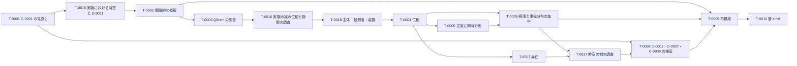

# ロードマップ

最終更新: 2026-09-30（第 16 回。T-0016 を進行中にし、用語のタスク T-0018 を追加）

このファイルは、[フレームワーク](framework.md) を完成させるための作業の最新版です。セッションの終わりごとに更新します（[`CLAUDE.md`](CLAUDE.md) の「セッションの終え方」）。

## 1. 使い方

- 作業は**タスク**（`T-NNNN`）に分け、1 セッションで 1 タスク（大きいものはその一部）を扱う。次のセッションで扱うタスクは [`NEXT.md`](NEXT.md) に書く。
- 詳細化の論点の**本文**は、関係する定義・前提の「未解決の点」と、予想の「詳細化の論点」に置く（そこが正本）。ロードマップは、それらをタスクにまとめ、ID で参照する。
- 順序は、第 11 回にユーザーと相談して決めた（2 節）。第 13 回に、ユーザーの提案で T-0015（D-0003 の未解決の点の解決）を T-0002 の前に加えた。第 15 回に、調査が不足している領域を洗い出し、Claude の提案にユーザーが賛成して、調査のタスク T-0016（段階 B の前）と T-0017（T-0008 の前）を加えた。優先の順は、状況に応じてユーザーと相談して見直す。

## 2. 進める順序

C-0001 の見直しに必要な定義と前提から先に固め（第 09 回の PR #22 で決めた方針）、そのあとでフレームワークの層を下から順に詳しくしていく。

```math
\text{T-0001} \;→\; \text{T-0015} \;→\; \text{T-0002} \;→\; \text{T-0003} \;→\; \text{T-0016} \;→\; \text{T-0018} \;→\; \text{段階 B（T-0004〜T-0007）} \;→\; \text{T-0017} \;→\; \text{T-0008} \;→\; \text{段階 C（T-0009）} \;→\; \text{段階 D（T-0010）}
```

| 段階 | 内容 | タスク |
| --- | --- | --- |
| A | C-0001 の見直し、実験における時空の詳細化、フレームワークの概観 | T-0001、T-0015、T-0002 |
| （調査） | QBism の先行研究、実験の族の位相と極限 | T-0003、T-0016 |
| （用語） | 主体・観測者・装置の使い分け | T-0018 |
| B | 層 1・2（実験・観測量）の詳細化 | T-0004〜T-0007 |
| （調査） | 時空の側の先行研究（因果構造からの再構成、局在の不可能性の定理、操作的な座標づけ） | T-0017 |
| （検証） | C-0001・C-0007・C-0008 の検証 | T-0008 |
| C | 層 3（観測量の時空）の再構成 | T-0009 |
| D | 層 4〜6（可能な実験・可能な観測量・点なし時空） | T-0010 |
| 随時 | 予想の詳細化、予想の候補、運用、文献 | T-0011〜T-0014 |

T-0015 は、番号は後から付けたが、順序は T-0001 の次である。T-0016 は T-0003 の次、T-0018 は T-0016 の次（第 16 回にユーザーと決めた）、T-0017 は段階 B の次（T-0008 の前）である。

## 3. タスク

状態は、未着手・進行中・完了・保留のどれかです。

| ID | タスク | 段階 | 前提のタスク | 関係する ID | 状態 |
| --- | --- | --- | --- | --- | --- |
| T-0001 | 予想 C-0001 の見直し（第 12 回） | A | なし | [C-0001](conjectures/C-0001.md)、[C-0007](conjectures/C-0007.md)、[C-0008](conjectures/C-0008.md)、[D-0008](definitions/D-0008.md)、[R-0001](results/R-0001.md)〜[R-0008](results/R-0008.md) | 完了 |
| T-0002 | フレームワークの圏論的な概観（第 14 回） | A | T-0001 | [framework.md](framework.md) のすべての要素 | 完了 |
| T-0003 | QBism の先行研究の調査（第 15 回） | 調査 | なし | [D-0005](definitions/D-0005.md)、[A-0007](assumptions/A-0007.md)、[C-0003](conjectures/C-0003.md) | 完了 |
| T-0004 | 実験パラメータの空間と、結果の統計の空間の位相 | B | なし | [D-0001](definitions/D-0001.md)、[D-0003](definitions/D-0003.md)、[D-0004](definitions/D-0004.md)、[A-0005](assumptions/A-0005.md)、[A-0006](assumptions/A-0006.md) | 未着手 |
| T-0005 | 尤度と同時分布、主体の間で共有するデータの空間 | B | T-0004 | [D-0001](definitions/D-0001.md)、[D-0004](definitions/D-0004.md)、[A-0006](assumptions/A-0006.md)、[A-0007](assumptions/A-0007.md) | 未着手 |
| T-0006 | 極限と事後分布の集中 | B | T-0004、T-0005 | [D-0005](definitions/D-0005.md)、[D-0006](definitions/D-0006.md)、[A-0007](assumptions/A-0007.md)、[C-0005](conjectures/C-0005.md)、[C-0006](conjectures/C-0006.md) | 未着手 |
| T-0007 | 局在の詳細化 | B | T-0004 | [D-0001](definitions/D-0001.md)、[D-0008](definitions/D-0008.md)、[A-0008](assumptions/A-0008.md) | 未着手 |
| T-0008 | C-0001・C-0007・C-0008 の検証 | 検証 | T-0001 | [C-0001](conjectures/C-0001.md)、[C-0007](conjectures/C-0007.md)、[C-0008](conjectures/C-0008.md) | 未着手 |
| T-0009 | 観測における時空の再構成 | C | T-0002、T-0006 | [D-0007](definitions/D-0007.md)、[C-0002](conjectures/C-0002.md)、[C-0003](conjectures/C-0003.md) | 未着手 |
| T-0010 | 層 4〜6 の定義と前提 | D | T-0009 | [D-0006](definitions/D-0006.md)、[C-0002](conjectures/C-0002.md) | 未着手 |
| T-0011 | 予想 C-0002〜C-0006 の詳細化 | 随時 | 関係する段階のタスク | [C-0002](conjectures/C-0002.md)〜[C-0006](conjectures/C-0006.md) | 未着手 |
| T-0012 | ほかの予想の候補 | 随時 | なし | — | 未着手 |
| T-0013 | `framework.md` の層別の表の検査 | 随時 | なし | [framework.md](framework.md)、`tools/` | 未着手 |
| T-0014 | 文献の未確認事項の確認 | 随時 | なし | [`references.bib`](references.bib)、[`surveys/`](surveys/) | 未着手 |
| T-0015 | D-0003 の未解決の点の解決と、D-0011 を可能な実験の定義に改めること（第 13 回） | A | T-0001 | [D-0003](definitions/D-0003.md)、[D-0011](definitions/D-0011.md)、[A-0008](assumptions/A-0008.md)、[A-0009](assumptions/A-0009.md)、[A-0010](assumptions/A-0010.md)、[C-0008](conjectures/C-0008.md) | 完了 |
| T-0016 | 実験の族の位相と極限の先行研究の調査 | 調査 | なし | [D-0001](definitions/D-0001.md)〜[D-0005](definitions/D-0005.md)、[A-0006](assumptions/A-0006.md)、[A-0007](assumptions/A-0007.md)、[C-0003](conjectures/C-0003.md)、[C-0005](conjectures/C-0005.md)、[C-0006](conjectures/C-0006.md) | 進行中 |
| T-0017 | 時空の側の先行研究の調査 | 調査 | なし | [D-0003](definitions/D-0003.md)、[D-0007](definitions/D-0007.md)、[D-0008](definitions/D-0008.md)、[A-0010](assumptions/A-0010.md)、[C-0002](conjectures/C-0002.md)、[C-0007](conjectures/C-0007.md)、[C-0008](conjectures/C-0008.md) | 未着手 |
| T-0018 | 主体・観測者・装置の使い分け（第 16 回に追加） | 用語 | なし | [A-0001](assumptions/A-0001.md)、[A-0007](assumptions/A-0007.md)、[A-0010](assumptions/A-0010.md)、[D-0001](definitions/D-0001.md)、[D-0003](definitions/D-0003.md)、[D-0005](definitions/D-0005.md)、[D-0011](definitions/D-0011.md) | 未着手 |



図の矢印は、2 節の進める順序です。表の「前提のタスク」は、内容の上で先に要るものだけを書いています（例えば T-0003 は、内容の上では前提がないが、順序は T-0002 の後にする。T-0008 も、内容の上の前提は T-0001 だけで、T-0006・T-0007 から T-0017 を経る矢印は順序を表す。T-0016・T-0017 も、内容の上の前提はない）。

## 4. 各タスクの内容

### T-0001 予想 C-0001 の見直し（第 12 回に完了）

- 第 12 回に行った（[まとめ](summaries/2026-09-29_12_c0001-revision.md)）。
  - 膨張と余白付きの包含を定義 [D-0009](definitions/D-0009.md)・[D-0010](definitions/D-0010.md) に移し、R-0006〜R-0008 の「依存する ID」を加えた（R-0001〜R-0005 は C-0001 の土台ではないので、依存は加えていない）。
  - 「区別」を、実験における時空の言葉で書き直した（候補 A：装置の占める領域による膨張 [D-0011](definitions/D-0011.md)、上下限の前提 [A-0009](assumptions/A-0009.md)）。
  - C-0001 を、数学の部分（[C-0001](conjectures/C-0001.md)）、物理から装置の占有範囲の上下限を導く部分（[C-0007](conjectures/C-0007.md)）、共変性との緊張（[C-0008](conjectures/C-0008.md)）に分けた。
- 第 11 回までの手がかりのうち、C-0007・C-0008 に関わるもの（distal split、分離の距離、観測者ごとの族と赤外の上限）は、それぞれの予想の「詳細化の論点」に移した。第 07 回からの検討課題は T-0009 に、未読の文献は T-0009・T-0014 に移した。

### T-0002 フレームワークの圏論的な概観（第 14 回に完了）

- 第 14 回に行った（[まとめ](summaries/2026-09-29_14_categorical-overview.md)、[調査メモ](surveys/2026-09-29_14_categorical-overview.md)、`framework.md` の 4.1 節）。ユーザーの判断で、骨組みはマルコフ圏（層 1〜2）と随伴の不動点（層 3〜5）とし、深さは対応表と文献の確認まで、状態の扱いはモデル全体の圏とした。
- 候補として記録したもの（登録していない）の扱い：
  - 「実験の圏」「モデルの圏」の定義の候補と、実際の観測量の極限をコルモゴロフ積の上のベイズの逆の極限として定式化する予想の候補は、T-0005・T-0006 で検討する。
  - 再構成と記述し直しが随伴をなし、整合条件がその不動点になるという予想の候補は、T-0009 で検討する。
  - 局在の関手と観測者の取り替えの亜群の両立（C-0008 の言い換え）は、T-0008 で検討する。

第 14 回の開始時の記録：

- フレームワークの要素（定義・前提・予想）と、その間の関係を、特に圏論的な視点で概観する（第 11 回にユーザーが追加を依頼）。
- 観点の候補（見立て。どれを採るかはユーザーと相談する）：
  - 各層の対象と射：実験（プロトコルと設定）、応答関数、観測量、ロケール（点なしの空間）がそれぞれどんな圏をなすか。
  - 層の間の構成：実験から応答関数へ、観測量から空間への再構成を、関手とみなせるか。実験から応答関数への対応では、状態や装置のモデルを固定するのか、それらも対象に含めるのかを先に決める（同じプロトコルと設定でも、状態や装置が異なれば応答確率は異なる。PR #24 のレビュー）。再構成を、ゲルファント双対性やフレームとロケールの双対性のような双対・随伴として述べられるか。
  - 極限：「有限な実験の族の極限」を、圏論の極限・余極限や完備化として述べられるか。
  - 整合条件：観測における時空と実験における時空の整合条件（不動点の条件）を、随伴の不動点などとして述べられるか。
- 成果物：調査メモと、`framework.md` への概観の節の追加。

### T-0003 QBism の先行研究の調査（第 15 回に完了）

- 第 09 回にユーザーが追加を依頼した。第 15 回に、ユーザーの判断で「(a) 主体の間の一致」に重点を置き、中心の文献の本文で定理の仮定と結論を確かめた（[調査メモ](surveys/2026-09-29_15_qbism-agreement.md)）。
  - 量子 de Finetti 定理と量子ベイズ則の仮定と結論を確かめた。主体の間の一致の主張の証明は、確認した範囲の文献では見つけられなかった。
  - [A-0007](assumptions/A-0007.md) と [D-0005](definitions/D-0005.md) の「注意」に比較の結果を加え、一致の定理の原典の確認を T-0014 に加えた。
- 残した論点（今後の調査対象。調査メモの 5 節）：(b) 推定の対象（[C-0003](conjectures/C-0003.md) と断層撮影・SIC 測定）、(c) 立場の違い（QBism への批判）、(d) 第 14 回の圏論的概観とのつながり（非可換ベイズの逆）。

### T-0004 実験パラメータの空間と、結果の統計の空間の位相

各ファイルの未解決の点のうち、位相に関するものをまとめて決める。

- [D-0003](definitions/D-0003.md)：$`X`$ の位相と、時空の部分と比べる写像は、第 13 回（T-0015）に決めた（直和の位相、観測者の座標 $`M_O`$ への換算）。残るのは、結果の読みでない座標の扱い。
- [D-0004](definitions/D-0004.md)・[A-0006](assumptions/A-0006.md)：$`\mathrm{Prob}(Y_π)`$ の位相（弱位相か全変動距離か）と、等価原理の「近い」の意味。
- [A-0005](assumptions/A-0005.md)：座標ごとの値域のコンパクト性か、$`X`$ 自体のコンパクト性か。「一様に有界」の範囲。
- [D-0001](definitions/D-0001.md)：結果の空間 $`Y_π`$ の意味。

### T-0005 尤度と同時分布、主体の間で共有するデータの空間

- [D-0004](definitions/D-0004.md)：複数回の結果の同時分布と尤度（条件付き独立を仮定するか）、推定の対象の区別。
- [A-0006](assumptions/A-0006.md)：交換可能性を別の前提として課すか。
- [A-0007](assumptions/A-0007.md)：予測分布を作る同時分布と尤度、主体の間で共有するデータの空間、適用範囲。前提を相互とするか片側とするか、フレームワークで採る一致の段階（第 16 回に加えた論点。ユーザーの判断で次に回した）。

### T-0006 極限と事後分布の集中

- [D-0005](definitions/D-0005.md)：極限の位相（一様構造、完備性、分離性）、収束させる対象、部分列の選び方、事後分布の集中の条件、事後分布を置く空間。
- [D-0006](definitions/D-0006.md)（層 5）：予備的な検討にとどめる。実際の観測量の極限の位相を決めるときに、可能な観測量にも同じ取り方が使えるかを確かめる。層 5 の定義と前提そのものは T-0010 で扱う。
- 関係する予想：[C-0005](conjectures/C-0005.md)、[C-0006](conjectures/C-0006.md)。

### T-0007 局在の詳細化

- [D-0008](definitions/D-0008.md)：$`o`$ を実際の観測量と可能な観測量のどちらで取るか、「有界」と「収まる」の意味、代数として閉じるか。
- [A-0008](assumptions/A-0008.md)：実験における時空の領域の与え方。
- [D-0001](definitions/D-0001.md)：各実験が占める領域の決め方。

### T-0008 C-0001・C-0007・C-0008 の検証

- 始めるときに、予想全件（C-0001〜C-0008）の優先度を見直す（第 12 回にユーザーと合意）。
- [C-0001](conjectures/C-0001.md)（数学。[Issue #8](https://github.com/kittenkiki15/point-free-spacetime/issues/8)）：主張 1・2 を自然言語で証明し、ユークリッド空間の場合を Lean で形式化する。主張 3 と点なし版。
- [C-0007](conjectures/C-0007.md)（物理）：DFR の 2 節と split property（Doplicher–Longo）の文献を調べ、装置の占める領域の下限を与える議論を取り出す。候補 B（操作的な切り離し）で $`\mathrm{occ}`$ を定める方法と、第 06 回の調査メモの 6.4 節の言い換えも検討する。
- [C-0008](conjectures/C-0008.md)（共変性）：主張 1 の証明と、2 次元ミンコフスキー時空での Lean による形式化。主張 3（観測者ごとの族）の形を決める。
- Connes–van Suijlekom の作用素系（`connes2022`）との対応。

### T-0009 観測における時空の再構成

- [D-0007](definitions/D-0007.md)：再構成の入力、一意性、整合条件、応答関数から積などの演算をどう定めるか（PR #23 の最後のレビュー）。
- [C-0002](conjectures/C-0002.md)・[C-0003](conjectures/C-0003.md) の詳細化。
- 先行研究の調査（まだ読んでいない）：Cao–Carroll–Michalakis "Space from Hilbert Space"（2017）、Van Raamsdonk（2010）、Buchholz–Summers の幾何的モジュラー作用、Keyl の因果構造の再構成。
- 第 07 回からの検討課題（第 12 回に T-0001 から移した）：
  - 主張 1'（橋渡し）：実験における時空の領域の性質（互いに空間的に離れている、など）が $`𝒪(R)`$ の性質（互いに可換である、など）にどう反映されるか。$`R ↦ 𝒪(R)`$ から観測における時空の局在を再構成できるか。Fewster–Verch の定理 3.3 は、時空と局所代数をあらかじめ与えた枠組みでの主張で、そのままでは主張 1' にならない。各操作が事象 $`p`$ からの信号で起動し、結果を $`q`$ で読み出すと仮定すれば操作の領域は $`J^+(p) ∩ J^-(q)`$ に収まる（あらかじめ置いた装置も許すなら、領域の主張を弱める必要がある）。
  - 観測における時空の局所性を定義する候補（可換子による因果的な補集合、split property、核型性）と、観測量が局在できる領域の族（上に閉じた族。交わりで閉じるのはどんな族か）。
  - 「観測する側と観測される側の対称性」：局所代数（フォン・ノイマン代数）の包含 $`𝒜(O_1) ⊂ 𝒜(O_2)`$（$`O_1 ⋐ O_2`$ は領域。第 08 回の調査メモの 4 節の記号では $`R_i = R(O_i)`$）について、$`𝒜(O_1) ⊗ 𝒜(O_1)`$ の上の flip が $`𝒜(O_2) ⊗ 𝒜(O_2)`$ の内部自己同型で実装できること ⇔ split（追加の条件の下で。系と装置の入れ替えにはそのまま適用できない）、split と大域的な対称性 ⇒ 対称性の局所的な実装（生成子を保存する局所的なカレントのぼかしと読むのは解釈）、という既知の鎖（第 08 回の調査メモの 4 節）。
  - 装置の占める領域による膨張（[D-0011](definitions/D-0011.md)）と余白付きの包含が、観測における時空にどう移るか。
- [D-0003](definitions/D-0003.md) の整合条件（第 13 回に T-0015 から残した）：観測における時空のモデルが予測する基準の時計と物差しの読みと、較正の写像 $`τ^O`$ の一致（不動点の条件）。観測者の取り替え $`M_O → M_{O'}`$ の形（ポアンカレ変換になるか。[C-0008](conjectures/C-0008.md) はこれを仮定する）。実際の実験の記録された占める領域と、モデルの占める領域の整合的な関係（一致や包含。[D-0011](definitions/D-0011.md)）。

### T-0010 層 4〜6 の定義と前提

- 層 4（可能な実験）の定義：観測量の時空の中でモデル化した装置による、可能な実験の記述（[C-0002](conjectures/C-0002.md)）。
- 層 5（可能な観測量）：[D-0006](definitions/D-0006.md) の極限の取り方、実際の観測量との関係、不動点の条件（T-0006 の予備的な検討を踏まえる）。
- 層 6（点なし時空）：第 07 回のユーザーの構想の 3〜5（観測する側とされる側の対称性による座標系の誘導、点なし時空、一般相対論の時空連続体への極限）を、予想として登録するか、優先度とあわせてユーザーと相談する。

### T-0011 予想 C-0002〜C-0006 の詳細化

- 各予想の「詳細化の論点」を扱う。いずれも優先度は低で、ほかの予想の証明に必要になった場合に優先度を上げる（第 09 回にユーザーと合意）。

### T-0012 ほかの予想の候補

- 有限な実験の族の極限が、通常の点を持つ空間と確率測度では表せない（どの表現が不可能かの定式化が先に要る。C-0006 から切り離したもの）。整合する有限回の測定結果の分布は、標準ボレル空間などの通常の条件の下では、点を持つ結果の列の空間の上の測度で表せる。そのため、確率分布だけでなく、局在や代数的な演算など、表現が保存すべき構造を指定する必要がある（PR #24 のレビュー）。
- 第 05 回のおもちゃのモデルの案：C（因果的に閉じた領域。`casini2002`、`cegla1977`）、E（エンタングルメントのエントロピー。余白を狭めたときの発散を、膨張の「コスト」として入れられるか）、F（非可換な空間。DFR の量子時空、Connes–van Suijlekom）。
- 第 03 回の候補（[heunen2026 のメモ](surveys/2026-09-25_03_heunen2026.md)）：点なしの時制論理、点がないと表せない因果構造、量子と時空の点のなさの統一。
- 第 04 回の候補：時間スライス公理を点なしの依存領域で述べる、因果集合理論の連続極限と Hauptvermutung、量子の文脈依存性と点のなさの統一。
- 時空から作ったフレームのような良いクラスで、共役から (f±) が出るか（[R-0005](results/R-0005.md) の反例は時空とは程遠い）。

### T-0013 `framework.md` の層別の表の検査

- 層別の表の ID・層・状態を各ファイルと照合するテストを加えるか、表をメタデータから生成する（PR #23 のレビュー）。

### T-0014 文献の未確認事項の確認

- 第 09 回に記憶で挙げた文献：Blackwell–Dubins 1962、Diaconis–Freedman、Doob、de Finetti、量子 de Finetti、Kreisel–Lacombe–Shoenfield・Ceitin。
- 第 15 回の調査メモの 4 節：事後一致性の定理（Doob、Schwartz）と Blackwell–Dubins 1962 の原典で、QBism の主体の間の一致の主張（確認した範囲の文献では証明を見つけられなかった）を正確な定理の形にし、「データが指す状態の近傍で正」という条件がどの仮定に当たるかを確かめる。A-0007 の注意の同値（交換可能で同一の情報的に完全な測定を繰り返す場合）の証明と、測定を変える場合の条件も確かめる。一致の主張で将来の系の数 $`N`$ を固定するかも定める。データが指す状態 $`ρ_{D_K}`$ の有限のデータからの定め方（制約付きの最尤推定など）と、その収束の条件も確かめる。Hudson–Moody 1976 の原典の仮定。
  - 第 16 回に、Blackwell–Dubins 1962 と Diaconis–Freedman 1986 の原典、Doob と Schwartz の定理の正確な形（二次文献）を確かめ、固定した真の状態を用いる設定での一致の十分条件を、Schwartz の定理の当てはめとして確かめた（QBism の「データが指す状態」との対応は未確認）。A-0007 の注意の同値（同一の情報的に完全な測定を繰り返す場合）も証明した（[第 16 回の調査メモ](surveys/2026-09-30_16_merging-and-consistency.md)）。残るのは、Bernstein–von Mises の定理の仮定、Freedman 1963・Schwartz 1965 の原典、Hudson–Moody 1976 の原典、$`ρ_{D_K}`$ の定め方、測定を変える場合の同値の条件。
- 第 08 回の調査メモの 9 節：原典が未入手の文献（核型性と split property の原論文、dantoni1987、Doplicher–Longo、Buchholz–Doplicher–Longo、fewster2015、Hepp 1972、Vickers *Topology via Logic*、Abramsky 1987）、fewster2016・landsman2005 の掲載情報、記憶に基づいて挙げた事項（Wigner–Araki–Yanase の定理、Lieb–Robinson 評価と無限遠の観測量など）。
- 第 06 回の調査メモの 7 節：sorkin2007 の掲載先、halvorson2002 の書名・刊行年、fewster2020 の DOI、borsten2021 の本文など。
- 第 05 回の調査メモの 5 節：劣位代数とストーン空間上の閉じた関係の双対性、proximity frame（Celani、Bezhanishvili ら）。
- 基礎の調査メモの未確認事項（正則開集合の例の典拠、全射の例の候補の正確な定式化と典拠など）。
- heunen2026・halvorson2001 の出版社版と arXiv 版の違い（未比較）。heunen2024 の例 6.6（一点を除いたミンコフスキー時空が $`T_0`$ 順序でない）の具体的な理由。
- 第 07 回の最初の回答で挙げた、観測・実験に関する物理学の哲学の先行研究（[まとめ](summaries/2026-09-27_07_observation-and-experiment.md)）。

### T-0015 D-0003 の未解決の点の解決と、D-0011 を可能な実験の定義に改めること（第 13 回に完了）

- 第 13 回に、ユーザーの提案で T-0002 の前に行った（[まとめ](summaries/2026-09-29_13_experimental-spacetime.md)）。
  - [D-0003](definitions/D-0003.md)：$`X`$ を $`X_π ⊆ ℝ^{n_π}`$ の直和とし、直和の位相を入れた。時空の部分は、観測者 $`O`$ の基準の時計と物差しとの較正で座標 $`M_O = ℝ^{1+n}`$ に換算する（新しい前提 [A-0010](assumptions/A-0010.md)）。$`M_O`$ に座標の距離 $`d_O`$ を入れた。
  - [A-0008](assumptions/A-0008.md)：領域を $`M_O`$ の開集合、有界性を $`d_O`$ での有界性として中身を決め、未定から作業上にした。
  - [D-0011](definitions/D-0011.md)：可能な実験についての定義と明記し、層を「可能な実験」に移した。実際の実験の記録された占める領域と、可能な実験のモデルの占める領域を分け、[C-0002](conjectures/C-0002.md) を依存する ID に加えた（ユーザーの指摘）。A-0009・C-0007・C-0008 も層 4 に移った。
  - [C-0008](conjectures/C-0008.md)：観測者の取り替えがポアンカレ変換で表されることを、整合条件の一部として仮定する形にした。
- D-0003 の整合条件（観測者の取り替えの形、記録とモデルの占める領域の整合的な関係を含む）は、T-0009 に残した。

### T-0016 実験の族の位相と極限の先行研究の調査（第 15 回に追加）

第 15 回に、調査が不足している領域のうち、段階 B（T-0004〜T-0006）の位相と極限に直結するものを一つの調査にまとめた（文献は記憶による。未確認）。

- 統計的実験の比較と収束の理論：Le Cam の不足度と距離、Blackwell の実験の比較、Torgersen。実験の族の極限の位相と距離の候補。第 14 回の概観の「模倣」の順序との対応（[調査メモ](surveys/2026-09-29_14_categorical-overview.md)の 6 節）。
- 操作的な確率論の枠組み：一般化確率論（Hardy、Barrett、Chiribella–D'Ariano–Perinotti）と Ludwig の公理的な量子力学。実験から統計への対応（[D-0001](definitions/D-0001.md)〜[D-0004](definitions/D-0004.md)）の先行研究、状態空間の再構成、有限な実験からの一様構造による完備化（[D-0005](definitions/D-0005.md) の極限の位相）。[C-0003](conjectures/C-0003.md)・[C-0005](conjectures/C-0005.md) との関係。
- ベイズ統計の事後一致性：Doob、Schwartz、Diaconis–Freedman の不一致の例、Ghosal–van der Vaart。[C-0006](conjectures/C-0006.md) の反例と条件、[A-0007](assumptions/A-0007.md) の一致の定理の正確な形（原典の確認は T-0014 と共通）。
- 成果物：調査メモと、T-0004〜T-0006 で決める事項への候補。
- 第 16 回：ユーザーの判断で、事後一致性の領域のうち「A-0007 の一致の定理の正確な形」に重点を置き、本文で定理の仮定と結論を確かめた（[調査メモ](surveys/2026-09-30_16_merging-and-consistency.md)）。結果を A-0007・D-0005 に反映した。残るのは、Le Cam の理論と実験の比較、一般化確率論と Ludwig、弱い併合（Kalai–Lehrer 1994。第 16 回にユーザーの判断で扱わなかった）。
- 第 16 回の後に、ユーザーが実験の比較の原典 5 件を入手し、非公開リポジトリの `papers/` に置いた：`blackwell1951`（Blackwell, Comparison of experiments, Proc. Second Berkeley Symp., 1951）、`blackwell1953`（Blackwell, Equivalent comparisons of experiments, Ann. Math. Statist. 24, 1953）、`lecam1964`（Le Cam, Sufficiency and approximate sufficiency, Ann. Math. Statist. 35, 1964）、`shannon1958`（Shannon, A note on a partial ordering for communication channels, Information and Control 1, 1958）、`raginsky2011`（Raginsky, Shannon meets Blackwell and Le Cam: channels, codes, and statistical experiments, Proc. IEEE ISIT, 2011）。`references.bib` への登録は、読んだセッションで行う。

### T-0017 時空の側の先行研究の調査（第 15 回に追加）

第 15 回に、調査が不足している領域のうち、時空の側（検証 T-0008 と段階 C・D）に関わるものを一つの調査にまとめた（文献は記憶による。未確認）。

- 時空の因果構造からの再構成：Malament、Hawking–King–McCarthy の定理。観測から時空を再構成するときに、何の情報で幾何が決まるか（[C-0002](conjectures/C-0002.md)、[D-0007](definitions/D-0007.md)）。
- 相対論的な局在の不可能性の定理：Newton–Wigner、Hegerfeldt、Malament の局在の定理。[C-0007](conjectures/C-0007.md)・[C-0008](conjectures/C-0008.md)・[D-0008](definitions/D-0008.md) に近い既存の定理があるか。
- 操作的な座標づけと参照系：レーダー座標、Bondi の k 計算、量子参照系。較正の写像と観測者の取り替え（[A-0010](assumptions/A-0010.md)、[D-0003](definitions/D-0003.md) の整合条件）。
- 順序は段階 B の後、T-0008 の前とする（局在の定理を C-0007・C-0008 の検証に使うため）。

### T-0018 主体・観測者・装置の使い分け（第 16 回に追加）

第 16 回に、ユーザーの指摘で追加した。「主体」「観測者」「装置」などの語の、プロジェクト内での意味を決める。

- 今の使われ方（第 16 回に確認した範囲）：
  - **主体**：事前分布を持ち、データで信念を更新する者（[A-0007](assumptions/A-0007.md)、[D-0005](definitions/D-0005.md)）。[A-0001](assumptions/A-0001.md) の「実験の主体」は、実験をする者の意味（ユーザーによる）。
  - **観測者**：基準の時計と物差しを持ち、座標 $`M_O`$ を与える者（[D-0003](definitions/D-0003.md)、[A-0010](assumptions/A-0010.md)、[D-0011](definitions/D-0011.md)、[A-0008](assumptions/A-0008.md)、[C-0008](conjectures/C-0008.md)）。[D-0001](definitions/D-0001.md) では、実験をする者の意味（「実験を行う観測者の世界線」）で使っている。
  - **装置**：時空の中に領域を占める物理系（[D-0001](definitions/D-0001.md)、[D-0011](definitions/D-0011.md)、[C-0007](conjectures/C-0007.md)、[C-0008](conjectures/C-0008.md)）。
  - 「観測装置」「実験者」は使っていない。
- 論点：「観測者」の二つの意味（基準系と、実験をする者）。主体（信念を持つ者）と観測者（世界線や基準系を持つ者）と実験をする者が同じものか。装置と、観測者の時計・物差しの関係。第 07 回の「観測する側と観測される側の対称性」との関係。装置とそれ以外の境界の取り方と、実験の個別化（何を一つの実験として数えるか。[A-0001](assumptions/A-0001.md) の未解決の点。境界を連続的に動かすと主体が非可算になりうる、というユーザーの考察が A-0001 の背景にある。記録はアナログでもありうるので、必要がなければ記録の有限な記述は仮定しない、というユーザーの意見がある）。
- 進め方：(1) 既存研究での使われ方の調査（記憶による候補：相対論の観測者と基準系、量子測定論の系・プローブ・装置（Fewster–Verch、Busch–Lahti–Mittelstaedt）、von Neumann の測定の連鎖とハイゼンベルクの切断（切断の位置の移動）、Wigner の友人、QBism と意思決定理論の agent、操作的な確率論の準備と測定の装置）。(2) プロジェクト内の意味の決定（定義として登録するかを含む）。
- 順序：T-0016 の次、段階 B の前（「主体」は T-0005 の A-0007 で、「観測者」は T-0009 の D-0003 の整合条件で使うため）。

## 5. 保留している事項

- 用語一覧の localic cones の訳「局所的な錐」は、局所性（locality）と紛らわしい。「ロケールの錐」などへの改名を検討する（第 07 回）。
- 調査の候補（第 15 回に洗い出し、優先度を低〜中とした。文献は記憶による）：計算可能解析とアルゴリズム的ランダムネス（Weihrauch、Martin-Löf。[C-0004](conjectures/C-0004.md)・[A-0002](assumptions/A-0002.md)、「ほとんど確実に」をデータ列ごとの主張に言い換える手段）。QBism の残した論点 (b)〜(d)（T-0003）。
