# ロードマップ

最終更新: 2026-10-07（第 32 回。T-0027 を進めた。タグ付けは PR のマージの後）

このファイルは、[フレームワーク](framework.md) を完成させるための作業の最新版です。セッションの終わりごとに更新します（[`CLAUDE.md`](CLAUDE.md) の「セッションの終え方」）。

## 1. 使い方

- 作業は**タスク**（`T-NNNN`）に分け、1 セッションで 1 タスク（大きいものはその一部）を扱う。次のセッションで扱うタスクは [`NEXT.md`](NEXT.md) に書く。
- 詳細化の論点の**本文**は、関係する定義・前提の「未解決の点」と、予想の「詳細化の論点」に置く（そこが正本。[`questions/`](questions/README.md) に移した論点は、移した後は Q のファイルが正本）。ロードマップは、それらをタスクにまとめ、ID で参照する。
- タスクの「関係する ID」に挙げたファイルの未解決の点・詳細化の論点は、そのタスクで扱う。どの未完了のタスクにも入らない論点を残さない（第 27 回にユーザーと決めた）。一つのファイルの論点を複数のタスクに分けて扱うときは、各タスクのファイルに、どの論点を扱うかを書く。`tools/tests/test_framework.py` で検査するのは、論点を持つファイルが少なくとも一つの未完了のタスクの「関係する ID」にあること（ファイルの掲載漏れ）までで、論点ごとの割り当ては、各タスクのファイルの記述で確かめる（PR #50 のレビュー）。
- 各段階を終えるときは、次の段階に入る前に、成果物の見直しのタスクを置く。手順は [`docs/review-procedure.md`](docs/review-procedure.md) による（第 27 回にユーザーと決めた。T-0021 のやり方を手順にしたもの）。
- 順序は、第 11 回にユーザーと相談して決めた（2 節）。第 13 回に、ユーザーの提案で T-0015（D-0003 の未解決の点の解決）を T-0002 の前に加えた。第 15 回に、調査が不足している領域を洗い出し、Claude の提案にユーザーが賛成して、調査のタスク T-0016（段階 B の前）と T-0017（T-0008 の前）を加えた。第 19 回に、ユーザーの判断で、T-0018 の範囲を概念と用語の整理に広げ、調査のタスク T-0019（T-0018 の次、段階 B の前）を加えた。優先の順は、状況に応じてユーザーと相談して見直す。

## 2. 進める順序

C-0001 の見直しに必要な定義と前提から先に固め（第 09 回の PR #22 で決めた方針）、そのあとでフレームワークの層を下から順に詳しくしていく。

```math
\text{T-0001} \;→\; \text{T-0015} \;→\; \text{T-0002} \;→\; \text{T-0003} \;→\; \text{T-0016} \;→\; \text{T-0018} \;→\; \text{T-0019} \;→\; \text{T-0020} \;→\; \text{段階 A のクロージング（T-0021、T-0022、T-0025）} \;→\; \text{リリース（T-0027）} \;→\; \text{段階 B（T-0004、T-0023、T-0005〜T-0007）} \;→\; \text{T-0017} \;→\; \text{T-0024} \;→\; \text{T-0008} \;→\; \text{段階 C（T-0009）} \;→\; \text{段階 D（T-0010）}
```

| 段階 | 内容 | タスク |
| --- | --- | --- |
| A | C-0001 の見直し、実験における時空の詳細化、フレームワークの概観 | T-0001、T-0015、T-0002 |
| （調査） | QBism の先行研究、実験の族の位相と極限 | T-0003、T-0016 |
| （用語） | 主体・観測者・装置の使い分けと、設定・時空・パラメータの概念と用語の整理 | T-0018 |
| （調査） | 量子・古典・混成の実験の扱い（一般化確率論、Le Cam の量子版、量子参照系） | T-0019 |
| （整理） | 段階 A のクロージング（成果物の見直し、振り返り、運用の改善） | T-0021、T-0022、T-0025 |
| （整理） | 段階 A の成果のリリース（不具合の修正、公開前の確認、タグ付け） | T-0027 |
| B | 層 1・2（実験・観測量）の詳細化 | T-0020、T-0004、T-0023、T-0005〜T-0007 |
| （調査） | 時空の側の先行研究（因果構造からの再構成、局在の不可能性の定理、操作的な座標づけ） | T-0017 |
| （詳細化） | 較正と観測者の取り替えの予想の詳細化 | T-0024 |
| （検証） | C-0001・C-0007・C-0008 の検証 | T-0008 |
| C | 層 3（観測量の時空）の再構成 | T-0009 |
| D | 層 4〜6（可能な実験・可能な観測量・点なし時空） | T-0010 |
| 随時 | 予想の詳細化、予想の候補、運用、文献、ナレッジグラフの語彙 | T-0011〜T-0014、T-0026 |

T-0015 は、番号は後から付けたが、順序は T-0001 の次である。T-0016 は T-0003 の次、T-0018 は T-0016 の次（第 16 回にユーザーと決めた）、T-0019 は T-0018 の次で段階 B の前（第 19 回にユーザーと決めた）、T-0017 は段階 B の次（T-0008 の前）である。 T-0020 は、第 25 回のユーザーの判断を定義・前提に反映するタスクで、段階 B の最初に行う（第 25 回）。T-0021・T-0022 は、段階 B の最初の T-0020 の後、段階 B の残りのタスク（T-0004 以降）に進む前に、段階 A のクロージングとして行う（第 26 回にユーザーが追加した。段階 A と、段階 B の最初の T-0020 までを対象とする）。T-0023 は T-0004 の後、T-0005 の前に、T-0024 は T-0017 の後、T-0008 の前に行う（第 27 回にユーザーと決めた）。T-0027 は、T-0025 の後、段階 B の残り（T-0004 以降）の前に行う（第 31 回にユーザーと決めた）。T-0026 は随時のタスクで、順序の中の位置はまだ決めていない。

## 3. タスク

状態は、未着手・進行中・完了・保留のどれかです。

| ID | タスク | 段階 | 前提のタスク | 関係する ID | 状態 | Issue |
| --- | --- | --- | --- | --- | --- | --- |
| [T-0001](tasks/T-0001.md) | 予想 C-0001 の見直し（第 12 回） | A | なし | [C-0001](conjectures/C-0001.md)、[C-0007](conjectures/C-0007.md)、[C-0008](conjectures/C-0008.md)、[D-0008](definitions/D-0008.md)、[R-0001](results/R-0001.md)〜[R-0008](results/R-0008.md) | 完了 | なし |
| [T-0002](tasks/T-0002.md) | フレームワークの圏論的な概観（第 14 回） | A | T-0001 | [framework.md](framework.md) のすべての要素 | 完了 | なし |
| [T-0003](tasks/T-0003.md) | QBism の先行研究の調査（第 15 回） | 調査 | なし | [D-0005](definitions/D-0005.md)、[A-0007](assumptions/A-0007.md)、[C-0003](conjectures/C-0003.md) | 完了 | なし |
| [T-0004](tasks/T-0004.md) | 設定の空間と、結果の統計の空間の位相 | B | なし | [D-0001](definitions/D-0001.md)、[D-0003](definitions/D-0003.md)、[D-0004](definitions/D-0004.md)、[A-0005](assumptions/A-0005.md)、[A-0006](assumptions/A-0006.md)、[A-0004](assumptions/A-0004.md)、[D-0014](definitions/D-0014.md)、[D-0013](definitions/D-0013.md) | 未着手 | [#53](https://github.com/kittenkiki15/point-free-spacetime/issues/53) |
| [T-0005](tasks/T-0005.md) | 尤度と同時分布、主体の間で共有するデータの空間 | B | T-0004、T-0023 | [D-0001](definitions/D-0001.md)、[D-0004](definitions/D-0004.md)、[A-0006](assumptions/A-0006.md)、[A-0007](assumptions/A-0007.md)、[D-0002](definitions/D-0002.md)、[D-0012](definitions/D-0012.md)、[A-0011](assumptions/A-0011.md)、[A-0012](assumptions/A-0012.md)、[A-0001](assumptions/A-0001.md) | 未着手 | [#54](https://github.com/kittenkiki15/point-free-spacetime/issues/54) |
| [T-0006](tasks/T-0006.md) | 極限と事後分布の集中 | B | T-0004、T-0005 | [D-0005](definitions/D-0005.md)、[D-0006](definitions/D-0006.md)、[A-0007](assumptions/A-0007.md)、[C-0005](conjectures/C-0005.md)、[C-0006](conjectures/C-0006.md)、[D-0012](definitions/D-0012.md)、[A-0011](assumptions/A-0011.md)、[A-0012](assumptions/A-0012.md) | 未着手 | [#55](https://github.com/kittenkiki15/point-free-spacetime/issues/55) |
| [T-0007](tasks/T-0007.md) | 局在の詳細化 | B | T-0004 | [D-0001](definitions/D-0001.md)、[D-0008](definitions/D-0008.md)、[A-0008](assumptions/A-0008.md)、[D-0009](definitions/D-0009.md) | 未着手 | [#56](https://github.com/kittenkiki15/point-free-spacetime/issues/56) |
| [T-0008](tasks/T-0008.md) | C-0001・C-0007・C-0008 の検証 | 検証 | T-0001 | [C-0001](conjectures/C-0001.md)、[C-0007](conjectures/C-0007.md)、[C-0008](conjectures/C-0008.md)、[A-0009](assumptions/A-0009.md)、[D-0011](definitions/D-0011.md) | 未着手 | [#57](https://github.com/kittenkiki15/point-free-spacetime/issues/57) |
| [T-0009](tasks/T-0009.md) | 観測における時空の再構成 | C | T-0002、T-0006 | [D-0007](definitions/D-0007.md)、[D-0013](definitions/D-0013.md)、[C-0002](conjectures/C-0002.md)、[C-0003](conjectures/C-0003.md) | 未着手 | [#58](https://github.com/kittenkiki15/point-free-spacetime/issues/58) |
| [T-0010](tasks/T-0010.md) | 層 4〜6 の定義と前提 | D | T-0009 | [D-0006](definitions/D-0006.md)、[C-0002](conjectures/C-0002.md)、[D-0002](definitions/D-0002.md)、[D-0014](definitions/D-0014.md) | 未着手 | [#59](https://github.com/kittenkiki15/point-free-spacetime/issues/59) |
| [T-0011](tasks/T-0011.md) | 予想 C-0002〜C-0006 の詳細化 | 随時 | 関係する段階のタスク | [C-0002](conjectures/C-0002.md)〜[C-0006](conjectures/C-0006.md) | 未着手 | [#60](https://github.com/kittenkiki15/point-free-spacetime/issues/60) |
| [T-0012](tasks/T-0012.md) | ほかの予想の候補 | 随時 | なし | — | 未着手 | [#61](https://github.com/kittenkiki15/point-free-spacetime/issues/61) |
| [T-0013](tasks/T-0013.md) | `framework.md` の層別の表の検査 | 随時 | なし | [framework.md](framework.md)、`tools/` | 未着手 | [#62](https://github.com/kittenkiki15/point-free-spacetime/issues/62) |
| [T-0014](tasks/T-0014.md) | 文献の未確認事項の確認 | 随時 | なし | [`references.bib`](references.bib)、[`surveys/`](surveys/) | 未着手 | [#63](https://github.com/kittenkiki15/point-free-spacetime/issues/63) |
| [T-0015](tasks/T-0015.md) | D-0003 の未解決の点の解決と、D-0011 を可能な実験の定義に改めること（第 13 回） | A | T-0001 | [D-0003](definitions/D-0003.md)、[D-0011](definitions/D-0011.md)、[A-0008](assumptions/A-0008.md)、[A-0009](assumptions/A-0009.md)、[A-0010](assumptions/A-0010.md)、[C-0008](conjectures/C-0008.md) | 完了 | なし |
| [T-0016](tasks/T-0016.md) | 実験の族の位相と極限の先行研究の調査（第 15〜19 回） | 調査 | なし | [D-0001](definitions/D-0001.md)〜[D-0005](definitions/D-0005.md)、[A-0006](assumptions/A-0006.md)、[A-0007](assumptions/A-0007.md)、[C-0003](conjectures/C-0003.md)、[C-0005](conjectures/C-0005.md)、[C-0006](conjectures/C-0006.md) | 完了 | なし |
| [T-0017](tasks/T-0017.md) | 時空の側の先行研究の調査 | 調査 | なし | [D-0013](definitions/D-0013.md)、[D-0007](definitions/D-0007.md)、[D-0008](definitions/D-0008.md)、[A-0010](assumptions/A-0010.md)、[C-0002](conjectures/C-0002.md)、[C-0007](conjectures/C-0007.md)、[C-0008](conjectures/C-0008.md) | 未着手 | [#64](https://github.com/kittenkiki15/point-free-spacetime/issues/64) |
| [T-0018](tasks/T-0018.md) | 主体・観測者・装置の使い分けと、設定・時空・パラメータの概念と用語の整理（第 16 回に追加、第 19 回に範囲を拡大、第 20 回に完了） | 用語 | なし | [A-0001](assumptions/A-0001.md)、[A-0007](assumptions/A-0007.md)、[A-0010](assumptions/A-0010.md)、[D-0001](definitions/D-0001.md)、[D-0003](definitions/D-0003.md)、[D-0005](definitions/D-0005.md)、[D-0011](definitions/D-0011.md)、[D-0012](definitions/D-0012.md)、[D-0013](definitions/D-0013.md)、[A-0011](assumptions/A-0011.md)〜[A-0016](assumptions/A-0016.md)、[C-0009](conjectures/C-0009.md)〜[C-0013](conjectures/C-0013.md) | 完了 | なし |
| [T-0019](tasks/T-0019.md) | 量子・古典・混成の実験の扱いの先行研究の調査（第 19 回に追加） | 調査 | なし | [D-0001](definitions/D-0001.md)、[D-0002](definitions/D-0002.md)、[D-0003](definitions/D-0003.md)、[D-0004](definitions/D-0004.md)、[D-0005](definitions/D-0005.md)、[D-0006](definitions/D-0006.md)、[A-0003](assumptions/A-0003.md)、[A-0006](assumptions/A-0006.md)、[A-0010](assumptions/A-0010.md)、[C-0003](conjectures/C-0003.md) | 完了 | なし |
| [T-0020](tasks/T-0020.md) | T-0019 の判断（第 25 回）に沿った、実際の実験と可能な実験の区別の定義・前提への反映 | B | T-0019 | [D-0014](definitions/D-0014.md)、[A-0003](assumptions/A-0003.md)、[D-0001](definitions/D-0001.md)、[D-0002](definitions/D-0002.md)、[D-0012](definitions/D-0012.md)、[D-0013](definitions/D-0013.md)、[A-0013](assumptions/A-0013.md)、[A-0016](assumptions/A-0016.md)、[C-0012](conjectures/C-0012.md)、[C-0013](conjectures/C-0013.md) | 完了 | なし |
| [T-0021](tasks/T-0021.md) | 成果物の見直し（予想の優先度の棚卸、定義・前提の状態の更新、文章の校正） | 整理 | T-0020 | 横断的なタスク（特定の ID はない。対象はすべての定義・前提・予想・結果） | 完了 | なし |
| [T-0022](tasks/T-0022.md) | 段階 A までの本プロジェクトの振り返り | 整理 | T-0021 | 横断的なタスク（特定の ID はない。対象は `framework.md`・`roadmap.md`・まとめ） | 完了 | なし |
| [T-0023](tasks/T-0023.md) | 予想 C-0003・C-0004・C-0006 の検証（第 27 回に追加） | B | T-0004 | [C-0003](conjectures/C-0003.md)、[C-0004](conjectures/C-0004.md)、[C-0006](conjectures/C-0006.md)、[A-0002](assumptions/A-0002.md) | 未着手 | [#65](https://github.com/kittenkiki15/point-free-spacetime/issues/65) |
| [T-0024](tasks/T-0024.md) | 較正と観測者の取り替えの予想の詳細化（第 27 回に追加） | 詳細化 | T-0017 | [C-0009](conjectures/C-0009.md)〜[C-0013](conjectures/C-0013.md)、[A-0013](assumptions/A-0013.md)、[A-0016](assumptions/A-0016.md)、[A-0014](assumptions/A-0014.md)、[A-0015](assumptions/A-0015.md) | 未着手 | [#66](https://github.com/kittenkiki15/point-free-spacetime/issues/66) |
| [T-0025](tasks/T-0025.md) | 運用の改善（第 28 回に追加） | 整理 | T-0022 | 横断的なタスク（特定の ID はない。対象は運用の仕組み） | 完了 | [#67](https://github.com/kittenkiki15/point-free-spacetime/issues/67) |
| [T-0026](tasks/T-0026.md) | ナレッジグラフの中身の語彙（オントロジー）の設計 | 随時 | T-0025 | 横断的なタスク（特定の ID はない。対象は `tools/pfs.ttl` と、すべての定義・前提・予想・結果） | 未着手 | [#70](https://github.com/kittenkiki15/point-free-spacetime/issues/70) |
| [T-0027](tasks/T-0027.md) | 段階 A の成果のリリース | 整理 | T-0025 | 横断的なタスク（特定の ID はない。対象はリポジトリ全体と `tools/`） | 進行中 | [#71](https://github.com/kittenkiki15/point-free-spacetime/issues/71) |

```mermaid
flowchart LR
  T0001["T-0001 C-0001 の見直し"] --> T0015["T-0015 実験における時空と D-0011"]
  T0015 --> T0002["T-0002 圏論的な概観"]
  T0002 --> T0003["T-0003 QBism の調査"]
  T0003 --> T0016["T-0016 実験の族の位相と極限の調査"]
  T0016 --> T0018["T-0018 概念と用語の整理"]
  T0018 --> T0019["T-0019 量子・古典・混成の調査"]
  T0019 --> T0020["T-0020 実際と可能の区別の反映"]
  T0020 --> T0021["T-0021 成果物の見直し"]
  T0021 --> T0022["T-0022 振り返り"]
  T0022 --> T0025["T-0025 運用の改善"]
  T0025 --> T0027["T-0027 リリース"]
  T0027 --> T0004["T-0004 位相"]
  T0004 --> T0023["T-0023 C-0003・C-0004・C-0006 の検証"]
  T0023 --> T0005["T-0005 尤度と同時分布"]
  T0004 --> T0006["T-0006 極限と事後分布の集中"]
  T0005 --> T0006
  T0004 --> T0007["T-0007 局在"]
  T0001 --> T0008["T-0008 C-0001・C-0007・C-0008 の検証"]
  T0006 --> T0017["T-0017 時空の側の調査"]
  T0007 --> T0017
  T0017 --> T0024["T-0024 較正と取り替えの予想"]
  T0024 --> T0008
  T0002 --> T0009["T-0009 再構成"]
  T0006 --> T0009
  T0008 --> T0009
  T0009 --> T0010["T-0010 層 4〜6"]
  T0025 -.-> T0026["T-0026 ナレッジグラフの語彙"]
```



図の矢印は、2 節の進める順序です。表の「前提のタスク」は、内容の上で先に要るものだけを書いています（例えば T-0003 は、内容の上では前提がないが、順序は T-0002 の後にする。T-0008 も、内容の上の前提は T-0001 だけで、T-0006・T-0007 から T-0017 を経る矢印は順序を表す。T-0016・T-0017・T-0019 も、内容の上の前提はない）。

## 4. 各タスクの内容

各タスクの内容（扱う論点、手がかり、成果物）と履歴は、[`tasks/`](tasks/README.md) の 1 件 1 ファイル（`tasks/T-NNNN.md`）にある。状態などの内容はファイルが正本で、作業の進み具合と議論は GitHub の Issue に置く（第 30 回にユーザーと決めた。T-0025 の 2）。この表は、ファイルの表の項目（段階・前提のタスク・関係する ID・状態・Issue）と一致させる（`tools/tests/test_framework.py` で検査する）。

第 30 回まで各タスクの内容を置いていたこのファイルの 4 節を指すリンクは、第 30 回に `tasks/T-NNNN.md` へ付け替えた（PR #69）。タスクと Q の ID のリンクがそのファイルを指すことは、`logs/` を除くすべての Markdown で検査する。

## 5. 保留している事項

- 第 28 回の振り返り（T-0022）で、次回以降に回したもの（ユーザーの判断）：先行研究の地図の「文献 × 層」の対応表（[振り返り](docs/retrospective-stage-A.md)の 2.2 節）と、段階 B の計画の見直し（T-0004〜T-0007 の範囲と順序）。
- 用語一覧の localic cones の訳「局所的な錐」は、局所性（locality）と紛らわしい。「ロケールの錐」などへの改名を検討する（第 07 回）。
- 調査の候補（第 15 回に洗い出し、優先度を低〜中とした。文献は記憶による）：計算可能解析とアルゴリズム的ランダムネス（Weihrauch、Martin-Löf。[C-0004](conjectures/C-0004.md)・[A-0002](assumptions/A-0002.md)、「ほとんど確実に」をデータ列ごとの主張に言い換える手段）。QBism の残した論点 (b)〜(d)（T-0003）。
