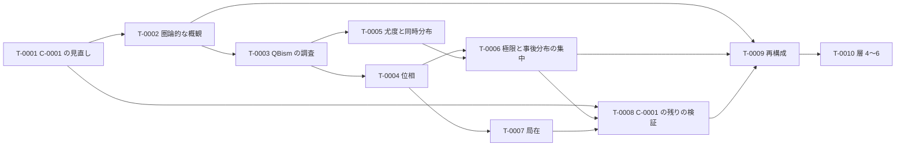

# ロードマップ

最終更新: 2026-09-29（第 11 回、初版）

このファイルは、[フレームワーク](framework.md) を完成させるための作業の最新版です。セッションの終わりごとに更新します（[`CLAUDE.md`](CLAUDE.md) の「セッションの終え方」）。

## 1. 使い方

- 作業は**タスク**（`T-NNNN`）に分け、1 セッションで 1 タスク（大きいものはその一部）を扱う。次のセッションで扱うタスクは [`NEXT.md`](NEXT.md) に書く。
- 詳細化の論点の**本文**は、関係する定義・前提の「未解決の点」と、予想の「詳細化の論点」に置く（そこが正本）。ロードマップは、それらをタスクにまとめ、ID で参照する。
- 順序は、第 11 回にユーザーと相談して決めた（2 節）。優先の順は、状況に応じてユーザーと相談して見直す。

## 2. 進める順序

C-0001 の見直しに必要な定義と前提から先に固め（第 09 回の PR #22 で決めた方針）、そのあとでフレームワークの層を下から順に詳しくしていく。

```math
\text{T-0001} \;→\; \text{T-0002} \;→\; \text{T-0003} \;→\; \text{段階 B（T-0004〜T-0007）} \;→\; \text{T-0008} \;→\; \text{段階 C（T-0009）} \;→\; \text{段階 D（T-0010）}
```

| 段階 | 内容 | タスク |
| --- | --- | --- |
| A | C-0001 の見直しと、フレームワークの概観 | T-0001、T-0002 |
| （調査） | QBism の先行研究 | T-0003 |
| B | 層 1・2（実験・観測量）の詳細化 | T-0004〜T-0007 |
| （検証） | C-0001 の残りの検証 | T-0008 |
| C | 層 3（観測量の時空）の再構成 | T-0009 |
| D | 層 4〜6（可能な実験・可能な観測量・点なし時空） | T-0010 |
| 随時 | 予想の詳細化、予想の候補、運用、文献 | T-0011〜T-0014 |

## 3. タスク

状態は、未着手・進行中・完了・保留のどれかです。

| ID | タスク | 段階 | 前提のタスク | 関係する ID | 状態 |
| --- | --- | --- | --- | --- | --- |
| T-0001 | 予想 C-0001 の見直し | A | なし | [C-0001](conjectures/C-0001.md)、[D-0008](definitions/D-0008.md)、[R-0001](results/R-0001.md)〜[R-0008](results/R-0008.md) | 未着手（第 12 回の予定） |
| T-0002 | フレームワークの圏論的な概観 | A | T-0001 | [framework.md](framework.md) のすべての要素 | 未着手 |
| T-0003 | QBism の先行研究の調査 | 調査 | なし | [D-0005](definitions/D-0005.md)、[A-0007](assumptions/A-0007.md)、[C-0003](conjectures/C-0003.md) | 未着手 |
| T-0004 | 実験パラメータの空間と、結果の統計の空間の位相 | B | なし | [D-0001](definitions/D-0001.md)、[D-0003](definitions/D-0003.md)、[D-0004](definitions/D-0004.md)、[A-0005](assumptions/A-0005.md)、[A-0006](assumptions/A-0006.md) | 未着手 |
| T-0005 | 尤度と同時分布、主体の間で共有するデータの空間 | B | なし | [D-0001](definitions/D-0001.md)、[D-0004](definitions/D-0004.md)、[A-0006](assumptions/A-0006.md)、[A-0007](assumptions/A-0007.md) | 未着手 |
| T-0006 | 極限と事後分布の集中 | B | T-0004、T-0005 | [D-0005](definitions/D-0005.md)、[D-0006](definitions/D-0006.md)、[A-0007](assumptions/A-0007.md)、[C-0005](conjectures/C-0005.md)、[C-0006](conjectures/C-0006.md) | 未着手 |
| T-0007 | 局在の詳細化 | B | T-0004 | [D-0001](definitions/D-0001.md)、[D-0008](definitions/D-0008.md)、[A-0008](assumptions/A-0008.md) | 未着手 |
| T-0008 | C-0001 の残りの検証 | 検証 | T-0001 | [C-0001](conjectures/C-0001.md)（[Issue #8](https://github.com/kittenkiki15/point-free-spacetime/issues/8)） | 未着手 |
| T-0009 | 観測における時空の再構成 | C | T-0002、T-0006 | [D-0007](definitions/D-0007.md)、[C-0002](conjectures/C-0002.md)、[C-0003](conjectures/C-0003.md) | 未着手 |
| T-0010 | 層 4〜6 の定義と前提 | D | T-0009 | [D-0006](definitions/D-0006.md)、[C-0002](conjectures/C-0002.md) | 未着手 |
| T-0011 | 予想 C-0002〜C-0006 の詳細化 | 随時 | 関係する段階のタスク | [C-0002](conjectures/C-0002.md)〜[C-0006](conjectures/C-0006.md) | 未着手 |
| T-0012 | ほかの予想の候補 | 随時 | なし | — | 未着手 |
| T-0013 | `framework.md` の層別の表の検査 | 随時 | なし | [framework.md](framework.md)、`tools/` | 未着手 |
| T-0014 | 文献の未確認事項の確認 | 随時 | なし | [`references.bib`](references.bib)、[`surveys/`](surveys/) | 未着手 |



図の矢印は、2 節の進める順序です。表の「前提のタスク」は、内容の上で先に要るものだけを書いています（例えば T-0003 は、内容の上では前提がないが、順序は T-0002 の後にする）。

## 4. 各タスクの内容

### T-0001 予想 C-0001 の見直し（第 12 回の予定）

- フレームワークの中での位置づけ（どの定義と前提の上で述べる予想か）を明らかにしてから見直す。
- 第 05 回の膨張と余白付きの包含を定義として `definitions/` に移し、C-0001 と結果 R-0001〜R-0008 の「依存する ID」を加える。
- 「区別」の定義を、実験における時空と観測における時空を分けた形（$`𝒪(R)`$ の添字 $`R`$ は実験における時空の領域）で書き直す。
- 詳しい手がかりは [`NEXT.md`](NEXT.md) に書いてある（第 06・07・08 回の調査メモの整理）。

### T-0002 フレームワークの圏論的な概観

- フレームワークの要素（定義・前提・予想）と、その間の関係を、特に圏論的な視点で概観する（第 11 回にユーザーが追加を依頼）。
- 観点の候補（見立て。どれを採るかはユーザーと相談する）：
  - 各層の対象と射：実験（プロトコルと設定）、応答関数、観測量、ロケール（点なしの空間）がそれぞれどんな圏をなすか。
  - 層の間の構成：実験から応答関数へ、観測量から空間への再構成を、関手とみなせるか。再構成を、ゲルファント双対性やフレームとロケールの双対性のような双対・随伴として述べられるか。
  - 極限：「有限な実験の族の極限」を、圏論の極限・余極限や完備化として述べられるか。
  - 整合条件：観測における時空と実験における時空の整合条件（不動点の条件）を、随伴の不動点などとして述べられるか。
- 成果物：調査メモと、`framework.md` への概観の節の追加。

### T-0003 QBism の先行研究の調査（第 09 回にユーザーが追加を依頼）

- 量子ベイズ主義（QBism）と、本プロジェクトのベイズ推定の描像（[D-0005](definitions/D-0005.md)、[A-0007](assumptions/A-0007.md)）との関係を調べる。
- 候補（記憶による）：Caves–Fuchs–Schack の量子 de Finetti 定理、Fuchs–Schack などの QBism の総説、Fuchs–Mermin–Schack "An introduction to QBism"。
- 比べる論点：個人の信念を基本に置く QBism と、主体の間の意見の一致（Blackwell–Dubins）を課す本プロジェクトの立場の違い。統計の関数の推定と状態の推定の違い（[C-0003](conjectures/C-0003.md)）。

### T-0004 実験パラメータの空間と、結果の統計の空間の位相

各ファイルの未解決の点のうち、位相に関するものをまとめて決める。

- [D-0003](definitions/D-0003.md)：$`X`$ の位相（$`X_π`$ を合わせる方法）と、時空の部分と比べる写像。
- [D-0004](definitions/D-0004.md)・[A-0006](assumptions/A-0006.md)：$`\mathrm{Prob}(Y_π)`$ の位相（弱位相か全変動距離か）と、等価原理の「近い」の意味。
- [A-0005](assumptions/A-0005.md)：座標ごとの値域のコンパクト性か、$`X`$ 自体のコンパクト性か。「一様に有界」の範囲。
- [D-0001](definitions/D-0001.md)：結果の空間 $`Y_π`$ の意味。

### T-0005 尤度と同時分布、主体の間で共有するデータの空間

- [D-0004](definitions/D-0004.md)：複数回の結果の同時分布と尤度（条件付き独立を仮定するか）、推定の対象の区別。
- [A-0006](assumptions/A-0006.md)：交換可能性を別の前提として課すか。
- [A-0007](assumptions/A-0007.md)：予測分布を作る同時分布と尤度、主体の間で共有するデータの空間、適用範囲。

### T-0006 極限と事後分布の集中

- [D-0005](definitions/D-0005.md)：極限の位相（一様構造、完備性、分離性）、収束させる対象、部分列の選び方、事後分布の集中の条件、事後分布を置く空間。
- [D-0006](definitions/D-0006.md)（層 5）：予備的な検討にとどめる。実際の観測量の極限の位相を決めるときに、可能な観測量にも同じ取り方が使えるかを確かめる。層 5 の定義と前提そのものは T-0010 で扱う。
- 関係する予想：[C-0005](conjectures/C-0005.md)、[C-0006](conjectures/C-0006.md)。

### T-0007 局在の詳細化

- [D-0008](definitions/D-0008.md)：$`o`$ を実際の観測量と可能な観測量のどちらで取るか、「有界」と「収まる」の意味、代数として閉じるか。
- [A-0008](assumptions/A-0008.md)：実験における時空の領域の与え方。
- [D-0001](definitions/D-0001.md)：各実験が占める領域の決め方。

### T-0008 C-0001 の残りの検証（Issue #8 の作業計画の順）

- 主張 1・3：ユークリッド空間の $`ℓ`$ 近傍による膨張で示し、点なし版を定式化する。
- 主張 2：DFR の 2 節と split property（Doplicher–Longo）の文献を調べ、「操作的に切り離せる」関係を定義する。第 06 回の調査メモの 6.4 節の言い換えも検討する。
- Connes–van Suijlekom の作用素系（`connes2022`）との対応。
- T-0001 の見直しの結果に応じて、内容を改める。

### T-0009 観測における時空の再構成

- [D-0007](definitions/D-0007.md)：再構成の入力、一意性、整合条件、応答関数から積などの演算をどう定めるか（PR #23 の最後のレビュー）。
- [C-0002](conjectures/C-0002.md)・[C-0003](conjectures/C-0003.md) の詳細化。
- 先行研究の調査（まだ読んでいない）：Cao–Carroll–Michalakis "Space from Hilbert Space"（2017）、Van Raamsdonk（2010）、Buchholz–Summers の幾何的モジュラー作用、Keyl の因果構造の再構成。

### T-0010 層 4〜6 の定義と前提

- 層 4（可能な実験）の定義：観測量の時空の中でモデル化した装置による、可能な実験の記述（[C-0002](conjectures/C-0002.md)）。
- 層 5（可能な観測量）：[D-0006](definitions/D-0006.md) の極限の取り方、実際の観測量との関係、不動点の条件（T-0006 の予備的な検討を踏まえる）。
- 層 6（点なし時空）：第 07 回のユーザーの構想の 3〜5（観測する側とされる側の対称性による座標系の誘導、点なし時空、一般相対論の時空連続体への極限）を、予想として登録するか、優先度とあわせてユーザーと相談する。

### T-0011 予想 C-0002〜C-0006 の詳細化

- 各予想の「詳細化の論点」を扱う。いずれも優先度は低で、ほかの予想の証明に必要になった場合に優先度を上げる（第 09 回にユーザーと合意）。

### T-0012 ほかの予想の候補

- 有限な実験の族の極限が、通常の点を持つ空間と確率測度では表せない（どの表現が不可能かの定式化が先に要る。C-0006 から切り離したもの）。
- 第 05 回のおもちゃのモデルの案：C（因果的に閉じた領域。`casini2002`、`cegla1977`）、E（エンタングルメントのエントロピー）、F（非可換な空間。DFR の量子時空、Connes–van Suijlekom）。
- 第 03 回の候補（[heunen2026 のメモ](surveys/2026-09-25_03_heunen2026.md)）：点なしの時制論理、点がないと表せない因果構造、量子と時空の点のなさの統一。
- 第 04 回の候補：時間スライス公理を点なしの依存領域で述べる、因果集合理論の連続極限と Hauptvermutung、量子の文脈依存性と点のなさの統一。
- 時空から作ったフレームのような良いクラスで、共役から (f±) が出るか（[R-0005](results/R-0005.md) の反例は時空とは程遠い）。

### T-0013 `framework.md` の層別の表の検査

- 層別の表の ID・層・状態を各ファイルと照合するテストを加えるか、表をメタデータから生成する（PR #23 のレビュー）。

### T-0014 文献の未確認事項の確認

- 第 09 回に記憶で挙げた文献：Blackwell–Dubins 1962、Diaconis–Freedman、Doob、de Finetti、量子 de Finetti、Kreisel–Lacombe–Shoenfield・Ceitin。
- 第 08 回の調査メモの 9 節：原典が未入手の文献（核型性と split property の原論文、Doplicher–Longo、Buchholz–Doplicher–Longo、fewster2015、Hepp 1972、Vickers *Topology via Logic*、Abramsky 1987）、fewster2016・landsman2005 の掲載情報、記憶に基づいて挙げた事項（Wigner–Araki–Yanase の定理、Lieb–Robinson 評価と無限遠の観測量など）。
- 第 06 回の調査メモの 7 節：sorkin2007 の掲載先、halvorson2002 の書名・刊行年、fewster2020 の DOI、borsten2021 の本文など。
- 第 05 回の調査メモの 5 節：劣位代数とストーン空間上の閉じた関係の双対性、proximity frame（Celani、Bezhanishvili ら）。
- 基礎の調査メモの未確認事項（正則開集合の例の典拠、全射の例の候補の正確な定式化と典拠など）。
- heunen2026・halvorson2001 の出版社版と arXiv 版の違い（未比較）。heunen2024 の例 6.6（一点を除いたミンコフスキー時空が $`T_0`$ 順序でない）の具体的な理由。
- 第 07 回の最初の回答で挙げた、観測・実験に関する物理学の哲学の先行研究（[まとめ](summaries/2026-09-27_07_observation-and-experiment.md)）。

## 5. 保留している事項

- 用語一覧の localic cones の訳「局所的な錐」は、局所性（locality）と紛らわしい。「ロケールの錐」などへの改名を検討する（第 07 回）。
