# ロードマップ

最終更新: 2026-10-03（第 28 回。T-0022 を完了し、振り返りを受けて T-0025「運用の改善」を加えた）

このファイルは、[フレームワーク](framework.md) を完成させるための作業の最新版です。セッションの終わりごとに更新します（[`CLAUDE.md`](CLAUDE.md) の「セッションの終え方」）。

## 1. 使い方

- 作業は**タスク**（`T-NNNN`）に分け、1 セッションで 1 タスク（大きいものはその一部）を扱う。次のセッションで扱うタスクは [`NEXT.md`](NEXT.md) に書く。
- 詳細化の論点の**本文**は、関係する定義・前提の「未解決の点」と、予想の「詳細化の論点」に置く（そこが正本）。ロードマップは、それらをタスクにまとめ、ID で参照する。
- タスクの「関係する ID」に挙げたファイルの未解決の点・詳細化の論点は、そのタスクで扱う。どの未完了のタスクにも入らない論点を残さない（第 27 回にユーザーと決めた）。一つのファイルの論点を複数のタスクに分けて扱うときは、各タスクの節に、どの論点を扱うかを書く。`tools/tests/test_framework.py` で検査するのは、論点を持つファイルが少なくとも一つの未完了のタスクの「関係する ID」にあること（ファイルの掲載漏れ）までで、論点ごとの割り当ては、各タスクの節の記述で確かめる（PR #50 のレビュー）。
- 各段階を終えるときは、次の段階に入る前に、成果物の見直しのタスクを置く。手順は [`docs/review-procedure.md`](docs/review-procedure.md) による（第 27 回にユーザーと決めた。T-0021 のやり方を手順にしたもの）。
- 順序は、第 11 回にユーザーと相談して決めた（2 節）。第 13 回に、ユーザーの提案で T-0015（D-0003 の未解決の点の解決）を T-0002 の前に加えた。第 15 回に、調査が不足している領域を洗い出し、Claude の提案にユーザーが賛成して、調査のタスク T-0016（段階 B の前）と T-0017（T-0008 の前）を加えた。第 19 回に、ユーザーの判断で、T-0018 の範囲を概念と用語の整理に広げ、調査のタスク T-0019（T-0018 の次、段階 B の前）を加えた。優先の順は、状況に応じてユーザーと相談して見直す。

## 2. 進める順序

C-0001 の見直しに必要な定義と前提から先に固め（第 09 回の PR #22 で決めた方針）、そのあとでフレームワークの層を下から順に詳しくしていく。

```math
\text{T-0001} \;→\; \text{T-0015} \;→\; \text{T-0002} \;→\; \text{T-0003} \;→\; \text{T-0016} \;→\; \text{T-0018} \;→\; \text{T-0019} \;→\; \text{T-0020} \;→\; \text{段階 A のクロージング（T-0021、T-0022、T-0025）} \;→\; \text{段階 B（T-0004、T-0023、T-0005〜T-0007）} \;→\; \text{T-0017} \;→\; \text{T-0024} \;→\; \text{T-0008} \;→\; \text{段階 C（T-0009）} \;→\; \text{段階 D（T-0010）}
```

| 段階 | 内容 | タスク |
| --- | --- | --- |
| A | C-0001 の見直し、実験における時空の詳細化、フレームワークの概観 | T-0001、T-0015、T-0002 |
| （調査） | QBism の先行研究、実験の族の位相と極限 | T-0003、T-0016 |
| （用語） | 主体・観測者・装置の使い分けと、設定・時空・パラメータの概念と用語の整理 | T-0018 |
| （調査） | 量子・古典・混成の実験の扱い（一般化確率論、Le Cam の量子版、量子参照系） | T-0019 |
| （整理） | 段階 A のクロージング（成果物の見直し、振り返り、運用の改善） | T-0021、T-0022、T-0025 |
| B | 層 1・2（実験・観測量）の詳細化 | T-0020、T-0004、T-0023、T-0005〜T-0007 |
| （調査） | 時空の側の先行研究（因果構造からの再構成、局在の不可能性の定理、操作的な座標づけ） | T-0017 |
| （詳細化） | 較正と観測者の取り替えの予想の詳細化 | T-0024 |
| （検証） | C-0001・C-0007・C-0008 の検証 | T-0008 |
| C | 層 3（観測量の時空）の再構成 | T-0009 |
| D | 層 4〜6（可能な実験・可能な観測量・点なし時空） | T-0010 |
| 随時 | 予想の詳細化、予想の候補、運用、文献 | T-0011〜T-0014 |

T-0015 は、番号は後から付けたが、順序は T-0001 の次である。T-0016 は T-0003 の次、T-0018 は T-0016 の次（第 16 回にユーザーと決めた）、T-0019 は T-0018 の次で段階 B の前（第 19 回にユーザーと決めた）、T-0017 は段階 B の次（T-0008 の前）である。 T-0020 は、第 25 回のユーザーの判断を定義・前提に反映するタスクで、段階 B の最初に行う（第 25 回）。T-0021・T-0022 は、段階 B の最初の T-0020 の後、段階 B の残りのタスク（T-0004 以降）に進む前に、段階 A のクロージングとして行う（第 26 回にユーザーが追加した。段階 A と、段階 B の最初の T-0020 までを対象とする）。T-0023 は T-0004 の後、T-0005 の前に、T-0024 は T-0017 の後、T-0008 の前に行う（第 27 回にユーザーと決めた）。

## 3. タスク

状態は、未着手・進行中・完了・保留のどれかです。

| ID | タスク | 段階 | 前提のタスク | 関係する ID | 状態 |
| --- | --- | --- | --- | --- | --- |
| T-0001 | 予想 C-0001 の見直し（第 12 回） | A | なし | [C-0001](conjectures/C-0001.md)、[C-0007](conjectures/C-0007.md)、[C-0008](conjectures/C-0008.md)、[D-0008](definitions/D-0008.md)、[R-0001](results/R-0001.md)〜[R-0008](results/R-0008.md) | 完了 |
| T-0002 | フレームワークの圏論的な概観（第 14 回） | A | T-0001 | [framework.md](framework.md) のすべての要素 | 完了 |
| T-0003 | QBism の先行研究の調査（第 15 回） | 調査 | なし | [D-0005](definitions/D-0005.md)、[A-0007](assumptions/A-0007.md)、[C-0003](conjectures/C-0003.md) | 完了 |
| T-0004 | 設定の空間と、結果の統計の空間の位相 | B | なし | [D-0001](definitions/D-0001.md)、[D-0003](definitions/D-0003.md)、[D-0004](definitions/D-0004.md)、[A-0005](assumptions/A-0005.md)、[A-0006](assumptions/A-0006.md)、[A-0004](assumptions/A-0004.md)、[D-0014](definitions/D-0014.md) | 未着手 |
| T-0005 | 尤度と同時分布、主体の間で共有するデータの空間 | B | T-0004、T-0023 | [D-0001](definitions/D-0001.md)、[D-0004](definitions/D-0004.md)、[A-0006](assumptions/A-0006.md)、[A-0007](assumptions/A-0007.md)、[D-0002](definitions/D-0002.md)、[D-0012](definitions/D-0012.md)、[A-0011](assumptions/A-0011.md)、[A-0012](assumptions/A-0012.md)、[A-0001](assumptions/A-0001.md) | 未着手 |
| T-0006 | 極限と事後分布の集中 | B | T-0004、T-0005 | [D-0005](definitions/D-0005.md)、[D-0006](definitions/D-0006.md)、[A-0007](assumptions/A-0007.md)、[C-0005](conjectures/C-0005.md)、[C-0006](conjectures/C-0006.md)、[D-0012](definitions/D-0012.md)、[A-0011](assumptions/A-0011.md)、[A-0012](assumptions/A-0012.md) | 未着手 |
| T-0007 | 局在の詳細化 | B | T-0004 | [D-0001](definitions/D-0001.md)、[D-0008](definitions/D-0008.md)、[A-0008](assumptions/A-0008.md)、[D-0009](definitions/D-0009.md) | 未着手 |
| T-0008 | C-0001・C-0007・C-0008 の検証 | 検証 | T-0001 | [C-0001](conjectures/C-0001.md)、[C-0007](conjectures/C-0007.md)、[C-0008](conjectures/C-0008.md)、[A-0009](assumptions/A-0009.md)、[D-0011](definitions/D-0011.md) | 未着手 |
| T-0009 | 観測における時空の再構成 | C | T-0002、T-0006 | [D-0007](definitions/D-0007.md)、[D-0013](definitions/D-0013.md)、[C-0002](conjectures/C-0002.md)、[C-0003](conjectures/C-0003.md) | 未着手 |
| T-0010 | 層 4〜6 の定義と前提 | D | T-0009 | [D-0006](definitions/D-0006.md)、[C-0002](conjectures/C-0002.md)、[D-0002](definitions/D-0002.md)、[D-0014](definitions/D-0014.md) | 未着手 |
| T-0011 | 予想 C-0002〜C-0006 の詳細化 | 随時 | 関係する段階のタスク | [C-0002](conjectures/C-0002.md)〜[C-0006](conjectures/C-0006.md) | 未着手 |
| T-0012 | ほかの予想の候補 | 随時 | なし | — | 未着手 |
| T-0013 | `framework.md` の層別の表の検査 | 随時 | なし | [framework.md](framework.md)、`tools/` | 未着手 |
| T-0014 | 文献の未確認事項の確認 | 随時 | なし | [`references.bib`](references.bib)、[`surveys/`](surveys/) | 未着手 |
| T-0015 | D-0003 の未解決の点の解決と、D-0011 を可能な実験の定義に改めること（第 13 回） | A | T-0001 | [D-0003](definitions/D-0003.md)、[D-0011](definitions/D-0011.md)、[A-0008](assumptions/A-0008.md)、[A-0009](assumptions/A-0009.md)、[A-0010](assumptions/A-0010.md)、[C-0008](conjectures/C-0008.md) | 完了 |
| T-0016 | 実験の族の位相と極限の先行研究の調査（第 15〜19 回） | 調査 | なし | [D-0001](definitions/D-0001.md)〜[D-0005](definitions/D-0005.md)、[A-0006](assumptions/A-0006.md)、[A-0007](assumptions/A-0007.md)、[C-0003](conjectures/C-0003.md)、[C-0005](conjectures/C-0005.md)、[C-0006](conjectures/C-0006.md) | 完了 |
| T-0017 | 時空の側の先行研究の調査 | 調査 | なし | [D-0013](definitions/D-0013.md)、[D-0007](definitions/D-0007.md)、[D-0008](definitions/D-0008.md)、[A-0010](assumptions/A-0010.md)、[C-0002](conjectures/C-0002.md)、[C-0007](conjectures/C-0007.md)、[C-0008](conjectures/C-0008.md) | 未着手 |
| T-0018 | 主体・観測者・装置の使い分けと、設定・時空・パラメータの概念と用語の整理（第 16 回に追加、第 19 回に範囲を拡大、第 20 回に完了） | 用語 | なし | [A-0001](assumptions/A-0001.md)、[A-0007](assumptions/A-0007.md)、[A-0010](assumptions/A-0010.md)、[D-0001](definitions/D-0001.md)、[D-0003](definitions/D-0003.md)、[D-0005](definitions/D-0005.md)、[D-0011](definitions/D-0011.md)、[D-0012](definitions/D-0012.md)、[D-0013](definitions/D-0013.md)、[A-0011](assumptions/A-0011.md)〜[A-0016](assumptions/A-0016.md)、[C-0009](conjectures/C-0009.md)〜[C-0013](conjectures/C-0013.md) | 完了 |
| T-0019 | 量子・古典・混成の実験の扱いの先行研究の調査（第 19 回に追加） | 調査 | なし | [D-0001](definitions/D-0001.md)、[D-0002](definitions/D-0002.md)、[D-0003](definitions/D-0003.md)、[D-0004](definitions/D-0004.md)、[D-0005](definitions/D-0005.md)、[D-0006](definitions/D-0006.md)、[A-0003](assumptions/A-0003.md)、[A-0006](assumptions/A-0006.md)、[A-0010](assumptions/A-0010.md)、[C-0003](conjectures/C-0003.md) | 完了 |
| T-0020 | T-0019 の判断（第 25 回）に沿った、実際の実験と可能な実験の区別の定義・前提への反映 | B | T-0019 | [D-0014](definitions/D-0014.md)、[A-0003](assumptions/A-0003.md)、[D-0001](definitions/D-0001.md)、[D-0002](definitions/D-0002.md)、[D-0012](definitions/D-0012.md)、[D-0013](definitions/D-0013.md)、[A-0013](assumptions/A-0013.md)、[A-0016](assumptions/A-0016.md)、[C-0012](conjectures/C-0012.md)、[C-0013](conjectures/C-0013.md) | 完了 |
| T-0021 | 成果物の見直し（予想の優先度の棚卸、定義・前提の状態の更新、文章の校正） | 整理 | T-0020 | 横断的なタスク（特定の ID はない。対象はすべての定義・前提・予想・結果） | 完了 |
| T-0022 | 段階 A までの本プロジェクトの振り返り | 整理 | T-0021 | 横断的なタスク（特定の ID はない。対象は `framework.md`・`roadmap.md`・まとめ） | 完了 |
| T-0023 | 予想 C-0003・C-0004・C-0006 の検証（第 27 回に追加） | B | T-0004 | [C-0003](conjectures/C-0003.md)、[C-0004](conjectures/C-0004.md)、[C-0006](conjectures/C-0006.md)、[A-0002](assumptions/A-0002.md) | 未着手 |
| T-0024 | 較正と観測者の取り替えの予想の詳細化（第 27 回に追加） | 詳細化 | T-0017 | [C-0009](conjectures/C-0009.md)〜[C-0013](conjectures/C-0013.md)、[A-0013](assumptions/A-0013.md)、[A-0016](assumptions/A-0016.md)、[A-0014](assumptions/A-0014.md)、[A-0015](assumptions/A-0015.md) | 未着手 |
| T-0025 | 運用の改善（第 28 回に追加） | 整理 | T-0022 | 横断的なタスク（特定の ID はない。対象は運用の仕組み） | 未着手 |

```mermaid
flowchart LR
  T0001["T-0001 C-0001 の見直し"] --> T0015["T-0015 実験における時空と D-0011"]
  T0015 --> T0002["T-0002 圏論的な概観"]
  T0002 --> T0003["T-0003 QBism の調査"]
  T0003 --> T0016["T-0016 実験の族の位相と極限の調査"]
  T0016 --> T0018["T-0018 概念と用語の整理"]
  T0018 --> T0019["T-0019 量子・古典・混成の調査"]
  T0019 --> T0020["T-0020 実際と可能の区別の反映"]
  T0020 --> T0021["T-0021 成果物の見直し"]
  T0021 --> T0022["T-0022 振り返り"]
  T0022 --> T0025["T-0025 運用の改善"]
  T0025 --> T0004["T-0004 位相"]
  T0004 --> T0023["T-0023 C-0003・C-0004・C-0006 の検証"]
  T0023 --> T0005["T-0005 尤度と同時分布"]
  T0004 --> T0006["T-0006 極限と事後分布の集中"]
  T0005 --> T0006
  T0004 --> T0007["T-0007 局在"]
  T0001 --> T0008["T-0008 C-0001・C-0007・C-0008 の検証"]
  T0006 --> T0017["T-0017 時空の側の調査"]
  T0007 --> T0017
  T0017 --> T0024["T-0024 較正と取り替えの予想"]
  T0024 --> T0008
  T0002 --> T0009["T-0009 再構成"]
  T0006 --> T0009
  T0008 --> T0009
  T0009 --> T0010["T-0010 層 4〜6"]
```



図の矢印は、2 節の進める順序です。表の「前提のタスク」は、内容の上で先に要るものだけを書いています（例えば T-0003 は、内容の上では前提がないが、順序は T-0002 の後にする。T-0008 も、内容の上の前提は T-0001 だけで、T-0006・T-0007 から T-0017 を経る矢印は順序を表す。T-0016・T-0017・T-0019 も、内容の上の前提はない）。

## 4. 各タスクの内容

### T-0001 予想 C-0001 の見直し（第 12 回に完了）

- 第 12 回に行った（[まとめ](summaries/2026-09-29_12_c0001-revision.md)）。
  - 膨張と余白付きの包含を定義 [D-0009](definitions/D-0009.md)・[D-0010](definitions/D-0010.md) に移し、R-0006〜R-0008 の「依存する ID」を加えた（R-0001〜R-0005 は C-0001 の土台ではないので、依存は加えていない）。
  - 「区別」を、実験における時空の言葉で書き直した（候補 A：装置の占める領域による膨張 [D-0011](definitions/D-0011.md)、上下限の前提 [A-0009](assumptions/A-0009.md)）。
  - C-0001 を、数学の部分（[C-0001](conjectures/C-0001.md)）、物理から装置の占有範囲の上下限を導く部分（[C-0007](conjectures/C-0007.md)）、共変性との緊張（[C-0008](conjectures/C-0008.md)）に分けた。
- 第 11 回までの手がかりのうち、C-0007・C-0008 に関わるもの（distal split、分離の距離、観測者ごとの族と赤外の上限）は、それぞれの予想の「詳細化の論点」に移した。第 07 回からの検討課題は T-0009 に、未読の文献は T-0009・T-0014 に移した。

### T-0002 フレームワークの圏論的な概観（第 14 回に完了）

- 第 14 回に行った（[まとめ](summaries/2026-09-29_14_categorical-overview.md)、[調査メモ](surveys/2026-09-29_14_categorical-overview.md)、`framework.md` の 4.1 節）。ユーザーの判断で、骨組みはマルコフ圏（層 1〜2）と随伴の不動点（層 3〜5）とし、深さは対応表と文献の確認まで、状態の扱いはモデル全体の圏とした。
- 候補として記録したもの（登録していない）の扱い：
  - 「実験の圏」「モデルの圏」の定義の候補と、実際の観測量の極限をコルモゴロフ積の上のベイズの逆の極限として定式化する予想の候補は、T-0005・T-0006 で検討する。
  - 再構成と記述し直しが随伴をなし、整合条件がその不動点になるという予想の候補は、T-0009 で検討する。
  - 局在の関手と観測者の取り替えの亜群の両立（C-0008 の言い換え）は、T-0008 で検討する。

第 14 回の開始時の記録：

- フレームワークの要素（定義・前提・予想）と、その間の関係を、特に圏論的な視点で概観する（第 11 回にユーザーが追加を依頼）。
- 観点の候補（見立て。どれを採るかはユーザーと相談する）：
  - 各層の対象と射：実験（プロトコルと設定）、応答関数、観測量、ロケール（点なしの空間）がそれぞれどんな圏をなすか。
  - 層の間の構成：実験から応答関数へ、観測量から空間への再構成を、関手とみなせるか。実験から応答関数への対応では、状態や装置のモデルを固定するのか、それらも対象に含めるのかを先に決める（同じプロトコルと設定でも、状態や装置が異なれば応答確率は異なる。PR #24 のレビュー）。再構成を、ゲルファント双対性やフレームとロケールの双対性のような双対・随伴として述べられるか。
  - 極限：「有限な実験の族の極限」を、圏論の極限・余極限や完備化として述べられるか。
  - 整合条件：観測における時空と実験における時空の整合条件（不動点の条件）を、随伴の不動点などとして述べられるか。
- 成果物：調査メモと、`framework.md` への概観の節の追加。

### T-0003 QBism の先行研究の調査（第 15 回に完了）

- 第 09 回にユーザーが追加を依頼した。第 15 回に、ユーザーの判断で「(a) 主体の間の一致」に重点を置き、中心の文献の本文で定理の仮定と結論を確かめた（[調査メモ](surveys/2026-09-29_15_qbism-agreement.md)）。
  - 量子 de Finetti 定理と量子ベイズ則の仮定と結論を確かめた。主体の間の一致の主張の証明は、確認した範囲の文献では見つけられなかった。
  - [A-0007](assumptions/A-0007.md) と [D-0005](definitions/D-0005.md) の「注意」に比較の結果を加え、一致の定理の原典の確認を T-0014 に加えた。
- 残した論点（今後の調査対象。調査メモの 5 節）：(b) 推定の対象（[C-0003](conjectures/C-0003.md) と断層撮影・SIC 測定）、(c) 立場の違い（QBism への批判）、(d) 第 14 回の圏論的概観とのつながり（非可換ベイズの逆）。

### T-0004 設定の空間と、結果の統計の空間の位相

各ファイルの未解決の点のうち、位相に関するものをまとめて決める。

- [D-0003](definitions/D-0003.md)：$`X`$ の位相と、時空の部分と比べる写像は、第 13 回（T-0015）に決めた（直和の位相、観測者の座標 $`M_O`$ への換算）。残るのは、結果の読みでない座標の扱い。
- [D-0004](definitions/D-0004.md)・[A-0006](assumptions/A-0006.md)：$`\mathrm{Prob}(Y_π)`$ の位相（弱位相か全変動距離か）と、等価原理の「近い」の意味。
- [A-0005](assumptions/A-0005.md)：座標ごとの値域のコンパクト性か、$`X`$ 自体のコンパクト性か。「一様に有界」の範囲。
- [D-0001](definitions/D-0001.md)：結果の空間 $`Y_π`$ の意味。
- [D-0014](definitions/D-0014.md)（未解決の点の「位相・可測構造・許す状態」。ほかの論点は T-0010 で扱う）：可能な実験の設定と結果の空間（状態の集合）の位相（双対ノルムの位相か弱 * 位相か。$`B(H)`$ の正規状態ではトレースノルムの位相）と、座標による表示に同相写像であることを課すか。状態を値とする設定・結果の上の較正（[D-0013](definitions/D-0013.md) の 4 の核の定義域と可測構造）も、ここで扱う（第 26 回。PR #48 のレビュー）。
- 第 27 回に割り当てた（T-0021）：[A-0004](assumptions/A-0004.md)（観測の外の操作の資源、予算か実際の消費量か）。

### T-0005 尤度と同時分布、主体の間で共有するデータの空間

- [D-0004](definitions/D-0004.md)：複数回の結果の同時分布と尤度（条件付き独立を仮定するか）、推定の対象の区別。
- [A-0006](assumptions/A-0006.md)：交換可能性を別の前提として課すか。
- [A-0007](assumptions/A-0007.md)：予測分布を作る同時分布と尤度、主体の間で共有するデータの空間、適用範囲。前提を相互とするか片側とするか、フレームワークで採る一致の段階（第 16 回に加えた論点。ユーザーの判断で次に回した）。
- 弱い併合（Kalai–Lehrer 1994。文献は記憶による。未確認）：A-0007 の一致の段階の候補として、ここで調べる（第 19 回に T-0016 から移した）。
- 第 27 回に割り当てた（T-0021）：[D-0002](definitions/D-0002.md)（適応的な規則の定義域と可測性）、[D-0012](definitions/D-0012.md)・[A-0011](assumptions/A-0011.md)（事前分布の使い方、主体の包含、信念の更新、記録の共有）、[A-0001](assumptions/A-0001.md)（主体の境界と実験の個別化）、[A-0012](assumptions/A-0012.md)（読み出しと登録、重なる観測）。

### T-0006 極限と事後分布の集中

- [D-0005](definitions/D-0005.md)：極限の位相（一様構造、完備性、分離性）、収束させる対象、部分列の選び方、事後分布の集中の条件、事後分布を置く空間。
- [D-0006](definitions/D-0006.md)（層 5）：予備的な検討にとどめる。実際の観測量の極限の位相を決めるときに、可能な観測量にも同じ取り方が使えるかを確かめる。層 5 の定義と前提そのものは T-0010 で扱う。
- 関係する予想：[C-0005](conjectures/C-0005.md)、[C-0006](conjectures/C-0006.md)。
- 第 17 回の候補（[調査メモ](surveys/2026-09-30_17_comparison-of-experiments.md)の 7 節）：実験を共通の空間に置く方法としての Le Cam の不足度（$`Θ`$ の読み方の二つの候補）、$`Θ`$ が有限の場合の極限の二つの見方の一致、模倣をねじれ射の圏 $`\mathrm{Tw}(\mathsf{Stoch})`$ の射と読む候補（第 14 回の模倣の向きの論点。T-0005 とも関係する）。
- 第 19 回に T-0016 から移したもの：(1) 第 17 回・第 18 回の検算（有限の $`Θ`$ での $`Δ`$ 収束と、一般の事前分布への拡張。[第 18 回の調査メモ](surveys/2026-09-30_18_limit-topology.md)の 6.2 節）の、証明の形での確認。(2) ねじれ射の圏による模倣の読み替え（第 17 回の調査メモの 7.3 節。まだ検算していない候補）の、式での確認。
- 第 27 回に割り当てた（T-0021）：[D-0012](definitions/D-0012.md)・[A-0011](assumptions/A-0011.md)（可能な観測量の推定での事前分布）、[A-0012](assumptions/A-0012.md)（極限での制限の列）。

### T-0007 局在の詳細化

- [D-0008](definitions/D-0008.md)：$`o`$ を実際の観測量と可能な観測量のどちらで取るか、「有界」と「収まる」の意味、代数として閉じるか。
- [A-0008](assumptions/A-0008.md)：実験における時空の領域の与え方。
- [D-0001](definitions/D-0001.md)：各実験が占める領域の決め方。
- 第 27 回に割り当てた（T-0021）：[D-0009](definitions/D-0009.md)（完備束 $`L`$ の取り方。[A-0008](assumptions/A-0008.md) と同じ論点）。

### T-0008 C-0001・C-0007・C-0008 の検証

- 始めるときに、予想全件（C-0001〜C-0008）の優先度を見直す（第 12 回にユーザーと合意）。
- [C-0001](conjectures/C-0001.md)（数学。[Issue #8](https://github.com/kittenkiki15/point-free-spacetime/issues/8)）：主張 1・2 を自然言語で証明し、ユークリッド空間の場合を Lean で形式化する。主張 3 と点なし版。
- [C-0007](conjectures/C-0007.md)（物理）：DFR の 2 節と split property（Doplicher–Longo）の文献を調べ、装置の占める領域の下限を与える議論を取り出す。候補 B（操作的な切り離し）で $`\mathrm{occ}`$ を定める方法と、第 06 回の調査メモの 6.4 節の言い換えも検討する。
- [C-0008](conjectures/C-0008.md)（共変性）：主張 1 の証明と、2 次元ミンコフスキー時空での Lean による形式化。主張 3（観測者ごとの族）の形を決める。
- Connes–van Suijlekom の作用素系（`connes2022`）との対応。
- 第 27 回に割り当てた（T-0021）：[A-0009](assumptions/A-0009.md)（$`d_O`$ の選び方、$`ℓ`$ と $`Λ`$ の比、観測者ごとの族）、[D-0011](definitions/D-0011.md)（装置の占める領域による膨張の未解決の点）。

### T-0009 観測における時空の再構成

- [D-0007](definitions/D-0007.md)：再構成の入力、一意性、整合条件、応答関数から積などの演算をどう定めるか（PR #23 の最後のレビュー）。
- [C-0002](conjectures/C-0002.md)・[C-0003](conjectures/C-0003.md) の詳細化。
- 先行研究の調査（まだ読んでいない）：Cao–Carroll–Michalakis "Space from Hilbert Space"（2017）、Van Raamsdonk（2010）、Buchholz–Summers の幾何的モジュラー作用、Keyl の因果構造の再構成。
- 第 07 回からの検討課題（第 12 回に T-0001 から移した）：
  - 主張 1'（橋渡し）：実験における時空の領域の性質（互いに空間的に離れている、など）が $`𝒪(R)`$ の性質（互いに可換である、など）にどう反映されるか。$`R ↦ 𝒪(R)`$ から観測における時空の局在を再構成できるか。Fewster–Verch の定理 3.3 は、時空と局所代数をあらかじめ与えた枠組みでの主張で、そのままでは主張 1' にならない。各操作が事象 $`p`$ からの信号で起動し、結果を $`q`$ で読み出すと仮定すれば操作の領域は $`J^+(p) ∩ J^-(q)`$ に収まる（あらかじめ置いた装置も許すなら、領域の主張を弱める必要がある）。
  - 観測における時空の局所性を定義する候補（可換子による因果的な補集合、split property、核型性）と、観測量が局在できる領域の族（上に閉じた族。交わりで閉じるのはどんな族か）。
  - 「観測する側と観測される側の対称性」：局所代数（フォン・ノイマン代数）の包含 $`𝒜(O_1) ⊂ 𝒜(O_2)`$（$`O_1 ⋐ O_2`$ は領域。第 08 回の調査メモの 4 節の記号では $`R_i = R(O_i)`$）について、$`𝒜(O_1) ⊗ 𝒜(O_1)`$ の上の flip が $`𝒜(O_2) ⊗ 𝒜(O_2)`$ の内部自己同型で実装できること ⇔ split（追加の条件の下で。系と装置の入れ替えにはそのまま適用できない）、split と大域的な対称性 ⇒ 対称性の局所的な実装（生成子を保存する局所的なカレントのぼかしと読むのは解釈）、という既知の鎖（第 08 回の調査メモの 4 節）。
  - 装置の占める領域による膨張（[D-0011](definitions/D-0011.md)）と余白付きの包含が、観測における時空にどう移るか。
- [D-0013](definitions/D-0013.md) の整合条件（第 13 回に T-0015 から残した。第 20 回に D-0003 から D-0013 に移った）：観測における時空のモデルが予測する準備の事象と登録の事象（基準の時計と物差しで測った時刻と場所）と、較正の写像 $`τ_e`$・$`σ_e`$ が与えるものとの一致（不動点の条件。第 19 回までは旧記法 $`τ^O`$ で述べていた）。観測者の取り替え $`M_O → M_{O'}`$ の形（ポアンカレ変換になるか。[C-0008](conjectures/C-0008.md) はこれを仮定する）。実際の実験の記録された占める領域と、モデルの占める領域の整合的な関係（一致や包含。[D-0011](definitions/D-0011.md)）。

### T-0010 層 4〜6 の定義と前提

- 層 4（可能な実験）の定義：観測量の時空の中でモデル化した装置による、可能な実験の記述（[C-0002](conjectures/C-0002.md)）。
- 層 5（可能な観測量）：[D-0006](definitions/D-0006.md) の極限の取り方、実際の観測量との関係、不動点の条件（T-0006 の予備的な検討を踏まえる）。
- 層 6（点なし時空）：第 07 回のユーザーの構想の 3〜5（観測する側とされる側の対称性による座標系の誘導、点なし時空、一般相対論の時空連続体への極限）を、予想として登録するか、優先度とあわせてユーザーと相談する。
- 第 27 回に割り当てた（T-0021）：[D-0002](definitions/D-0002.md)（可能な実験として許すプロトコル、観測対象の物理モデルの置き場所）、[D-0014](definitions/D-0014.md)（結果の読み方、設定とプロトコルの境界、実際の実験との対応。位相・可測構造・許す状態は T-0004 で扱う）。D-0014 の「ほかの枠組みとの関係」（一般化確率論の状態空間との関係。[C-0003](conjectures/C-0003.md)）もここで扱う。

### T-0011 予想 C-0002〜C-0006 の詳細化

- 各予想の「詳細化の論点」を扱う。いずれも優先度は低で、ほかの予想の証明に必要になった場合に優先度を上げる（第 09 回にユーザーと合意）。

### T-0012 ほかの予想の候補

- 有限な実験の族の極限が、通常の点を持つ空間と確率測度では表せない（どの表現が不可能かの定式化が先に要る。C-0006 から切り離したもの）。整合する有限回の測定結果の分布は、標準ボレル空間などの通常の条件の下では、点を持つ結果の列の空間の上の測度で表せる。そのため、確率分布だけでなく、局在や代数的な演算など、表現が保存すべき構造を指定する必要がある（PR #24 のレビュー）。
- 第 05 回のおもちゃのモデルの案：C（因果的に閉じた領域。`casini2002`、`cegla1977`）、E（エンタングルメントのエントロピー。余白を狭めたときの発散を、膨張の「コスト」として入れられるか）、F（非可換な空間。DFR の量子時空、Connes–van Suijlekom）。
- 第 03 回の候補（[heunen2026 のメモ](surveys/2026-09-25_03_heunen2026.md)）：点なしの時制論理、点がないと表せない因果構造、量子と時空の点のなさの統一。
- 第 04 回の候補：時間スライス公理を点なしの依存領域で述べる、因果集合理論の連続極限と Hauptvermutung、量子の文脈依存性と点のなさの統一。
- 時空から作ったフレームのような良いクラスで、共役から (f±) が出るか（[R-0005](results/R-0005.md) の反例は時空とは程遠い）。

### T-0013 `framework.md` の層別の表の検査

- 層別の表の ID・層・状態を各ファイルと照合するテストを加えるか、表をメタデータから生成する（PR #23 のレビュー）。

### T-0014 文献の未確認事項の確認

- 第 09 回に記憶で挙げた文献：Blackwell–Dubins 1962、Diaconis–Freedman、Doob、de Finetti、量子 de Finetti、Kreisel–Lacombe–Shoenfield・Ceitin。
- 第 15 回の調査メモの 4 節：事後一致性の定理（Doob、Schwartz）と Blackwell–Dubins 1962 の原典で、QBism の主体の間の一致の主張（確認した範囲の文献では証明を見つけられなかった）を正確な定理の形にし、「データが指す状態の近傍で正」という条件がどの仮定に当たるかを確かめる。A-0007 の注意の同値（交換可能で同一の情報的に完全な測定を繰り返す場合）の証明と、測定を変える場合の条件も確かめる。一致の主張で将来の系の数 $`N`$ を固定するかも定める。データが指す状態 $`ρ_{D_K}`$ の有限のデータからの定め方（制約付きの最尤推定など）と、その収束の条件も確かめる。Hudson–Moody 1976 の原典の仮定。
  - 第 16 回に、Blackwell–Dubins 1962 と Diaconis–Freedman 1986 の原典、Doob と Schwartz の定理の正確な形（二次文献）を確かめ、固定した真の状態を用いる設定での一致の十分条件を、Schwartz の定理の当てはめとして確かめた（QBism の「データが指す状態」との対応は未確認）。A-0007 の注意の同値（同一の情報的に完全な測定を繰り返す場合）も証明した（[第 16 回の調査メモ](surveys/2026-09-30_16_merging-and-consistency.md)）。残るのは、Bernstein–von Mises の定理の仮定、Freedman 1963・Schwartz 1965 の原典、Hudson–Moody 1976 の原典、$`ρ_{D_K}`$ の定め方、測定を変える場合の同値の条件。
- 第 08 回の調査メモの 9 節：原典が未入手の文献（核型性と split property の原論文、dantoni1987、Doplicher–Longo、Buchholz–Doplicher–Longo、fewster2015、Hepp 1972、Vickers *Topology via Logic*、Abramsky 1987）、fewster2016・landsman2005 の掲載情報、記憶に基づいて挙げた事項（Wigner–Araki–Yanase の定理、Lieb–Robinson 評価と無限遠の観測量など）。
- 第 06 回の調査メモの 7 節：sorkin2007 の掲載先、halvorson2002 の書名・刊行年、fewster2020 の DOI、borsten2021 の本文など。
- 第 05 回の調査メモの 5 節：劣位代数とストーン空間上の閉じた関係の双対性、proximity frame（Celani、Bezhanishvili ら）。
- 基礎の調査メモの未確認事項（正則開集合の例の典拠、全射の例の候補の正確な定式化と典拠など）。
- heunen2026・halvorson2001 の出版社版と arXiv 版の違い（未比較）。heunen2024 の例 6.6（一点を除いたミンコフスキー時空が $`T_0`$ 順序でない）の具体的な理由。
- 第 07 回の最初の回答で挙げた、観測・実験に関する物理学の哲学の先行研究（[まとめ](summaries/2026-09-27_07_observation-and-experiment.md)）。
- 第 27 回の一覧の抜けの確認（T-0021）で見つけた、記憶による言及・未読の文献：Ignatowski 1910・Lévy-Leblond 1976（[C-0009](conjectures/C-0009.md)。ローレンツ変換かガリレイ変換を導く古典的な結果）、Hossenfelder 2012（[C-0008](conjectures/C-0008.md)、arXiv:1205.3636。hossenfelder2013 とは別の論文）。原典を確かめてから `references.bib` に登録する。

### T-0015 D-0003 の未解決の点の解決と、D-0011 を可能な実験の定義に改めること（第 13 回に完了）

- 第 13 回に、ユーザーの提案で T-0002 の前に行った（[まとめ](summaries/2026-09-29_13_experimental-spacetime.md)）。
  - [D-0003](definitions/D-0003.md)：$`X`$ を $`X_π ⊆ ℝ^{n_π}`$ の直和とし、直和の位相を入れた。時空の部分は、観測者 $`O`$ の基準の時計と物差しとの較正で座標 $`M_O = ℝ^{1+n}`$ に換算する（新しい前提 [A-0010](assumptions/A-0010.md)）。$`M_O`$ に座標の距離 $`d_O`$ を入れた。
  - [A-0008](assumptions/A-0008.md)：領域を $`M_O`$ の開集合、有界性を $`d_O`$ での有界性として中身を決め、未定から作業上にした。
  - [D-0011](definitions/D-0011.md)：可能な実験についての定義と明記し、層を「可能な実験」に移した。実際の実験の記録された占める領域と、可能な実験のモデルの占める領域を分け、[C-0002](conjectures/C-0002.md) を依存する ID に加えた（ユーザーの指摘）。A-0009・C-0007・C-0008 も層 4 に移った。
  - [C-0008](conjectures/C-0008.md)：観測者の取り替えがポアンカレ変換で表されることを、整合条件の一部として仮定する形にした。
- D-0003 の整合条件（観測者の取り替えの形、記録とモデルの占める領域の整合的な関係を含む）は、T-0009 に残した。

### T-0016 実験の族の位相と極限の先行研究の調査（第 15 回に追加、第 19 回に完了）

第 15 回に、調査が不足している領域のうち、段階 B（T-0004〜T-0006）の位相と極限に直結するものを一つの調査にまとめた（文献は記憶による。未確認）。

- 統計的実験の比較と収束の理論：Le Cam の不足度と距離、Blackwell の実験の比較、Torgersen。実験の族の極限の位相と距離の候補。第 14 回の概観の「模倣」の順序との対応（[調査メモ](surveys/2026-09-29_14_categorical-overview.md)の 6 節）。
- 操作的な確率論の枠組み：一般化確率論（Hardy、Barrett、Chiribella–D'Ariano–Perinotti）と Ludwig の公理的な量子力学。実験から統計への対応（[D-0001](definitions/D-0001.md)〜[D-0004](definitions/D-0004.md)）の先行研究、状態空間の再構成、有限な実験からの一様構造による完備化（[D-0005](definitions/D-0005.md) の極限の位相）。[C-0003](conjectures/C-0003.md)・[C-0005](conjectures/C-0005.md) との関係。
- ベイズ統計の事後一致性：Doob、Schwartz、Diaconis–Freedman の不一致の例、Ghosal–van der Vaart。[C-0006](conjectures/C-0006.md) の反例と条件、[A-0007](assumptions/A-0007.md) の一致の定理の正確な形（原典の確認は T-0014 と共通）。
- 成果物：調査メモと、T-0004〜T-0006 で決める事項への候補。
- 第 16 回：ユーザーの判断で、事後一致性の領域のうち「A-0007 の一致の定理の正確な形」に重点を置き、本文で定理の仮定と結論を確かめた（[調査メモ](surveys/2026-09-30_16_merging-and-consistency.md)）。結果を A-0007・D-0005 に反映した。残るのは、Le Cam の理論と実験の比較、一般化確率論と Ludwig、弱い併合（Kalai–Lehrer 1994。第 16 回にユーザーの判断で扱わなかった）。
- 第 16 回の後に、ユーザーが実験の比較の原典 5 件を入手し、非公開リポジトリの `papers/` に置いた：`blackwell1951`（Blackwell, Comparison of experiments, Proc. Second Berkeley Symp., 1951）、`blackwell1953`（Blackwell, Equivalent comparisons of experiments, Ann. Math. Statist. 24, 1953）、`lecam1964`（Le Cam, Sufficiency and approximate sufficiency, Ann. Math. Statist. 35, 1964）、`shannon1958`（Shannon, A note on a partial ordering for communication channels, Information and Control 1, 1958）、`raginsky2011`（Raginsky, Shannon meets Blackwell and Le Cam: channels, codes, and statistical experiments, Proc. IEEE ISIT, 2011）。書誌情報は `references.bib` に登録済み。
- 第 17 回：ユーザーの判断で、残りのうち「Le Cam の理論と実験の比較」に重点を置き、上の原典 5 件の本文で定理の仮定と結論を確かめた（[調査メモ](surveys/2026-09-30_17_comparison-of-experiments.md)）。プロジェクトへのつながりの候補（調査メモの 7 節。Claude の見立て）を、D-0005 の未解決の点と下の T-0006 に記録した。
- 第 17 回の後の予定（ユーザーの判断）：PR のマージ後に、ユーザーが第 17 回の調査メモを確認する。次回以降のセッションで、(1) 報告と調査メモへの疑問点・掘り下げ、(3) 調査メモの 7 節の候補の検算（有限の $`Θ`$ での不足度の距離 $`Δ`$ での収束（7.2 節の見通し）の証明、ねじれ射の圏による模倣の読み替え（7.3 節）の式での確認）を行う。
- 第 18 回：ユーザーの判断で、残りを「極限の位相」に絞り（Le Cam の実験の弱収束と Ludwig の構成）、原典（Le Cam 1972、van der Vaart 2002、Torgersen 1970、Ludwig 1968・1985）で確かめた（[第 18 回の調査メモ](surveys/2026-09-30_18_limit-topology.md)）。第 17 回の 7.2 節の見通し（共通のデータ列を入れ子に観測する族の、有限の $`Θ`$ での $`Δ`$ 収束）は、標準測度の弱収束と距離の同値から従うことを確かめた（Claude の検算）。A-0001 に Ludwig の「物理の有限性」を先例として加えた。
- 第 18 回の後の予定（ユーザーの判断）：次のセッションで、第 17 回の調査メモについてのユーザーの疑問点と掘り下げの対話を行う。T-0016 を閉じるかは、その対話が終わってから決める。閉じる場合の移し先の案（Claude の提案。未決定）：弱い併合 → T-0005、一般化確率論の再構成 → C-0003・T-0011、第 17 回・第 18 回の検算の証明の形での確認とねじれ射の圏の確認 → T-0006。
- 第 19 回：第 17 回・第 18 回の調査メモについて、ユーザーと対話した。ユーザーの判断で T-0016 を閉じ、残りを次のように移した。
  - 一般化確率論（状態空間の再構成、古典・量子・混成の区別）→ 新しい調査のタスク T-0019
  - 弱い併合（Kalai–Lehrer 1994）→ T-0005
  - 第 17 回・第 18 回の検算の、証明の形での確認と、ねじれ射の圏の確認 → T-0006

### T-0017 時空の側の先行研究の調査（第 15 回に追加）

第 15 回に、調査が不足している領域のうち、時空の側（検証 T-0008 と段階 C・D）に関わるものを一つの調査にまとめた（文献は記憶による。未確認）。

- 時空の因果構造からの再構成：Malament、Hawking–King–McCarthy の定理。観測から時空を再構成するときに、何の情報で幾何が決まるか（[C-0002](conjectures/C-0002.md)、[D-0007](definitions/D-0007.md)）。
- 相対論的な局在の不可能性の定理：Newton–Wigner、Hegerfeldt、Malament の局在の定理。[C-0007](conjectures/C-0007.md)・[C-0008](conjectures/C-0008.md)・[D-0008](definitions/D-0008.md) に近い既存の定理があるか。
- 操作的な座標づけと参照系：レーダー座標、Bondi の k 計算、量子参照系。較正の写像と観測者の取り替え（[A-0010](assumptions/A-0010.md)、[D-0013](definitions/D-0013.md) の整合条件、[A-0014](assumptions/A-0014.md)・[A-0015](assumptions/A-0015.md)。第 20 回に、整合条件は D-0003 から D-0013 に移った）。
- 順序は段階 B の後、T-0008 の前とする（局在の定理を C-0007・C-0008 の検証に使うため）。

### T-0018 主体・観測者・装置の使い分けと、設定・時空・パラメータの概念と用語の整理（第 16 回に追加、第 20 回に完了）

第 16 回に、ユーザーの指摘で追加した。「主体」「観測者」「装置」などの語の、プロジェクト内での意味を決める。

- 今の使われ方（第 16 回に確認した範囲）：
  - **主体**：事前分布を持ち、データで信念を更新する者（[A-0007](assumptions/A-0007.md)、[D-0005](definitions/D-0005.md)）。[A-0001](assumptions/A-0001.md) の「実験の主体」は、実験をする者の意味（ユーザーによる）。
  - **観測者**：基準の時計と物差しを持ち、座標 $`M_O`$ を与える者（[D-0003](definitions/D-0003.md)、[A-0010](assumptions/A-0010.md)、[D-0011](definitions/D-0011.md)、[A-0008](assumptions/A-0008.md)、[C-0008](conjectures/C-0008.md)）。[D-0001](definitions/D-0001.md) では、実験をする者の意味（「実験を行う観測者の世界線」）で使っている。
  - **装置**：時空の中に領域を占める物理系（[D-0001](definitions/D-0001.md)、[D-0011](definitions/D-0011.md)、[C-0007](conjectures/C-0007.md)、[C-0008](conjectures/C-0008.md)）。
  - 「観測装置」「実験者」は使っていない。
- 論点：「観測者」の二つの意味（基準系と、実験をする者）。主体（信念を持つ者）と観測者（世界線や基準系を持つ者）と実験をする者が同じものか。装置と、観測者の時計・物差しの関係。第 07 回の「観測する側と観測される側の対称性」との関係。装置とそれ以外の境界の取り方と、実験の個別化（何を一つの実験として数えるか。[A-0001](assumptions/A-0001.md) の未解決の点。境界を連続的に動かすと主体が非可算になりうる、というユーザーの考察が A-0001 の背景にある。記録はアナログでもありうるので、必要がなければ記録の有限な記述は仮定しない、というユーザーの意見がある）。
- 手がかり（第 18 回）：Ludwig（*An Axiomatic Basis for Quantum Mechanics*, Vol. 1, 1985 の第 I 章）は、「測定装置」の語を避け、実験の配置を準備装置（preparation apparatus）と登録装置（registration apparatus）に分け、観測量や状態を基本領域に入れない。準備と登録への切り分けは一意でないが、二つの部分からなる構造は常にある、とする（9 ページの図 1。[第 18 回の調査メモ](surveys/2026-09-30_18_limit-topology.md)の 5.2 節）。
- 進め方：(1) 既存研究での使われ方の調査（記憶による候補：相対論の観測者と基準系、量子測定論の系・プローブ・装置（Fewster–Verch、Busch–Lahti–Mittelstaedt）、von Neumann の測定の連鎖とハイゼンベルクの切断（切断の位置の移動）、Wigner の友人、QBism と意思決定理論の agent、操作的な確率論の準備と測定の装置）。(2) プロジェクト内の意味の決定（定義として登録するかを含む）。
- 順序：T-0016 の次、段階 B の前（「主体」は T-0005 の A-0007 で、「観測者」は T-0009 の D-0003 の整合条件で使うため）。
- 第 19 回に、ユーザーの提案で範囲を広げ、フレームワークの概念を既存研究の概念と対応づくように整理するタスクとした。次を加える（ユーザーの提案に Claude が賛成し、方針に合意した。実施はこのタスクで行う）。
  - **D-0003 の再編**：今の D-0003 では「実験における時空」が、設定全体の空間 $`X`$ と観測者の座標 $`M_O`$ の二つの意味に使われている。$`X_π`$ を「プロトコル $`π`$ の設定の空間」、$`X = ⨆_π X_π`$ を「プロトコル全体の設定の空間」とし、$`M_O`$ を「実験における観測者 $`O`$ の時空」とする。D-0003 を「設定の空間」とし、$`M_O`$・$`τ^O_π`$・$`σ^O_π`$ を新しい定義に分けることを候補とする（Claude の提案）。
  - **較正の写像の一般化**：「時空の部分」と「設定の部分」を単純に分けず、$`τ^O_π : X_π → M_O`$ を射影ではなく、$`X_π`$ 全体の上の一般の写像とする。時空の読み以外の設定の値によって、較正に補正が要る場合があるため（ユーザーの指摘。例：磁場の中の原子時計の周波数のずれ、物差しの熱膨張、装置の速度や重力ポテンシャルによる時計の進みの違い。例は Claude の補足）。補正のモデル自体も実験から推定するので、観測における時空との整合条件（T-0009）に関わる。
  - **「実験パラメータ」から「設定」への統一**：既存研究（統計学、Le Cam）では「パラメータ」は推定の対象（本プロジェクトの応答関数を定める量）を指すことが多いため（ユーザーの指摘）。「設定」は、ベル実験などの $`p(a \mid x)`$ の設定（setting）とも一致する（Claude の補足。記憶による）。過去のまとめと対話ログは記録なので書き換えず、用語一覧に旧称を注記する（Claude の提案）。
  - 影響の範囲：「実験における時空」「時空の部分」「実験パラメータ」を使う定義・前提・予想、`framework.md`、用語一覧、記号一覧（第 19 回の確認では、それぞれ 17・9・17 ファイル程度。まとめなどを含む）。

- 第 20 回：ユーザーの判断で、(B)「設定」への統一 → 既存研究の調査（[調査メモ](surveys/2026-09-30_20_agent-observer-apparatus.md)）→ (C) 主体・観測者・装置の使い分け → (A) D-0003 の再編、の順に行い、完了した（[まとめ](summaries/2026-09-30_20_terms-setting-and-agents.md)）。
  - (B)：定義・前提・予想、`framework.md`、用語一覧、記号一覧で「実験パラメータ」を「設定」に改めた。
  - (C)：主体（[D-0012](definitions/D-0012.md)）を観測者・装置と分け、観測者と装置を有限な実験の構成要素（実験と 1 対 1）とした（[D-0001](definitions/D-0001.md)）。三つの語を「実際の～」と「可能な～」に分け、A-0007 から可能な主体の前提 [A-0011](assumptions/A-0011.md) を分けた。
  - (A)：D-0001 に観測の回数と設定・結果の族を入れ、D-0003 を設定の空間に改め、実験における観測者の時空と較正（[D-0013](definitions/D-0013.md)。準備の事象と登録の事象）を新設した。前提 [A-0012](assumptions/A-0012.md)〜[A-0016](assumptions/A-0016.md) と予想 [C-0009](conjectures/C-0009.md)〜[C-0013](conjectures/C-0013.md)（優先度は低）を加えた。
  - 残した論点は、各ファイルの未解決の点と予想の詳細化の論点にある。観測者の取り替えの形と整合条件は T-0009・T-0017、主体と観測者の関係は D-0012 の未解決の点。

### T-0019 量子・古典・混成の実験の扱いの先行研究の調査（第 19 回に追加）

第 19 回に、ユーザーの判断で追加した。フレームワークの要件として、量子的な観測と古典的な観測の両方と、その混成を「実験」として扱えるようにしたい（ユーザーの方針。量子重力理論への寄与という目的による）。T-0016 では、Le Cam の実験の理論（結果が古典的な記録の実験）と Ludwig の構成（有限個の効果による位相）を調べたが、この要件に直接答える部分は調べていない。

- 調べること（文献は記憶による。未確認。主な文献は arXiv にあるはず）：
  1. 一般化確率論（Hardy、Barrett、Chiribella–D'Ariano–Perinotti）：古典・量子・混成の状態空間と効果空間の区別、複合系の扱い、状態空間の再構成（T-0016 から移した）。[C-0003](conjectures/C-0003.md) との関係。
  2. Le Cam の理論の量子版（量子統計的実験の比較。Buscemi、Jenčová、松本、Guţă–Kahn の量子局所漸近正規性）。
  3. 量子参照系と量子時計（Page–Wootters、Giacomini–Castro-Ruiz–Brukner など）。T-0017 の「操作的な座標づけと参照系」と重なる部分は、ここでは次の問いに絞る。
  4. 逐次・適応的な実験の扱い（測定後の状態まで与える測定（instrument）の合成、量子コム（Chiribella–D'Ariano–Perinotti）・量子戦略（Gutoski–Watrous）・process tensor、チャネルの識別と推定での適応的な戦略と並列の戦略の違い）。(a) の立場で、適応的な設定（[D-0001](definitions/D-0001.md)）の結果の族の分布を、履歴を入力とする古典的な核の合成として書けるか。核で表す対象を、「固定した選び方の規則での記録の同時分布」と「選び方の規則を変えても整合する同じ過程の記述」に分けて調べる（実数値の有限個の結果なら、前者は通常の可測性の条件の下で条件付き分布の核に分解できるが、それだけでは後者を扱えるとは限らない。PR #43 のレビューの論点）。[D-0002](definitions/D-0002.md)（選び方の規則の定義域・可測性・無作為な選択）、[D-0004](definitions/D-0004.md)・[A-0006](assumptions/A-0006.md)・[D-0006](definitions/D-0006.md)（履歴を入力とする核）の未解決の点の材料にする（決めるのは T-0004〜T-0006）。適応的な設定は、(b) の判定基準の論点（量子的な出力を後の装置につなぐ場合）のうち、古典的な記録を次の装置へ渡す部分にあたる（第 21 回に、ユーザーの判断で加えた）。
  5. 複合のプロトコル $`π^M`$（[D-0001](definitions/D-0001.md) の注意。$`M`$ 個の部分装置で並列に観測し、同時に読み出す）の結果の同時分布と、一般化確率論・量子論の複合系の扱い（テンソル積、局所的な効果、もつれ）との対応（第 21 回に加えた）。一つの設定で得た同時分布が積でないことだけでは、もつれと古典的な相関を区別できない。もつれを表すと言うときに、複数の設定にわたる統計や後続の操作まで、どの予測を再現することを求めるかを明確にする（PR #43 のレビューの論点）。
- 問い：「量子的な観測」を、(a) 量子系を測った古典的な記録（本プロジェクトの今の立場。実際の観測結果は高々可算個の実数で、量子的な時計や量子参照系は可能な実験装置の物理モデルの一部とする）と読むか、(b) 出力が量子系のまま残る実験を含める（時計を含む量子系を、古典的な記録へ読み出す前の量子的な出力として、実験の対象に含める。(a) でも量子的な時計を装置のモデルとして扱えることとは区別する）と読むか。量子参照系・量子時計の既存の扱いが、(a) の立場で「古典的な記録とモデルの組」として書き直せるか、書き直せない（本質的に (b) が要る）場合があるか。「書き直せる」の判定基準（固定した読み出しで同じ記録の分布を与えるだけでよいか、量子的な出力を後の装置や補助系につなぐ場合まで同じ予測を要するか。許す後の操作と、同等とみなす範囲）も、この調査で明確にする（PR #36 のレビューの論点）。どちらを採るかは、この調査の結果を踏まえてユーザーが判断する。
- Claude の見立て（第 19 回。記法 $`τ^O_π`$ は第 19 回のもので、第 20 回からは実験ごとの $`τ_e`$・$`σ_e`$（[D-0013](definitions/D-0013.md)）にあたる）：Ludwig と一般化確率論は、実験を量子・古典・混成について統一して記述する枠組みとして要件に合う。Le Cam の理論は、その上で有限な実験（[D-0001](definitions/D-0001.md)。一つ一つの実験が有限回の操作からなるという意味で、族に含まれる実験の個数が有限という意味ではない）の族の極限（[D-0005](definitions/D-0005.md)）を扱う道具になる（結果が古典的な記録なら、固定したプロトコルの量子の実験も、Le Cam の実験（古典的な統計的実験）として表せる。ただし、異なるプロトコルの族を比べるには、共通の推定の対象の集合 $`Θ`$ と、各 $`θ`$ が定める記録の分布が別に要る。これは [D-0005](definitions/D-0005.md) の未解決の点である）。(a) の立場では、時計が量子系であることは、モデルの側に現れる。時計の状態や読み取り方によっては、記録か較正を確率的に扱う必要がありうる（読みの揺らぎを結果の確率分布で表し、較正の写像 $`τ^O_π`$ は決定的なままにする構成もありうる。$`τ^O_π`$ をマルコフ核にするかは未決定。PR #36 のレビューの論点）。Le Cam の量子版は、可能な実験の層で量子的な装置のモデルを比べる道具として要る。調べるときは、比べる対象を量子状態の族とするか、チャネル・測定器とするかを区別する（状態の族の比較は、任意の入力を受ける装置の比較にそのまま当てはまるとは限らない。PR #36 のレビューの論点）。
- 成果物：調査メモと、(a)・(b) の判断の材料。
- 順序：T-0018 の次、段階 B の前（第 19 回にユーザーと決めた）。
- 第 22 回の進み具合（[調査メモ](surveys/2026-10-01_22_combs-and-composites.md)、[まとめ](summaries/2026-10-01_22_combs-and-composites.md)）：ユーザーの判断で、項目 4（逐次・適応的な実験）と項目 1（一般化確率論の複合系）を先に原典（arXiv 版の 8 件）で確かめた。量子コム・量子戦略・process tensor・条件付きの試験と因果性・Barrett の複合系・適応的な方式と並列の方式を確かめ、判定基準を「許す後の操作の類 $`𝒯`$」で整理した（見立て）。(a) と (b) は読み出していない量子的な出力を実験の対象に含めるかで区別し、合成性の不足は部分の記述が、全体の過程について足りない場合（許した準備・介入・読み出しの組がトモグラフィーに足りない場合や、各部分の記録は情報的に完全でも、部分の間の同時分布・共有相関を記述していない場合）の問題である、とした（見立て）。項目 5 は、調査メモの 4.2 節に見立てを置いた。
- 第 23 回の進み具合（[調査メモ](surveys/2026-10-02_23_quantum-clocks-and-frames.md)、[まとめ](summaries/2026-10-02_23_quantum-clocks-and-frames.md)）：ユーザーの判断で、項目 3（量子参照系・量子時計）を先に、中心の文献の本文（arXiv 版の 7 件）で確かめた。Page–Wootters の定式化（Giovannetti ほか 2015、Höhn ほか 2021）、量子時計の時間の遅れ（Smith–Ahmadi 2020）、量子参照系の取り替え（Giacomini ほか 2019）、事象の時間的な局在（Castro-Ruiz ほか 2020）、相対量と絶対的な量（Loveridge ほか 2018）、参照系と超選択則（Bartlett ほか 2007）である。見立てとして、既存の扱いが調べた最終の読み出しは (a) で書けるが、(b) の要否は許す後続の操作の類を指定した上で判断する、とした。(a) の中でも、較正を決定的・確率的・事象ごとに位置を定めない、のどの段階まで許すかという論点が残る（PR #45 のレビューを受けて限定した）（ユーザーの判断で、見立てとして記録するにとどめた）。
- 第 24 回の進み具合（[調査メモ](surveys/2026-10-02_24_quantum-comparison-and-causal-order.md)、[まとめ](summaries/2026-10-02_24_quantum-comparison-and-causal-order.md)）：ユーザーの判断で、項目 2（Le Cam の理論の量子版）は群 A（状態の族の比較。Buscemi 2012、松本）と群 B（チャネル・装置の比較。Jenčová 2016、Buscemi 2016）の対比に重点を置き、群 C（量子 LAN。Kahn–Guţă 2009）は要旨と主定理の主張の確認にとどめた。あわせて、因果的非分離性（Oreshkov–Costa–Brukner 2012、Araújo ほか 2015、Oreshkov–Giarmatzi 2016）を原典で確かめた。見立てとして、比較の順序は許す判定・操作の類で決まり（古典的な判定だけなら統計的射の水準、定理が要求する十分に完全な補助のモデルと同時測定を許す場合には CPTP の水準）、因果的非分離性は相関の水準と過程の水準を分けて扱う、とした。これで 5 項目の原典の確認が一通り終わったので、ユーザーの判断で T-0019 を完了にした。
- 残り（T-0019 の後）：(a)・(b) と、較正をどの段階まで許すかの判断は、第 25 回にユーザーが行った（下の「第 25 回の判断」）。Jenčová の量子の 2 値実験の比較と、前処理による比較は、必要になったときに確かめる。
- **第 25 回の判断**（ユーザーの判断。[まとめ](summaries/2026-10-02_25_actual-and-possible-experiments.md)）：実際の実験と可能な実験に分けて判断する。
  1. 「量子的な観測」の読み方：実際の実験では (a)（量子系を測った古典的な記録）だけを採る（物理学者が古典的な記録で結果を記録し、古典的な計算で解析し、物理法則を検証するという描像を表す）。可能な実験では (a) と (b)（出力が量子系のまま残る実験）の両方を採れるようにする。実際の実験が可能な実験に含まれるように、可能な実験でも (a) を採れるようにする。
  2. 較正（[D-0013](definitions/D-0013.md)）の段階：実際の実験は段階 1 を基本とし、段階 2 は拡張の候補とする。可能な実験では段階 1〜3 のいずれも採れるようにする。
  3. 補助系と合成した実験：可能な実験に含める。補助系と合成した実験が量子コンピュータなどで実際に実現できるなら、実際の実験にも含める。その場合も、実際の実験の結果は (a) とする。
  - 可能な実験についてのユーザーの構想：構成主義的に、可能な装置と可能な観測対象の物理モデルの組を可能な実験の主体とし、装置と観測対象の物理モデルどうしの相互作用を可能な実験とみなす。物理モデルは、実験をシミュレートするのに必要な構成要素（事前分布、記録から信念を更新する方法を含む）をすべて持つので、主体の定義（[D-0012](definitions/D-0012.md)）に合う。特に量子物理モデルでは、装置側の量子物理モデルの量子状態を可能な実験の結果とみなす（(b) の立場）。可能な実験の結果は量子状態を含んでよい（量子状態に限らず、古典力学や相対論の物理モデルも含める）。「可能な装置」（インスタンス）と「可能な装置の物理モデル」（その記述）を分け、主体になるのはモデルの組とする（観測対象も同様）。相互作用をプロトコル・観測の回数・設定の族の組で記述できるなら、D-0002 の定義は今のままとする（プロトコルの意味を広く取る）。
  - [A-0003](assumptions/A-0003.md)（設定と結果は実数の有限の組）は、実際の実験に限る（ユーザーの判断）。
  - 定義・前提の本文の改定は、T-0020 で行う（ユーザーの判断。第 25 回は判断の記録まで）。

### T-0020 実際の実験と可能な実験の区別の定義・前提への反映（第 25 回に追加、第 26 回に完了）

- 第 26 回に行った（[まとめ](summaries/2026-10-02_26_settings-and-results-of-possible-experiments.md)）。下の項目をすべて本文に反映した。
  - [A-0003](assumptions/A-0003.md)（採用）を実際の実験に限り、可能な実験の設定と結果の空間を新しい定義 [D-0014](definitions/D-0014.md)（出力・入力の代数の状態と、座標による表示）で定めた（ユーザーと合意）。
  - [D-0013](definitions/D-0013.md) に較正の段階 1〜3 を書き分け、[C-0012](conjectures/C-0012.md)・[C-0013](conjectures/C-0013.md) の主張を段階 1 に限った（ユーザーと合意）。
  - [D-0001](definitions/D-0001.md)・[D-0002](definitions/D-0002.md)・[D-0003](definitions/D-0003.md)・[D-0012](definitions/D-0012.md)・[A-0013](assumptions/A-0013.md)・[A-0016](assumptions/A-0016.md) の注意を改めた。
  - 残った論点は、各ファイルの未解決の点・詳細化の論点に置いた（D-0014 の位相は T-0004）。

第 25 回の記録：

第 25 回のユーザーの判断（T-0019 の節）を、定義・前提の本文に反映する。

- [A-0003](assumptions/A-0003.md)：主張を実際の実験に限る。可能な実験の設定と結果の空間（量子状態を含んでよい。量子状態に限らない）を、別の前提か定義で定める。古典的な記録を可換な（対角の）状態として埋め込み、実際の実験が可能な実験に含まれるようにする（Claude の提案）。「含まれる」の意味は、文字どおりの集合の包含ではなく、[D-0002](definitions/D-0002.md) の注意にある対応（実際の実験から結果・装置・観測者を忘れて可能な実験を得る対応）を、物理モデルの側にどう拡げるかとして明示する。また、A-0003 が許す連続値の記録は、可算次元の対角の密度行列では区別しきれないので、記録の可測空間とその上の確率測度、または可換な観測量の代数で表すかを検討する（PR #47 のレビューの詳細化の論点）。
- [D-0002](definitions/D-0002.md)：定義は今のまま（プロトコル・観測の回数・設定の族の組）とし、プロトコルの意味を広く取って、装置側の物理モデル（観測対象とのつなぎ方）と結果の空間 $`Y_π`$ を含める。[D-0013](definitions/D-0013.md) の $`Y_π ⊆ ℝ^{m_π}`$ の約束を実際の実験に限る。 (b) の「量子系を出力として保持すること」と「装置側の量子状態を $`Y_π`$ の値とすること」の関係を明確にする。補助系との合成を許す場合、装置だけの縮約状態が同じでも、補助系との相関が違えば後の実験で区別できるので、結果を状態として表す範囲と、補助系を含む結合状態・チャネル・instrument などをプロトコルで保持する範囲を区別する（PR #47 のレビューの詳細化の論点）。
- [D-0012](definitions/D-0012.md)：可能な主体を、可能な装置と可能な観測対象の物理モデルの組とする例を注意に書く（今の定義を満たしうる。装置のインスタンスとそのモデルを分けるので、[D-0001](definitions/D-0001.md) の区別は保たれる）。量子物理モデルで「信念の更新」にあたるもの（量子ベイズ則、装置側の状態の更新など）を決める。
- [D-0013](definitions/D-0013.md)・[A-0013](assumptions/A-0013.md)・[A-0016](assumptions/A-0016.md)：実際の実験は較正の段階 1（段階 2 は拡張の候補）、可能な実験は段階 1〜3 とする区別。
- [C-0012](conjectures/C-0012.md)・[C-0013](conjectures/C-0013.md)：可能な実験で段階 2・3 を許すと、今の主張が保証されるかは未検討である。反例の有無を検討し、段階に応じた主張の見直し（段階 1 の場合に限るなど）を行う。
- [D-0001](definitions/D-0001.md)：補助系と合成した実験（複合のプロトコルの一種）を、可能な実験と、実現できる場合の実際の実験に含める。補助系に許す状態と同時測定（[第 24 回の調査メモ](surveys/2026-10-02_24_quantum-comparison-and-causal-order.md)の 3.2 節）。

### T-0021 成果物の見直し（第 26 回に追加、第 27 回に完了）

- 第 27 回に行った（[まとめ](summaries/2026-10-02_27_review-of-deliverables.md)）。本体の 3 項目と、追加の項目 (a)〜(c) をすべて行った（ユーザーの判断）。予想の評価と優先度の見直し（C-0003・C-0004・C-0006 を中に上げ、C-0007 を中に下げた）、D-0003・D-0009・D-0010・A-0010 の採用、D-0013・D-0005・D-0014 の未解決の点の整理、割り当てのない論点の割り当てと T-0023・T-0024 の追加、一覧の抜けの補充。手順を [`docs/review-procedure.md`](docs/review-procedure.md) にまとめ、今後の各段階の終わりにも行う。

第 26 回の記録：

段階 B の残りのタスク（T-0004 以降）に進む前に、段階 A のクロージングとして、これまでの成果物を見直す（第 26 回にユーザーが追加した）。

- **予想の優先度の棚卸**：[conjectures/README.md](conjectures/README.md) の全予想の確度・重要度・検証費用と優先度を見直す。優先度はユーザーと相談して決める。Issue のラベルも合わせる。
- **定義・前提の状態の更新**：作業上のままの定義・前提のうち、採用にできるもの（ユーザーと合意したもの）、廃止にするものを見直す。
- **文章の校正**：定義・前提・予想・結果の本文の、重複した記述、古くなった記述（「次に判断する」など）、表記の揺れを直す。未解決の点・詳細化の論点が長くなったものは、要点を残して整理する。
- Claude の提案（採否は次回ユーザーが判断する）：
  - 未解決の点・詳細化の論点のうち、どのタスクにも割り当てていないものを洗い出し、段階 B 以降のタスクに割り当てる。
  - 予想のファイルと GitHub の Issue の状態（開閉・ラベル）が一致しているかを確かめる。
  - 用語一覧・記号一覧・参考文献一覧の抜けを確かめる（本文で使っているのに一覧にない語・記号、未確認のまま残っている文献の記述。T-0014 と関係する）。

### T-0022 段階 A までの本プロジェクトの振り返り（第 26 回に追加、第 28 回に完了）

- 第 28 回に行った（[まとめ](summaries/2026-10-03_28_retrospective-stage-A.md)、[振り返りの文書](docs/retrospective-stage-A.md)）。やったことと物理学への寄与、研究の進め方（地図としての骨組み、公開するサーベイの価値、運用）、改善点（定義と予想のバランス、仕組みの切り出し、運用の改善、各段階に検証のタスクを置くこと）、外部の読者向けの入口（README の現状と読み始める場所、調査メモのテーマ別の索引）をまとめた。運用の改善は T-0025 で行う。Claude の提案のうち、外部の読者向けの入口は行い、段階 B の計画の見直しは次回以降に回した（5 節）。

第 26 回の記録：

段階 A（と T-0020）までを振り返る（第 26 回にユーザーが追加した）。

- **やったことのまとめと、物理学への寄与についての評価**：第 01〜26 回で得た結果（[results/](results/README.md)）、定義・前提の体系、調査の成果をまとめ、既存の研究と比べて何が新しいかを評価する。
- **研究の進め方の評価**：フレームワーク（[framework.md](framework.md)）とロードマップ、1 セッション 1 タスクの運用、クロスモデルレビュー、対話ログとまとめの運用などを評価する。
- **今後改善した方がよい点**：上の評価から、運用（[CLAUDE.md](CLAUDE.md)）とロードマップの改善点を挙げる。
- Claude の提案（採否は次回ユーザーが判断する）：
  - 振り返りの結果を踏まえた、段階 B の計画の見直し（T-0004〜T-0007 の範囲と順序。T-0020 で可能な実験の側の論点が増えたため）。
  - 外部の読者向けの入口（リポジトリの README に、目的・現状・主な結果の要約を置く）。


### T-0023 予想 C-0003・C-0004・C-0006 の検証（第 27 回に追加）

第 27 回の棚卸し（T-0021）で、3 件とも確度を高、検証費用を低か中と見立て、優先度を中に上げた（ユーザーと決定）。段階 B の T-0005・T-0006 で使う前に、結果（R-ID）にしておく。

- [C-0003](conjectures/C-0003.md)：仮定（事前分布を押し出しで定め、尤度は共通、$`f`$ は像への同相写像）の下での事後分布の押し出しと、集中の同値。
- [C-0004](conjectures/C-0004.md)：計算可能解析（TTE）の「計算可能な関数は連続」という既知の定理の原典を確かめ、プロトコルのモデル化の妥当性を確かめる。[A-0002](assumptions/A-0002.md) の未解決の点（プロトコルを計算可能な手続きとして形式化するか）も、ここで扱う。何を入力の名前とし、手続きが標本ではなく出力分布の名前をどの表現で計算するのかを明確にし、有限なプロトコルの記述から、必要な表現の下での計算可能性が従うかを確かめる（PR #50 のレビューの詳細化の論点）。
- [C-0006](conjectures/C-0006.md)：識別できない二つの応答関数の例を書き下す。強い形にするかは詳細化で決める。

### T-0024 較正と観測者の取り替えの予想の詳細化（第 27 回に追加）

[C-0009](conjectures/C-0009.md)〜[C-0013](conjectures/C-0013.md) は「検証に着手したら見直す」とした（第 20 回）まま、どのタスクにも入っていなかった。関係する前提 [A-0013](assumptions/A-0013.md)・[A-0016](assumptions/A-0016.md) とまとめて、時空の側の調査（T-0017）の後に、詳細化の論点を整理し、主張を組み直す。着手するときに、各予想の優先度を見直す（第 27 回にユーザーと決定）。

- 較正の普遍性（A-0013・C-0013）：段階 2 の述べ方、座標の約束への依存、補正に使う設定。
- 座標時刻の順序（A-0016・C-0012）：段階 2 の述べ方、複合のプロトコル、結果を利用できる事象、強い形（因果的な順序）、時刻の精度。
- 観測者の取り替え（C-0009〜C-0011、[A-0014](assumptions/A-0014.md)・[A-0015](assumptions/A-0015.md) の未解決の点）：加える条件、比較の実験の体系での主張、一周のずれと曲率。

### T-0025 運用の改善（第 28 回に追加）

振り返り（T-0022）の [`docs/retrospective-stage-A.md`](docs/retrospective-stage-A.md) の 3.3 節で、ユーザーが提案した運用の改善を実装する。T-0022 の後、T-0004 の前に行う（第 28 回にユーザーと決めた）。1 セッションに収まらなければ、2〜3 件に分ける。

1. 対話ログを 1 ターンごとにリモートの `main` に追記する（`CLAUDE.md` の「Git の運用」の例外）。発言とタイムスタンプだけを記録し、ツールの出力は含めない。push の前に毎回、伏せ字の処理と照合を機械的に行い、登録していない個人情報・秘密情報と長い引用を検出する検査も行う（疑いがあるか確かめられないターンは保留する。PR #51 のレビュー）。Claude Code のフックで自動化する案がある。
2. タスクを 1 件 1 ファイル（例：`tasks/T-NNNN.md`）にし、GitHub の Issue で状態と対応した回を追跡する。`roadmap.md` には段階・順序・一覧表・図だけを残す。割り当て漏れの検査を、タスクのファイルを読むように直す。
3. `NEXT.md` の「状況」の各回の段落を、`summaries/README.md` のまとめの一覧に移し、`NEXT.md` には直近の状況だけを残す。
4. 全 ID の依存関係と参照箇所の索引を、ファイルから毎回生成する（例：JSON）。本文のリンクも集めて、本文の参照による循環も検査し、変更のときに参照箇所を逆引きできるようにする。参照箇所の索引と、循環の検査に使う意味上の依存（単なる関連・逆参照を除く）を分ける方法を決める（PR #51 のレビューの詳細化の論点）。
5. 未解決の点（と予想の詳細化の論点）を 1 件 1 ファイル（例：`Q-NNNN`）にし、Issue で管理する仕組みを作る。移すのは、段階 B 以降に触れたものから順に、タスクに割り当てたものだけとする（第 28 回のユーザーの判断。一度にすべては移さない）。
## 5. 保留している事項

- 第 28 回の振り返り（T-0022）で、次回以降に回したもの（ユーザーの判断）：先行研究の地図の「文献 × 層」の対応表（[振り返り](docs/retrospective-stage-A.md)の 2.2 節）と、段階 B の計画の見直し（T-0004〜T-0007 の範囲と順序）。
- 用語一覧の localic cones の訳「局所的な錐」は、局所性（locality）と紛らわしい。「ロケールの錐」などへの改名を検討する（第 07 回）。
- 調査の候補（第 15 回に洗い出し、優先度を低〜中とした。文献は記憶による）：計算可能解析とアルゴリズム的ランダムネス（Weihrauch、Martin-Löf。[C-0004](conjectures/C-0004.md)・[A-0002](assumptions/A-0002.md)、「ほとんど確実に」をデータ列ごとの主張に言い換える手段）。QBism の残した論点 (b)〜(d)（T-0003）。
